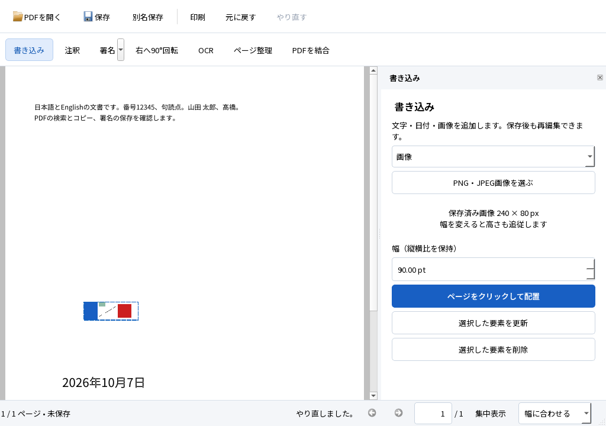

# PDF達人 0.2.0-rc4：配布候補の検証

2026-10-07。初版機能を備えたRC3に、通信を制限したWindowsでの保存・OCRと、配布ランタイムの選定修正を加えました。SPEC・TECH・ACCEPTANCE、固定入力・正解・閾値は変更していません。以前の版の結果は[RC3報告](M3_RC3_REPORT.md)に保持します。

## 1. 使える成果物と起動方法

ローカルの起動先は `dist/PDFTatsujin-0.2.0-rc4-windows-x64/PDFTatsujin.exe`、候補ZIPは `dist/PDFTatsujin-0.2.0-rc4-windows-x64.zip` です。全体を展開し、DLL・plugins・assets・licensesを同じ構成で保持してexeを起動します。日本語フォント・日英OCRモデルを同梱し、通常利用にPythonやTesseractの導入は不要です。合成例 `examples/D01.pdf`、`D03.pdf`、`D07.pdf` を試せます。

検証したexeのSHA-256：

```text
4f8a9692a78f3e275a8a62b245d3cfa66040bdc288cde351fc7dbec1c061cc45
```

製品ソースはコミット `f42fc036a5417e6c7e8df32d9c7ad9bc8af36089`。最終配布フォルダは試験したDesktop CRT版のバイナリ・資産をそのままコピーし、最新資料とファイル別SHA-256を追加します。Qtの対応ソース3アーカイブもZIPへ同梱します。確定したZIPの容量・ハッシュ・全ファイル照合・展開後の試験は、ZIP外の[配布結果](https://github.com/okakanatto/PDF_Tatsujin/blob/main/docs/testing/M3_RC4_DISTRIBUTION.json)に記録します。ZIP内の資料を自己参照するために作り直すことはしません。

確定後の追記：**403ファイルのCRC・SHA-256がすべて一致**。ZIPは139,019,340 bytes、SHA-256は `4b2266ebcf0ef8edaa568343539a85df3f75db7d5b1a35d3c30159a94d5b171b`。別フォルダへ展開し、B08のフォーム→署名→注釈→ページ操作→OCR→検索→保存→再編集→印刷を再実行して1件PASS・終了0・全件完了を確認しました。同じ開発PCのoffscreen試験で、クリーンWindowsの合格ではありません。

| 展開後の部品 | 容量（10進MB） |
|---|---:|
| アプリ＋PDF4QT | 11.42 |
| Qt＋plugins | 33.11 |
| その他ネイティブDLL＋Desktop MSVC | 28.80 |
| OCRモデル | 44.06 |
| フォント | 9.59 |
| 通知・資料・例・manifest | 12.79 |
| アプリ合計 | 139.78 |
| Qt対応ソース（別フォルダ） | 53.89 |

Qtソース込み193,669,629 bytes。依存・ビルド・過去候補・失敗ログ・今回のZIP展開複製を含むプロジェクトは約14.54GB、上限20GBに対して約5.46GBの余裕があります。ファイル長の合計で、NTFS割当量ではありません。ZIPの内部資料は確定前の内容を保持し、この追記と確定配布JSONは公開ソースへ反映します。

**バイナリの外部公開は、配布主体のMSVCランタイム再配布資格の確認待ちです。** PCのBuild Tools導入と、有効なVisual Studioライセンスの保有は別の確認です。[Microsoftの配布条件](https://learn.microsoft.com/en-us/visualstudio/releases/2026/redistribution)と[部品の扱い](docs/THIRD_PARTY.md)を参照してください。ローカル候補の検証と公開ソースの管理は進めています。一般配布品質の合格やGitHub Release完了とは呼びません。

## 2. 実際にできたこと

閲覧、書き込み4種、文字・画像署名、注釈5種、AcroForm6種、ページ整理・結合・抽出・分割、日英OCR、通常PDFへの保存・再編集を維持しています。今回の修正は次の範囲です。

- AppContainerで保存・OCRの一時領域を作成する際、利用者と現在のpackage SIDだけを許す私有DACLを作成時に設定します。通常のWindowsでは元のQt一時領域を使用します。
- AppContainerで使えないQtの通常の名前付きパイプに代わり、同じ私有領域内のファイルでOCR進捗・エラーを受け取ります。通信権限を追加せず、通常の実行経路と、成功結果だけを1回のUndoとして取り込む境界を維持します。
- 起動に失敗したワーカーの無効なパイプを読まず、起動エラーを表示して未保存編集を保持します。
- 梱包処理がOneCore CRTを先に選ぶ問題を修正し、Desktop x64 Release CRTを明示します。元の再頒布DLLとの一致を監査し、由来・ハッシュ・条件を同梱します。

次は最終RC4の実Qtウィンドウを取得した最小画面の書き込み試験です。Qt offscreenの画像であり、今回のネイティブIME操作の証拠ではありません。



## 3. 試験結果

Windows 11 Home 25H2 x64、Core i7-1360P、OS可視RAM約16.91GB、NVMe SSD、Qt 6.9.3、MSVC 19.50、Desktop Release CRT 14.50.35710で実行しました。[公開結果](docs/testing/M3_RC4_RESULTS.json)と[全27項目の受入一覧](docs/testing/M3_RC4_ACCEPTANCE.json)に、実行範囲・未実行部分・証拠ハッシュを記録しています。

| 実行した範囲 | 結果 |
|---|---|
| M1/M2回帰、表示・署名・Undo/Redo・再編集・注釈・フォーム・ページ操作・OCR・異常系 | **71件PASS、0件FAIL、終了0、全件完了** |
| NTFS書込拒否、Windows Print to PDF | PASS。試験用ACLの復元も確認。実容量不足・物理印刷とは区別 |
| PDFium 153.0.7999.0、Poppler 26.07.0、pypdf | 保存後の表示、文字、外観、フォーム値、リンク・しおり・注釈保持PASS |
| Firefox 157.0のPDF.js・DOM選択・WebDriver印刷 | 日英検索・文字選択、M2の4PDFの日本語フォーム・注釈・印刷PDFを確認 |
| 通信権限ゼロのAppContainer | **署名5件・OCR2件・途中取消1件PASS**。親とOCR子のtoken、対照接続、保存PDFの独立評価、profile除去を確認 |
| 実際の親プロセス強制終了 | 活動中ワーカーの入力を保持、OCR結果完成、次の起動で孤立領域回収、原本不変PASS |
| 実起動・NTFSジャンクションを含む回収 | 所有外・活動中・リンク先を保持、回収対象だけ削除PASS |
| 配布監査 | **75個のx64 PE、資産6点、通知104点、Desktop CRT10DLLを照合PASS** |

通信制限の試験は同じ開発PCで、使い捨てのAppContainerにネットワーク能力を一切与えない方法です。正常プロセスの接続は成功し、制限プロセスは10060で失敗しました。アプリとOCR子の両方がAppContainer・capability数0であることを実際のtokenから確認しています。ホストのネットワーク・ファイアウォール設定は変更していません。[全結果](docs/testing/M3_RC4_NETWORK.json)。この結果をクリーンWindowsやネイティブIMEの合格に置き換えません。

RC3ではこの制限環境の保存にアクセス拒否が発生し、その後の試作ではQtのパイプ作成・起動失敗時のエラー経路にも問題を確認しました。修正前の失敗ログもローカル証拠として保持しています。AppContainerのTemp親ディレクトリは検証側で準備し、長すぎる検証用パスは避けました。任意の長いパスや全Windows sandboxの保証ではありません。

| 固定D03の評価用ページ | 日本語CER | 英語CER | 固定検索語 |
|---|---:|---:|---|
| PDFium：通常／通信制限下の保存結果 | 0.5051% | 0.0455% | 日英各20/20 |
| Firefox PDF.js | 0.5051% | 0.7741% | 日英各20/20 |

基準は日本語2%以下、英語1%以下、各19/20以上のままです。8ページの可視画像は前後差なし、文字行の位置差は最大0.922mm、90度回転例は0.796mm（基準2mm以下）。抽出エンジンごとの結果を平均化していません。

### 継続閲覧と性能

[15分の継続試験](docs/testing/M3_RC4_SOAK.json)は製品と共通のWindowで、通常100ページと画像50ページを交互に開き、順方向・逆方向に閲覧して閉じるものです。**902.254秒、94回、7,050ページ**。原本・文書・Undo状態の不変、既存の文字選択16MiB／プレビュー8MiBのキャッシュ上限を確認しました。RSS最大217.26MB、private最大236.96MB、handle最大301です。

閉じた後のRSS中央値は1〜15回で41.39MB、41〜55回で60.65MB、61〜75回で65.90MB、81〜94回で67.32MB。初期の保持メモリ増加があり、後半の増加は小さくなっています。最後の3回の中央値はRSS68.19MB／private43.57MB、handle数中央値は初期・最後とも288でした。数時間のリークがない証明とは扱いません。300msの閉じた区間に含まれる直前のサンプルを使い、生データと計測exeのハッシュを保存しました。

[初回表示・OCRの各3回測定](docs/testing/M3_RC4_PERFORMANCE.json)では、読み取れる初回表示の中央値がD01で87ms、通常100ページで98ms、画像50ページで209ms。同じ画面の署名付き1ページOCRの中央値は6.985秒、親子合計RSS最大282.30MBでした。offscreen、OSキャッシュ・他のPC作業を制御していない観測です。物理画面FPSやAcrobat比較ではありません。RC3の画像待ち短縮の同日比較はRC3報告へ保持し、異なる測定を改善率へ混ぜません。

実スキャンR01/R02も最終候補で再実行しました。英語1901年原稿はCER0.3268%・検索3/4、古い縦書き日本語1917年原稿はCER約99.34%・検索0/4。画像は保持されますが、後者は実用上の認識失敗です。合成D03の閾値とは別の診断で、対応範囲の表示に反映しています。

## 4. 未実行・制約

- C02の説明なしの第三者試用。[週末に使える目的と記録欄](docs/testing/M3_FIRST_USE.md)を準備しました。自動試験で代替しません。
- クリーンWindows 11、通信停止下のネイティブIME／GUI、RC4のネイティブIME全行程。RC3の実画面結果は過去版として保持します。
- 隔離ボリュームの実容量不足、Reader GUI、物理プリンター、OS表示倍率100/150/200%、複数IME。
- 現代の横書き日本語の物理スキャン、数時間の継続使用、冷状態、物理画面FPS、Acrobatとの比較。
- 公開ZIPを別のWindows Server runnerで試す手動workflow。公開条件確認後に実行できる形で準備済みですが、未実行です。

これらは未評価のままです。一般の全PDF・全スキャン・全終了タイミングを保証しません。既存本文の直接編集、証明書署名、新しいフォーム作成、真の墨消しは提供対象外です。

## 5. 採用構成と理由

PDF4QTライブラリ＋独自Qt Widgets UI＋TesseractのローカルOCRを継続採用します。通常PDFの本文・標準注釈・外観を保持し、必要な再編集情報をPDF内へ保存する構成です。Qt DLLは動的リンク・未改変です。今回のWindows固有処理は`private_temp`と`worker_channels`へ分離し、Windowは監督と状態の接続を担います。[構成](docs/ARCHITECTURE.md)、[実行した開発手順](docs/DEVELOPMENT.md)、[回収結果](docs/testing/M3_RC4_RECOVERY.json)、[配布監査](docs/testing/M3_RC4_AUDIT.json)。

## 6. 次の判断

初版機能と追加の制限環境・継続使用試験を備えた、**ローカルで試用できるRC4候補**です。初見試用で迷いを収集して修正し、残る環境評価に基づいて正式版の可否を更新します。MSVCの再配布資格を確認できれば、検査済みZIPをGitHubの評価用prereleaseとして公開できます。現時点のソース管理、ローカル候補完成、一般配布の合格、バイナリ公開はそれぞれ区別して報告します。
