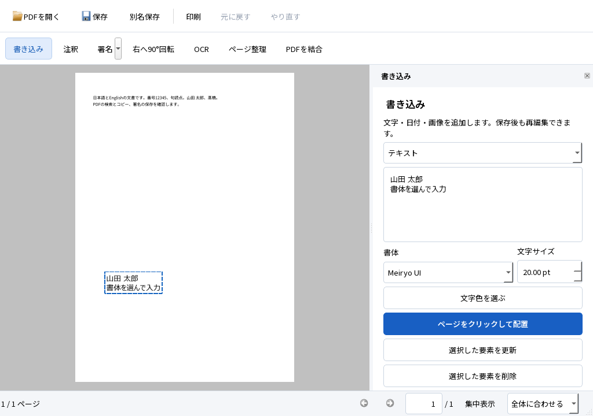

# PDF達人 0.2.0-rc6：保存・OCR資材のパスと品質評価

2026-10-08。RC5の書体選択を維持し、長い日本語パスでの保存・OCR、同梱資材の読み込みと不足時の失敗処理を修正しました。SPEC・TECH・ACCEPTANCE、固定文書・正解・検索語・閾値は変更していません。現在位置はM3の配布候補評価です。

## 1. 使える成果物と起動方法

`dist/PDFTatsujin-0.2.0-rc6-final/PDFTatsujin.exe` を起動します。ZIPを使う場合は全体を短いフォルダへ展開し、DLL・plugins・assets・licensesを保持します。日英OCRとNotoを同梱し、通常利用にPython・Tesseractの追加導入は不要です。Meiryo UI等は利用PCで使用可能な書体を選べます。

検証済みexeのSHA-256は `2aa8ef33c6fbd18b85b920c6ef5cd95b392701e89b7f54a7c6a7676c042372b0`。製品ソースは[cbf74c2](https://github.com/okakanatto/PDF_Tatsujin/commit/cbf74c24a0eb018f154e5a1f18a9a2def770071c)。最終候補は試験済みexe・DLL・資材のバイト列を保持し、対応ソースと75件の完了を `build-manifest.json` に記録します。

ZIP生成後のCRC・SHA-256・展開起動結果は[リポジトリの配布検査記録](https://github.com/okakanatto/PDF_Tatsujin/blob/codex/m2-m3-candidate/docs/testing/M3_RC6_DISTRIBUTION.json)に別添します。ZIPとその記録の循環ハッシュを作りません。配布候補の作成と外部へのバイナリ公開は別で、一般配布品質の合格は未宣言です。

## 2. 実際にできたこと

- 長い保存先・OCR作業先でWindowsのUnicodeファイルAPIへ拡張パスを渡します。OSのレジストリ・ネットワーク・グローバル権限は変更しません。保存の検証後置換・外部競合検知・Undo・原本保持を維持します。
- Tesseractには同じ固定モデルをQt経由で渡し、CのファイルAPIが扱えないパスを避けます。毎回のモデルコピーも不要になりました。認識エンジン・設定・結果の統合方式は維持しています。
- 要求した言語がすべて読み込まれたことを確認します。英語モデル不足で日本語だけへ縮退し、成功として保存することを防ぎます。
- 同梱NotoもQtでバイト列を読み込みます。397 UTF-16単位の日本語・絵文字の資材パスで、8ページ日英OCRと同一ウィンドウの署名・OCR・検索・コピー・保存を確認しました。
- ワーカー／試験／計測の資材不足は、非表示ダイアログを待たず失敗終了します。対話起動ではエラーを表示します。英語モデル不足で結果未生成・原本不変、フォント不足で即時失敗を確認しました。

方式の根拠：[Windowsの拡張パス](https://learn.microsoft.com/en-us/windows/win32/fileio/maximum-file-path-limitation)、[Tesseract 5.5.1 API](https://github.com/tesseract-ocr/tesseract/blob/5.5.1/src/api/baseapi.cpp)、[Qt 6.9のフォントデータ登録](https://doc.qt.io/archives/qt-6.9/qfontdatabase.html#addApplicationFontFromData)。成立性は以下の実行結果で判断します。

## 3. 試験結果

Windows 11 Home 25H2 x64、Core i7-1360P、RAM 16.91GB、NVMe、Qt 6.9.3、MSVC 19.50／Desktop x64 Release CRT。[公開した集約結果](docs/testing/M3_RC6_RESULTS.json)。通常ユーザー環境で実行し、GUI入力は特記したものを除きQt offscreen／合成イベントです。

実ウィジェットのoffscreen画像です。OS表示倍率・ネイティブIMEの実操作とは区別します。

| 実行範囲 | 実結果・範囲 |
|---|---|
| M1／M2全回帰 | **75件PASS・0件FAIL・終了0・全件完了**。書体9種・保存・再編集・Undo、混在した実務作業、NTFS書込拒否とWindows Print to PDFを含む |
| 通信権限ゼロ | **9件PASS**。署名5・OCR2・取消1・長いパス1。親・OCR子のtoken、接続対照、専用プロファイル除去を確認。同じ開発PCでありA12のクリーンWindows試験を代替しない |
| Unicode資材・不足時 | 397単位の資材パスで2件PASS。英語モデル不足は既定のワーカー終了2・結果未生成、フォント不足は終了1・待機なし |
| 外部PDF処理 | PDFium 153・Poppler 26.07・pypdfでOCR・文字・外観・フォーム・注釈・ページ操作PASS。9書体×保存／再編集後の18PDFをfontToolsでも検査 |
| Firefox 157／PDF.js | 専用headlessプロファイルで保存後の検索日英各20/20・選択・フォーム・注釈・WebDriver印刷PASS。OSクリップボード・ネイティブReader GUI試験ではない |
| Windows標準Qtバックエンド | 9書体の保存・再読込・再編集・Undo PASS。可視ウィンドウとIMEは操作していない |
| Qtの倍率1／1.5／2 | **各14件PASS**。1024×720の書体設定・配置／更新／削除、キーボード等。実OS表示倍率とは区別 |
| 一時ファイル・部品監査 | 起動時の所有領域回収、無関係な領域とNTFSジャンクション保持、PE依存・資材・通知・Desktop Release CRTの監査PASS |

固定D03のPDFium評価は日本語CER **0.5051%**、英語 **0.0455%**、検索は日英各 **20/20**。最大位置差 **0.922mm**、90度回転例 **0.796mm**、可視画像不変。Firefoxの選択文字評価は日本語 **0.5051%**、英語 **0.7741%**で両言語の元の閾値内です。エンジンごとの抽出差を混ぜて平均しません。

### 要件別の現在地

| ID | 実行した結果 | 未実行・制約 |
|---|---|---|
| A01 | 開く・表示・移動・検索・コピー・同じウィンドウの入口を自動検査 | RC6の全経路のネイティブ実画面操作は未実行 |
| A02 | 日本語文字・移動・サイズ・書体・1回のUndo／Redoを自動検査 | ネイティブ日本語IMEは未実行 |
| A03 | 保存・再編集・原本保持・独立描画・仮想印刷を実行 | Reader GUI・物理印刷は未実行 |
| A04 | 回転・CropBox・UserUnit・倍率の座標を検査 | OS実倍率は未実行 |
| A05 | 固定精度・検索・読み順・位置・可視画像保持を独立検査 | 全般的な実スキャン精度の保証ではない |
| A06 | 対象指定・混在ページ・既存文字／画像／署名／注釈保持を検査 | 基準外の複雑な原稿は別評価 |
| A07 | 再OCRの重複防止・処理不要／文字未検出を検査 | — |
| A08 | 署名→回転→OCR→Undo／Redo→保存を検査 | — |
| A09 | 途中取消・ワーカー強制終了・未保存変更保持・閲覧継続を検査 | すべての異常終了時点を網羅した証明ではない |
| A10 | 保存取消・競合・実NTFS書込拒否・状態保持、ACL復元を検査 | 実容量不足は未実行 |
| A11 | 誤パスワード拒否・保護文書の読取専用・変更拒否を検査 | 証明書の有効性評価は提供しない |
| A12 | 同梱構成・PATH制限・通信権限ゼロの処理を実行 | クリーンWindowsは未実行 |
| B01〜B08 | 書き込み・注釈・フォーム・ページ操作・複数出力・保存／閉じる・結合作業の回帰と外部検査を実行 | 上記のIME・対象環境の未実行を解消していない |
| C01 | 実ウィジェットの画像・主要経路・最小画面・3倍率を確認 | ネイティブ実画面全体の評価は未実行 |
| C02 | 第三者の初見試用は未評価 | 未実行。自動試験を代用しない |
| C03 | 合成入力・フォーカス・Qt倍率を検査 | 実IME・OS倍率100／150／200%は未実行 |
| C04 | 起動・表示・OCRを各3回、ドラッグ・取消等を各3回計測 | 物理画面FPS・冷状態・Acrobat比較は未実行 |
| C05 | 部品別容量・プロセス群ピーク・連続閲覧を計測 | 長時間・多様な実文書のメモリ上限保証ではない |
| C06 | 固定した公開実スキャン2例を再診断 | 縦書き・ルビに失敗例あり |
| C07 | 通信制限・一時回収・部品／資料を検査 | クリーンWindowsは未実行。外部公開条件は確認待ち |

### 性能・メモリ

各3回、同じPC、Qt offscreen。OSキャッシュ・利用者の活動は制御していません。「画面完成の観測上限」はプロセス起動前から最初のPNGが完全に書けるまでを20ms間隔で観測し、Qt初期化・キャプチャ保存も含みます。Qt初期化後の文書読込計測を、起動全体の時間とは呼びません。

| 固定文書／処理 | 中央値 | プロセス群RSSピーク |
|---|---|---|
| D01・1ページ | 画面完成の観測上限170ms、文書表示81ms | 62.1MB |
| D10・デジタル100ページ | 同173ms、文書表示95ms | 63.5MB |
| D10・画像50ページ | 同285ms、文書表示186ms | 169.7MB |
| 同じウィンドウの1ページOCR・検索・保存等 | 6.46秒 | 親＋OCR子307.8MB |

共有UIハーネスで、署名プレビューのイベント＋再描画中央値 **1.85ms**、確定して描画完了 **37.3ms**、OCR中のページ移動 **3.37ms**、取消から子終了・掃除 **44.3ms**。3回・90プレビュー試料で、Undo単位・原本・取消後の文書保持も検査しました。物理画面への入力遅延を測った数値ではありません。

最終版の追加連続試験は **5分／32回の開閉／2,400ページ**、RSSピーク **220.0MB**。文書・Undo・原本不変と既定のキャッシュ上限を確認しました。閉じた後のRSS中央値は最初3回 **50.7MB**→最後3回 **74.9MB**、privateは **34.1MB**→**57.0MB**。保持量の増加があり、リークなし・長時間安定を断定しません。

フォント読み込み修正前のRC6試作では別途15分／7,000ページを完了しましたが、exeハッシュが異なるため最終版の15分合格に数えません。RC4／RC5の過去試験も版別に保持します。

## 4. 未実行・既知の制約

### 配布容量と作業フォルダ

ZIP確定・展開試験後の別添値です。同梱報告はZIP生成前の版で、以下の確定値はリポジトリの[配布検査記録](docs/testing/M3_RC6_DISTRIBUTION.json)にも保存しました。411ファイルをCRC・SHA-256で全件照合、展開後のマニフェスト407ファイルを照合し、同じexeでB08結合作業と長い保存先の2件を完了しました。

| 部品 | ファイル長合計 |
|---|---|
| アプリ＋PDF4QT | 11.48MB |
| Qt＋plugins | 33.11MB |
| その他native＋MSVC | 28.80MB |
| OCRモデル等 | 44.06MB |
| 同梱フォント | 9.59MB |
| 通知・文書・メタデータ等 | 13.15MB |
| アプリ展開後 | **140.20MB** |
| 対応Qtソースアーカイブ | **53.89MB**（別フォルダ、同じZIPに含む） |
| 配布ZIP | **139.20MB** |

ZIPのSHA-256は `d5341f0fee9ac045d31ea5eae444e56c536d85baaebbcd6cdb4a4fd45cbe0f61`。2026-10-08 10:15のプロジェクト合計は **17.19GB／許可20GB、残り2.81GB**。依存・ビルド・旧配布物・証拠・今回の展開先も含むファイル長で、NTFS実占有量とは別です。T:は同じフォルダの別名なので二重計上しません。既存のWindows／MSVCや共有テストランタイムはフォルダ外です。

### 残る検証と対応範囲

- **未実行**：ネイティブIME、OS表示倍率、説明なしの第三者試用、クリーンWindows、実容量不足、Reader GUI、物理印刷、選択したWindows書体がない別PC。
- **未実行**：物理画面FPS、Acrobat比較、冷状態、数時間の連続試験、UNC／ネットワーク保存の評価。
- 350文字を超える日本語・絵文字のexe配置先ではWindowsの起動APIが実行前に失敗しました。短いインストール先を使用してください。長いPDF保存先・OCR一時領域・397単位の資材読み込みのPASSとは別の結果です。
- 公開実スキャンの古い縦書き・ルビ例はCER **99.34%・検索0/4**で未解決。英語例は **0.3268%・3/4**。可視画像は両例とも保持。D03の横書き合成基準と別集計し、一般精度として保証しません。
- バイナリ外部公開はMSVC再配布資格の回答待ち。PRのDraft解除・main統合は自動承認レビューの拒否により明示承認待ち。ソースは公開作業ブランチで管理しています。

初回の長いパス試験で見つけたWindows API・資材読み込みは修正しました。試験スクリプトの環境変数名、ワーカーの既定終了コード2を1とした誤記も修正し、途中ログを保持しています。精度の正解・検索語・閾値を変更したものではありません。

## 5. 採用構成と理由

PDF4QT＋独自Qt Widgets＋ローカルTesseractの構成Aを維持します。OS固有のパス処理は `windows_path` に集約し、文書状態には通常のQtパスを保持します。OCRモデル読み込みは固定資材だけを許可するコールバック、同梱フォントはQtのデータ登録APIを使います。通常PDFの再編集、標準外観・文字層、同一Documentの保存とUndoは継続します。

## 6. 次の判断

M1／M2の機能を維持したRC6が実行・配布候補として用意できました。残るM3の対象環境・初見操作・実画面評価と公開条件を追跡します。初版をAcrobat全機能と同等の完成とは表示せず、未実装の拡張範囲は[ロードマップ](ROADMAP.md)で区別します。
