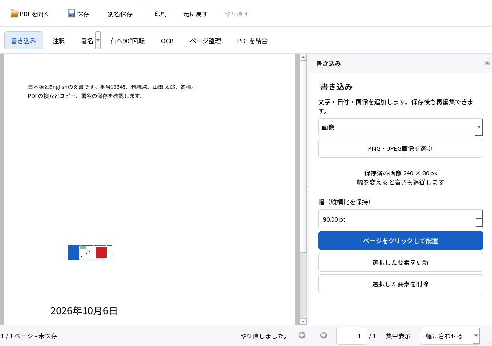
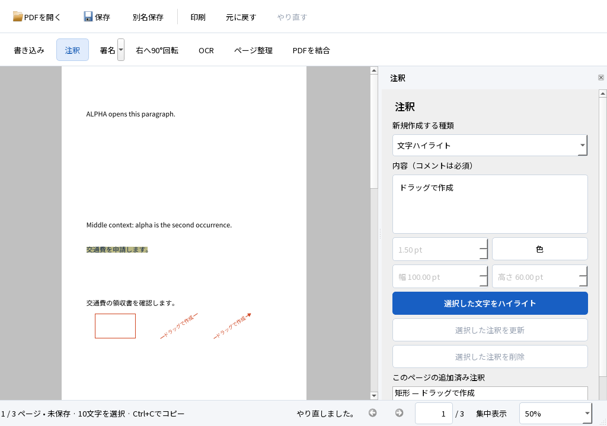
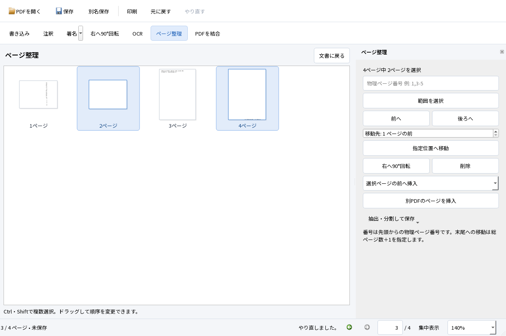

# PDF達人 0.2.0-rc2：実装・試験・配布候補の報告

2026-10-06。M2の機能を実装し、M3の配布候補と品質評価を作成しました。利用者のM3へ進める指示に従った作業で、SPEC・TECH・ACCEPTANCEの基準は変更していません。一般公開版の出荷合格、Acrobatとの優越比較は宣言しません。

## 1. 使える成果物と起動方法

この作業環境の起動先は `dist/PDFTatsujin-0.2.0-rc2-windows-x64/PDFTatsujin.exe`。配布ZIPは `dist/PDFTatsujin-0.2.0-rc2-windows-x64.zip` です。全体を展開してexeを起動します。DLL・plugins・assetsを移動せず同じフォルダに置いてください。通常利用に開発ツール、Python、追加のOCRモデル取得は不要です。

`examples/D01.pdf` は日本語・英語の通常PDF、`D03.pdf` は日英画像PDF8ページ、`D07.pdf` は標準フォームです。すべて合成試験入力で、実務文書は同梱しません。操作手順・制約はREADME、部品の通知はlicenses、Qtの対応ソースはZIP内の `third-party-sources` に含めます。

今回の最終受入・外部検証・起動測定を行ったexeのSHA-256：

```text
a829a2e17da44860a3a515962a2299b3029c9ea81766455e8e1c1ada83efd19a
```

試験後は製品exeを変更せず、報告・ライセンス資料を追加します。ZIPのCRCと全メンバーのSHA-256照合結果は `evidence/m3-rc2-archive-20261006.json`、部品別容量は `evidence/m3-rc2-storage-20261006.json` に残します。詳細な環境ログ・実画面の生証拠はローカルに保持し、GitHubではソース・固定入力・公開可能な結果を管理します。

ZIP確定後の[配布結果](docs/testing/M3_DISTRIBUTION.json)はZIP外の別記録です。ZIPは146,373,624 bytes、アプリ展開後155,658,686 bytes、Qtソース込み209,549,962 bytes。385ファイルすべてを照合し、別フォルダへ展開した版で起動とB08複合作業を再実行してPASSしました。これは同じ開発PC・Qt offscreen・System32のみのPATHによる試験で、クリーン／オフライン試験ではありません。展開試験の複製も含むプロジェクト全体は約9.892GBで、20GB以内です。ZIP内の報告は確定前の記録を保持し、この段落と配布結果は確定後に公開ソースへ追加しました。

## 2. 実際にできたこと

- 閲覧：連続表示、縮小画像、しおり、ページ・検索移動、表示履歴、幅／全体合わせ、ポインター位置を基準にしたズーム、手のひら移動、本文選択・コピー、印刷。閲覧操作は文書の編集履歴に入りません。
- 書き込み・署名：日本語文字、固定日付、PNG/JPEG画像、文字・画像署名の配置・移動・更新・削除・Undo／Redo・PDF保存・再編集。画像の透過と縦横比を保ち、元画像がなくても再編集できます。再利用署名の保存は明示操作でローカルに行います。
- 注釈：ハイライト、コメント、矩形、直線、矢印。標準PDF型・外観・印刷フラグで保存します。矩形は枠線だけを描き、本文を覆いません。コメントを消すと付随するPopupも除去します。
- フォーム：標準AcroFormの単行・複数行文字、チェック、ラジオ、コンボ、リスト。6種類のキーボード操作、日本語外観の埋め込み、下書きの未保存表示、Tab移動、入力欄と文書のUndoの切替を実装しました。
- ページ：中央の一覧で複数選択・移動・削除・回転・挿入、PDF結合、抽出・分割。最後のページの削除を防ぎ、フォーム名の衝突を事前に拒否します。複数出力の途中失敗はファイルごとに表示します。
- OCR・保存：日英のローカルOCR、指定範囲、進捗・取消、既存内容保持、成功時だけの1操作反映、安全な候補保存・外部変更検出・失敗後の再試行。同じウィンドウでフォーム→署名→注釈→ページ操作→OCR→検索→保存→再編集→印刷を実行しました。

中央のPDF、左のページ／検索／しおり、上の主要操作、右の作業設定、下のページ・倍率・状態を維持しています。最小1024×720で設定をスクロールでき、集中表示でも閲覧・検索・保存の経路を使えます。

以下は最終RC2の実Qtウィンドウをoffscreenで取得した画面です。WindowsネイティブのIME・OS倍率の証拠とは区別します。







## 3. 試験結果

環境はWindows 11 Home 25H2（10.0.26200）、x64、Core i7-1360P、OS可視RAM約16.91GB、Qt 6.9.3、MSVC 19.50。作業先はローカルWindowsの同一PCです。Qt offscreen試験を実機のディスプレイ操作成功とは呼びません。

最終回帰は **69件PASS、0件FAIL、プロセス終了0、全件完了**。`process-result.json` と `selftest.json` の両方を確認しました。署名・OCRのみの旧M1試験に、M2の試験とNTFS権限拒否・Windows PDFプリンター等を加えた数です。未実行の契約項目が69件へ含まれているという意味ではありません。

共通入力は変更していない `fixtures/manifest.json` と正解データ。操作は `scripts/test-windows-errors.ps1 -IncludeNativePrinter`、独立検証は `evaluate.py`・`evaluate-m2.py` で再現できます。[実行手順](docs/DEVELOPMENT.md#m2m3の再現)。次の表の環境・版は上記の最終RC2、期待結果はACCEPTANCEの同じIDです。証拠の記号は表の後に定義します。

| ID | 状態 | 入力・操作と実結果 | 証拠 | 残課題 |
|---|---|---|---|---|
| A01 | 実行範囲PASS | D01を表示・移動・検索・コピー。同じ画面で署名／OCRへ進める | T | 初見評価はC02 |
| A02 | 自動操作PASS／最終版のネイティブIME全行程は未実行 | D01に日本語署名、ドラッグ1回＝Undo1回、Redo、欠字拒否 | T、N | Nは別の中間版の単行フォーム。IME製品名・複数行・最終版署名行程の再実施 |
| A03 | 実行範囲PASS | 保存・再読込・再編集、原本不変。PDFium／Poppler／Firefox表示、Qt印刷、Microsoft Print to PDF、Firefox WebDriver印刷 | T、I、F、P | Reader GUI、物理プリンター未実行 |
| A04 | PASS | D02の4回転、CropBoxずれ、UserUnit=2、倍率変更。最大計算誤差1.14×10⁻¹³pt（基準0.5pt以下） | T、I | OS倍率はC03 |
| A05 | 独立評価PASS | D03の日4・英4ページ。固定評価用CER・検索・読み順・位置・保存後コピーを確認 | T、I、F | 外部OSクリップボード・Reader未実行 |
| A06 | PASS | D04／D05。対象外ページ、既存文字、画像、署名、注釈を保持。重複文字層を作らない | T、I | 一般実文書への保証ではない |
| A07 | PASS | D06。OCR済み・空白・写真の状態を分け、重ねて文字層を増やさない | T | — |
| A08 | PASS | 署名→回転→OCR→Undo／Redo→保存。OCRだけを取消し、署名を保持 | T、I | — |
| A09 | PASS | 1ページ完了後の取消、ワーカー異常終了。部分反映なし、未保存編集保持、閲覧可、一時領域削除 | T | 実ディスプレイのフレーム時間未実行 |
| A10 | 一部PASS／実容量不足は未実行 | D09。保存・閉じる取消、実NTFS権限拒否、読取専用、外部変更、パス競合、再試行で原本と未保存変更を保持 | T | 隔離した実容量不足環境が必要 |
| A11 | PASS | D08。誤パスワード・破損を拒否。暗号化・証明書署名・非対応フォームは読取専用 | T | 証明書の信頼性を検証する製品機能は対象外 |
| A12 | 環境制約／未実行 | 開発DLLのPATHを外した同一PCでの起動は実行。開発環境なしのクリーンWindows／通信を止めたA02・A05とは別 | T | クリーン環境とオフライン試験 |
| B01 | 実行範囲PASS | D01／D02。文字・日付・PNG透過・実JPEG・画像署名の更新／削除／保存後再編集。日付固定、縦横比保持 | T、I、F、P | — |
| B02 | 実行範囲PASS | D01／選択用PDF。5種類を作成・各種類更新・削除・Undo・保存。標準外観、透明な矩形、Popup除去。本文選択ハイライト・コピー | T、I、F、P | Reader未実行 |
| B03 | 実行範囲PASS | D07。6種類を実キー操作、Qt入力メソッドイベント、日本語外観・正規フィールド値・選択値を保存。Firefox表示・印刷後も日本語／選択文字を独立抽出 | T、I、F、P | 最終版のネイティブIME全行程は未実行 |
| B04 | PASS | D02／D07／D05。複数選択、移動・削除・回転・挿入、Undo。本文・注釈・フォーム・OCRがページに追従、最後のページ保護 | T、I | 極端に複雑な文書は未保証 |
| B05 | PASS | 結合・抽出・分割、ページ順とフォーム階層、原本ハッシュ。フォーム名衝突は反映前に拒否 | T、I | 名前を自動変更して結合する機能は未提供 |
| B06 | PASS | 3出力中2成功・1失敗を区別。既存ファイル・原本不変、重複出力指定拒否 | T | — |
| B07 | 実行範囲PASS | 保存・閉じるのQtダイアログ、未保存下書き、保存後Undo、保存失敗→再試行を同一文書で確認 | T | Windowsネイティブ保存ダイアログの全操作は未実行 |
| B08 | 実行範囲PASS | D07に入力→署名→注釈→D05挿入／回転→OCR→Undo→並替え→検索→保存→再読込・変更→失敗後再保存→2ページ印刷 | T、I、F、P | Reader・実プリンター未実行 |

証拠はローカルの次のフォルダです。生ログを公開Gitへ混ぜません。

| 記号 | 証拠・測定方法 |
|---|---|
| T | `evidence/m3-rc2-final-regression-20261006/`。Qt実アプリ、QTestイベント、別プロセスOCR、実ファイル保存、自己試験69件、プロセス完了記録 |
| I | 同じT内の `independent-verification.json`・`independent-m2.json`。PDFium 153.0.7999.0、Poppler 26.07.0、pypdfによる抽出・構造・座標・描画 |
| F | `evidence/m3-rc2-final-firefox-20261006/`、`evidence/m3-rc2-print-verified-firefox-20261006/`。Firefox 157.0、build 20260924084938、独立プロファイル・headless PDF.jsの実DOM選択／検索／描画／フォーム・注釈読取 |
| P | Fの印刷PDF・PDFium再描画／文字抽出、TのQt／Windows PDFプリンター出力。物理紙への印刷とは別 |
| N | `evidence/m3-native-review-20261006/result.json` とローカルComputer Useツール履歴。中間版SHA `20d886eed009a6817af9a4f0a35a0c79f05d494dfb9dc25cc831ea51e434bbcc` |

### 固定OCR評価

正解はOCR前に固定した評価用2ページ／言語。NFCと空白の統一だけを行い、句読点・大文字小文字等は消していません。

| 外部エンジン | 日本語CER | 英語CER | 事前固定検索語 |
|---|---:|---:|---|
| PDFium | 0.5051% | 0.0455% | 日20/20・英20/20 |
| Firefox PDF.js DOM | 0.5051% | 0.7741% | 日20/20・英20/20 |

基準は日本語2%以下、英語1%以下、各19/20以上。エンジンごとの抽出差を平均化しません。OCRのみの前後は同じ設定の描画で可視ピクセルの変化なし、文字行との位置差は全8ページ最大0.922mm、90度回転例0.796mm（基準2mm以下）です。保存後のフォーム階層と値、既存コメント・リンク・しおりも確認しています。

### M3の評価

| ID | 状態 | 実結果・証拠 | 残課題 |
|---|---|---|---|
| C01 | 実画面確認済み | Nで閲覧・書き込み・署名・注釈・OCR・ページ整理をWindows上で確認。最終RC2の設定と最小画面はTの実Qt画像・操作試験で確認 | 説明なしの使いやすさはC02 |
| C02 | 未評価 | 第三者へ説明なしの試用結果を依頼。自動試験を第三者評価へ置き換えない | 試用者の結果が必要 |
| C03 | 一部実行 | NでOS候補ウィンドウと未確定の「か」→確定→PDFフォーム外観反映→Undo。Tで6種のキー・Tab・下書きUndo・フォーカス・1024×720。最終RC2はQt強制倍率1／1.5／2でも配置・集中表示・フォーカス試験各1件PASS | Qt強制倍率はOS倍率の代替ではない。OS100／150／200%と複数IME・複数行の実操作は未実行 |
| C04 | 初期測定実行 | 起動／初回ページ／全ページ3周・各3回、イベントループ間隔、署名・OCRの操作試験。詳細は下表 | 物理表示FPS・コールド起動・長時間使用・Acrobat比較は未実行 |
| C05 | 初期測定実行 | 通常閲覧・OCRの親子プロセス合計RSS、ページ周回時RSS／private bytes、配布物部品別容量、ZIP全ファイル照合 | 全文書・全操作の上限保証ではない |
| C06 | 実行／制約発見 | 再利用可能な日英の実書籍スキャン各1ページを最終RC2でOCR。英語は限定的成功、古い縦書き日本語は実用失敗 | 現代横書き日本語の実スキャナー入力は未実行 |
| C07 | 一部実行／クリーン環境は未実行 | ローカルOCR、取消時の一時領域除去、署名の明示保存、依存通知・モデル・フォント・Qtソース同梱、PATHを開発DLLから隔離した実行 | クリーンWindows・通信停止試験、長期放置時の回収評価が残る |

### 初期性能・容量

3回ずつの個々の測定値と中央値を保存しました。OSキャッシュを消しておらず、利用者も使うPC上のQt offscreen測定です。画面上のFPSやAcrobatとの体験比較ではありません。MB／GBは10進のファイル長・RSSです。

| 入力 | 本文が読めるまで：3回／中央値 | 初回閲覧時RSSピーク |
|---|---|---:|
| D01・1ページ | 152／142／143ms、中央値143ms | 47.64MB |
| D10・通常100ページ | 160／191／174ms、中央値174ms | 49.23MB |
| D10・画像50ページ | 560／522／494ms、中央値522ms | 178.48MB |
| D05の同一ウィンドウOCR・検索・コピー・保存・Undoを含む行程 | 14.908／14.415／14.809秒、中央値14.809秒 | 親＋OCR子ピーク281.99MB、2プロセス |

全ページを連続スクロールで3周し、文書ごとに3プロセス実行しました。通常文書は各795地点、画像文書は各399地点でページ準備までの待ち時間を測定しました。

| 入力 | 待ち時間の中央値：各回／その中央値 | 95%点：各回／その中央値 | 最大待ち | RSSピーク：各回／最大 |
|---|---|---|---:|---|
| 通常100ページ | 9／9／9ms、9ms | 23／22／22ms、22ms | 64ms | 64.35／64.79／67.28MB、67.28MB |
| 画像50ページ | 19／20／21ms、20ms | 780／797／794ms、794ms | 951ms | 209.14／213.15／209.87MB、213.15MB |

イベントループ間隔の95%点は通常30／31／31ms、画像30／30／30ms。最大は通常114ms・画像146msでした。物理表示のフレーム率ではありません。各周回後のRSSは通常57.16→57.98、59.61→61.26、58.46→62.22MB、画像98.83→101.02、99.32→101.52、99.50→100.97MB。private bytesの最大は通常44.66MB・画像245.91MBです。3周の結果から長時間の漏れがないとは断定しません。画像の新規描画には1秒近い待ちがあり、改善・体験評価の対象として残します。

同じUI・文書・OCRコードをリンクした独立ハーネスで、署名ドラッグとOCR中の閲覧・取消も3回測定しました。製品exe自体は変更しません。

| 操作 | 3回の時間／中央値 |
|---|---|
| 署名ドラッグ解放→候補commit→ページ準備 | 51.130／53.100／63.555ms、53.100ms |
| OCRの1ページ完了後、次ページへ移動→準備 | 9.338／5.163／9.712ms、9.338ms |
| OCR取消ボタン→ワーカー終了・一時領域除去 | 81.058／73.930／78.284ms、78.284ms |

ドラッグは各30地点でQtイベント送信とoffscreen再描画を計測し、途中commitなし・解放時1commit・Undoで復元を検査しました。実ポインターからディスプレイ表示までの時間ではありません。OCR取消は既存の未保存署名とrevisionを保持しました。生データは `evidence/m3-rc2-final-performance-20261006/measurements.json`、`evidence/m3-rc2-final-reading-20261006/summary.json`、`evidence/m3-rc2-interactions-20261006/interactions.json`。Qt倍率の補足試験は `evidence/m3-rc2-qt-scale-*-20261006/`。

| 展開後の部品 | 容量（約） |
|---|---:|
| アプリ＋PDF4QT | 11.4MB |
| Qt DLL・プラグイン | 33.1MB |
| ネイティブ依存＋MSVCランタイム | 45.1MB |
| 日英OCRモデル | 44.1MB |
| 日本語フォント | 9.6MB |
| 通知・文書・画面・試用PDF | 12.4MB |
| アプリフォルダ合計 | 155.6MB |
| 別フォルダのQt対応ソース | 53.9MB |
| ZIP全体を展開した合計 | 209.5MB |

ZIPの正確な容量とhashは最終照合JSONの `zip_bytes`・`zip_sha256` に記録します。ZIP作成前のプロジェクト全体は9.53GB（tools約3.57GB、build約0.39GB、dist約4.29GB、evidence約1.15GB等）。以前の候補・証拠も含むファイル長で、NTFS実割当量とは別です。20GBを上限として確認し、最終ZIPを加えた容量は `evidence/m3-rc2-storage-20261006.json` に再計測します。T:のsubstを別コピーとして二重計上せず、既存のOS・MSVCや共有試験ランタイムはこのプロジェクトの外です。

### 実スキャンの診断

出典・再利用条件・画像／PDFハッシュ・正解・検索語は `fixtures/real-scans/manifest.json` へOCR前に固定しました。正解manifestのSHA-256は `6c8da43a51bc94126e5043cb3725fc0c842391326934d7dcecd06f35996306ab`、ソース検査で照合します。実結果は `evidence/m3-rc2-final-real-scans-20261006/real-scans.json`。

| 入力 | 実結果と利用上の判断 |
|---|---|
| R01：1917年『羅生門』、NDL由来の縦書き・旧字・ルビ・見開き | 診断CER99.34%、検索0/4。主本文だけの正解でルビは転記せず、CERは基準文書と比較できない診断値。検索と読み順も実用失敗。縦書き・ルビへの対応を保証しない |
| R02：1901年『The Yellow Wall Paper』、英語横書き・セリフ・軽い斜行・イタリック | 診断CER0.3268%、検索3/4。「congenial」を誤認識。読み順を確認。1ページの成功を英語実文書全般の保証にしない |

両方とも可視画像は変化なし。R01の失敗をD03の数値に混ぜません。OCR設定画面には、鮮明な横書きの印刷文字を確認済みの範囲とし、縦書き・ルビ・段組み・不鮮明原稿では原文照合が必要だと表示しました。

出典：[R01 Commons](https://commons.wikimedia.org/wiki/File:Rashomon.djvu)、[R02 Commons](https://commons.wikimedia.org/wiki/File:The_Yellow_Wall_Paper.djvu)。パブリックドメインの機械的スキャンで、非公開文書は使いません。

## 4. 未実行・制約

実容量不足、クリーンWindowsで通信を止めた署名・日英OCR、Adobe ReaderのGUI、Firefoxのネイティブ検索／OSクリップボード／印刷ダイアログ、物理プリンター、OS表示倍率100／150／200%、第三者の初見評価は **未実行または未評価** です。PATHの隔離、headlessブラウザ、QInputMethodEventはそれぞれの代替範囲を示し、契約項目の全合格に変更していません。

既存本文の直接編集、新フォームの設計、証明書署名の新規作成は対象外。矩形は墨消しではありません。暗号化・署名付き・XFA等は読取専用です。検索は改行・段組みを横断する高度な検索ではなく、極端なPDFでの終了待ち、多数一致、大量Undo履歴のメモリ上限は未保証です。

## 5. 採用構成と理由

TECHの構成A：PDF4QT 1.6.0.0＋Qt Widgets＋Tesseract 5.5.1／tessdata_best日英＋Noto Sans JPを継続採用します。表示・PDF標準オブジェクト・安全な保存・文字座標・日英OCRの組合せが同じ文書で成立しました。別のPDF処理エンジンによる構成Bの追加は行っていません。

上流ビューアの改造ではなくライブラリ利用により、閲覧中心の画面と状態管理を自作します。文書処理とUIを分離し、画像・注釈・フォーム・ページの操作を独立したファイル、Windowの接続を作業別ファイルに置きました。署名等の識別情報はPDF内、標準外観も保存し、通常保存で本文を画像化しません。[構成と変更時の約束](docs/ARCHITECTURE.md)。

固定上流で発見したワーカー開始通知・フォーム統合の不具合は、固定元ファイルからビルド領域へ派生する小さなアダプターで修正します。元ソースと適用手順をhash固定し、vendorサブモジュール自体は無変更です。失敗結果を保持し、元入力・閾値を変えて隠していません。

最終候補前に修正した主な不具合は、フォーム結合時の情報消失、注釈ストリーム長の不足、矩形の黒い塗りつぶし、コメントPopupの残存、リストのキー選択、ウィンドウ終了時の参照寿命です。修正後の69件と独立PDF検証が今回の結果です。

## 6. 次の判断

現在地は **M2の機能実装を経て、M3の評価用配布候補がある段階**。残りの主な作業は機能一式の新規実装ではなく、第三者の閲覧体験、クリーン／オフライン環境、OS倍率、実容量不足、外部GUI・実印刷の評価と、そこで発見する不具合の修正です。

鮮明な横書きPDFでの書き込み・署名・標準フォーム・ページ整理・日英OCRを試す候補として利用できます。一般公開版の出荷判定と、Acrobatから置き換えられるという体験の主張には上記の未実行試験が残ります。M1の未実行項目を消すために要件を緩めず、実装の進行と受入判定を分けて報告します。
