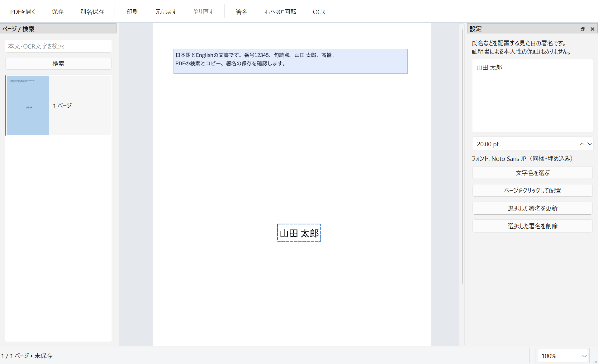

# PDF達人 / PDFTatsujin

日本語の署名テキストと日英OCRを、同じPDFに適用するOSSデスクトップアプリ。自作コードは[MIT](LICENSE)です。[構成](docs/ARCHITECTURE.md) · [開発手順](docs/DEVELOPMENT.md) · [貢献方法](CONTRIBUTING.md) · [M1の結果](M1_REPORT.md)

Windows 11 x64でビルド・起動・PDF入出力を試験した、署名テキストと日英OCRのデスクトップアプリです。M1の重要な環境試験が未実行のため、**M1全体の合格・一般配布の判断は保留**です。結果と未実行項目は `M1_REPORT.md` を参照してください。M2以降には進んでいません。

## 起動

GitHubにはソースと合成試験入力を登録しています。正式なバイナリリリースはまだありません。[開発手順](docs/DEVELOPMENT.md)でビルド・パッケージ化した後、`dist/PDFTatsujin-M1/PDFTatsujin.exe` を開いてください。配布用ZIPを使う場合は、全体を展開し、その中の `PDFTatsujin-M1/PDFTatsujin.exe` を開きます。DLL・assets・plugins・licensesを含むフォルダ一式が必要です。通常利用にPython・Tesseractの別途インストールは不要です。

1. 「PDFを開く」でPDFを選ぶか、単一PDFをウィンドウへドロップします。
2. 「署名」で右側に日本語を入力し、「ページをクリックして配置」を選びます。枠をドラッグして移動できます。選択した署名の文字・サイズ・色を右側で変更し、「選択した署名を更新」を押します。
3. 「元に戻す」「やり直す」で操作を戻せます。ドラッグ1回が1操作です。署名は見た目の文字であり、証明書署名ではありません。
4. 「OCR」で言語と全ページ／現在ページ／指定ページを選び、開始します。途中で中止できます。OCR中もページ移動・拡大縮小は可能です。
5. 左側で検索し、本文をドラッグ選択してCtrl+Cでコピーします。「別名保存」で通常のPDFとして保存します。本アプリで追加した署名は、保存したPDFを再度開いて選択・再編集できます。

試せる入力は `fixtures/D01.pdf`（署名）、`fixtures/D03.pdf`（日英画像PDF8ページ）、`fixtures/D05.pdf`（画像と既存文字・注釈の混在）です。すべて合成の試験文書です。

この作業環境での最新の試用版は `dist/PDFTatsujin-M1-review/PDFTatsujin.exe`、ZIPは `dist/PDFTatsujin-M1-review-windows-x64.zip` です。[最新修正と22件の回帰結果](docs/testing/M1_CORRECTIONS.md)を参照してください。

暗号化・証明書署名付き・非対応フォームの検出時は読み取り専用にします。暗号化の解除や証明書の有効性検証は行いません。保存失敗やOCR失敗時は未保存変更を保持します。



## 実装範囲と制約

同じ文書ウィンドウに中央PDF、左ページ／検索、上部操作、右設定、下部状態を配置しました。M1の署名テキスト・閲覧・検索・コピー・回転・保存・OCRを実装しています。注釈・AcroForm・リンク・しおりは既存内容の保持を検証しています。新しい注釈やフォームの全種類の作成・入力、画像署名、署名の再配置用ライブラリ、ページ結合等のM2機能は提供しません。

現在は1ページずつ表示します。連続スクロール、全ページのサムネイル先読み、検索結果ごとの移動、キーボードによる署名枠操作には未実装部分があります。UI・UXの完成版とはしていません。OCRには誤認識が残り、縦書き・段組み・低品質画像の実用精度を保証しません。

Google日本語入力での氏名・異体字・日付の変換、未確定時Esc、標準の保存ダイアログ、保存後のサイズ再編集は[Windows実画面で確認](docs/testing/NATIVE_UI.md)しました。Microsoft IME、Adobe Reader、Firefoxのネイティブ検索バー・OSクリップボード・印刷ダイアログ、実プリンター、実際の容量不足、開発環境のないWindowsで通信を無効にした試験は未実行です。自動試験の成功で代替したとは扱いません。

## 開発と試験

ソースは次のコマンドで取得できます。

```powershell
git clone --recurse-submodules https://github.com/okakanatto/PDF_Tatsujin.git
```

Windowsでの依存配置・ビルド・起動・試験は[開発手順](docs/DEVELOPMENT.md)、責務と保存・OCRの設計は[構成](docs/ARCHITECTURE.md)を参照してください。PDF4QTは固定コミットのサブモジュールです。大きなモデルやフォントはSHA-256を検証して取得し、実行時にはローカルに同梱します。

Windows上で署名・移動・Undo／Redo・再編集・日英OCR・検索・コピー・保存・取消の自動試験を実行しています。追加でNTFS権限拒否、Windows PDFプリンター、Firefoxでの検索・テキスト選択・PDF印刷を検証しました。[最新の追加検証](docs/testing/M1_FOLLOWUP.md)、[M1全体の結果](M1_REPORT.md)、[公開用整理時の回帰結果](docs/testing/OSS_PREPARATION.md)を確認してください。ヘッドレス試験・ネイティブ画面操作・未実行を区別し、GitHub Actionsのソース検査をWindows GUIの受入試験の代わりにはしません。

正解と検索語はOCR実行前に `fixtures/ground-truth.json` へ固定しました。既存結果に合わせて正解や閾値を変えません。ビルド成果物、依存本体、ローカルログはGit管理から除外します。非公開実務文書は含めません。

## 容量とライセンス

ユーザーが許可したプロジェクト上限は20,000,000,000バイトです。依存・ビルド・配布物・試験結果を含めて `measure-storage.ps1` で測ります。最終の部品別容量は `evidence/storage-breakdown.json` を参照してください。

PDF4QTはMIT、TesseractとモデルはApache-2.0、Noto Sans JPとLiberationはOFL、Qtは動的リンクのLGPL-3.0構成です。依存ごとの通知を `licenses` に、同梱するQt部品の対応ソースを `dist/third-party-sources` に置いています。自作コードはMITです。第三者部品には各ライセンスが適用されます。[配布時の扱い](docs/THIRD_PARTY.md)を参照してください。
