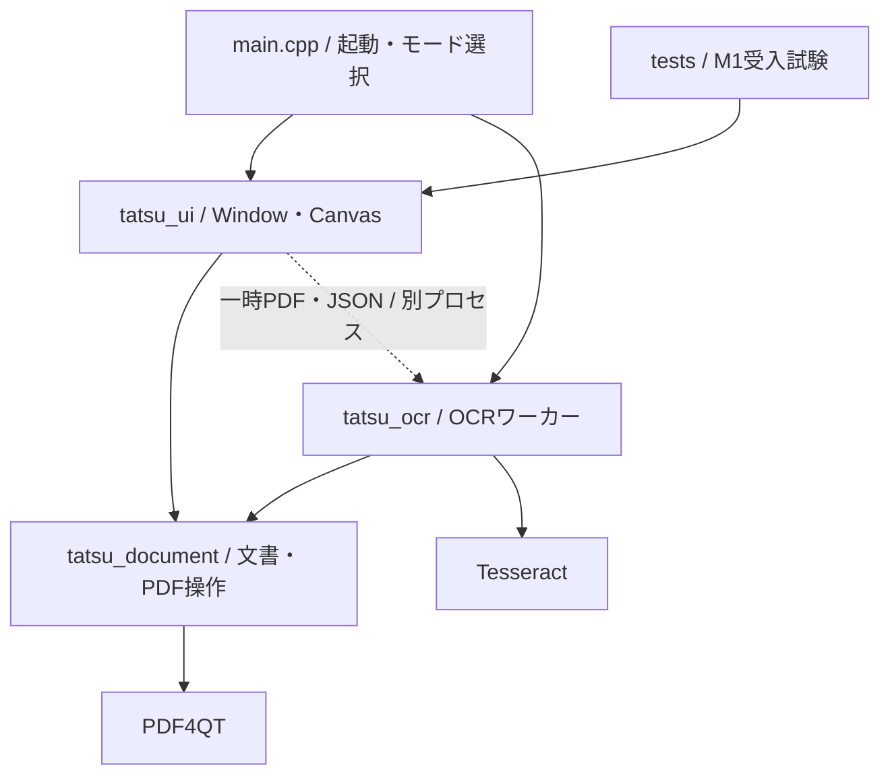

# PDF達人の構成と変更時の約束

PDF達人はPDF4QTをライブラリとして利用するQt Widgetsアプリです。署名とOCRを同じ文書に適用し、通常のPDFとして保存します。上流のビューアを改造せず、文書表示・操作画面はこのリポジトリが所有します。

## 依存の方向

M2の文書操作は `image_overlay`、`annotation_operations`、`form_fields`、`page_operations` に分けています。UIは `writing_panel`、`annotation_panel`、`form_editor`、`page_organizer` を担当し、Windowの接続は `window_writing`、`window_annotations`、`window_pages` に分けます。文書操作はQWidgetを必要とせず、同じDocumentへ候補を1操作としてcommitします。

画像はRGBと8ビットSMaskを損失なしで埋め込み、元画像がなくてもPDFの外観から取り出してサイズ変更できます。文字・日付・画像・注釈の識別情報はPDF内の `/Tatsujin` 辞書に版と種類を保存し、既存M1の種類なしメタデータも読めます。標準外観を維持し、サイドカーは不要です。署名テンプレートだけは明示操作でローカルJSONへ原子的に保存します。

フォームは正規のフィールド所有者の `/V` と、ページ上のWidgetの `/AP`・ボタンの `/AS` を同時に更新します。日本語の外観には同梱Notoを埋め込みます。編集中の下書きは未保存状態に含め、確定に失敗した際も残します。保存・OCR・文書操作の前に確定し、Tabは未選択ラジオの既存値を消しません。文字編集中のUndoは入力欄、文書上のUndoはDocumentに属します。

ページ操作はPDF4QTのアセンブラーを使用し、抽出前に残るWidgetに合わせてフォーム階層を剪定します。異なる文書間の完全修飾フォーム名衝突は結合前に拒否します。上流固定版のカタログ統合で見つかった、未接続のフォーム情報と後続の空情報による消失は `AdaptPdf4QtManipulator.cmake` でビルド領域にだけ派生修正を作ります。元ソース・派生手順のhashを固定し、サブモジュールは変更しません。

注釈はPDF標準型と外観を使います。上流のハイライト生成が省略するストリーム長は、生成候補を公開する前に補います。矩形は塗りつぶさない標準PDF命令 `re S` で外観を作り、本文を隠しません。線・矢印の移動では端点、ハイライトではQuadPointsも移動します。コメントの更新・削除は対応するPopupも同じ候補内で除去し、親のない注釈を残しません。通常保存で本文を画像へ固定化しません。

| 所有する処理 | ソース | 変更時に守ること |
|---|---|---|
| 文書状態・署名・履歴・保存の確定 | `src/document.*` | 1操作を1回のcommitにする。失敗時に原本・履歴を失わない |
| PDF読込・候補保存・ハッシュ | `src/pdf_io.cpp` | 保存候補を再読込してから置換する |
| 座標・描画・文字抽出・印刷 | `src/pdf_render.cpp` | 回転後のCropBox左上へ原点を移し、UserUnitと同じ物理倍率を両軸へ反映する。逆変換往復だけでなく、用紙四隅と独立描画の位置を検証する |
| フォント・Unicode対応 | `src/pdf_font.cpp` | 表示字形とコピー文字を両方検証する |
| PDFオブジェクト生成補助 | `src/pdf_objects.h` | 内部の小さな値生成関数。UIの状態を持たせない |
| 画像・透明度の共通埋込 | `src/image_embedding.*` | 画像署名と新規PDFで同じ画素・soft maskを使う。追加のJPEG再圧縮や間引きをしない |
| 画像からPDFの生成・入力照合 | `src/image_pdf.*` | 原画像を変更しない。ページ単位で処理し、全体の完成と入力の再照合後にだけ文書を返す |
| 作成順・設定・非同期処理 | `src/image_pdf_dialog.*`、`src/window_creation.cpp` | 所有するスレッドの完了を待つ。中止・失敗で部分文書を返さず、既存PDFとは別の未保存ウィンドウへ完成結果を表示する |
| PDFの画像描画・符号化・出力確定 | `src/image_export.*` | 物理寸法・権限を検査し、全画像の検証後に上書きしない移動で確定する。公開途中の失敗を個別に返す |
| 用紙の可視範囲・選択ページの検証 | `src/page_crop.*` | 見た目のmmからCropBoxへ変換し、全ページ検証後に1回commitする。MediaBox・本文・注釈・フォームを保持する |
| 余白入力・縮小プレビュー | `src/page_crop_dialog.*` | 描画するページは1枚だけ。所有するワーカーを待ち、古い要求を捨てる。無効入力・取消・ゼロで文書を変更しない |
| 画像出力範囲・設定・進捗 | `src/image_export_dialog.*`、`src/window_creation.cpp` | PDFスナップショットを所有するスレッドへ渡し、取消後も結果へ到達する。閲覧位置と編集Undoを変更しない |
| 連続表示・読書位置・選択・ドラッグ | `src/canvas.*` | PDF4QTの表示部品をアダプターで包む。閲覧で文書・履歴を変更しない |
| 表示範囲の準備・コンパイルキャッシュ解放 | `src/pdf_viewer_adapter.*` | DLL内部の非exportコンパイラーを同じDLL内でだけ扱う。上流ソースを改変しない |
| ページ一覧の本文・注釈描画 | `src/preview_raster.*` | 1回のコンパイルを使い、OCR・印刷の経路を変えない。独立描画との画素一致を検証する |
| 検索処理・結果モデル | `src/search_session.*` | 独立したPDFスナップショットを使い、古い世代の結果を反映しない |
| 検索入力・結果選択 | `src/search_panel.*` | IME未確定と検索開始を区別。結果追加で選択箇所を変えない |
| 選択用の文字読み込み・キャッシュ | `src/selection_text.*` | GUIでPDF解析しない。古い文書の結果を破棄し、範囲の全ページが揃う前にコピーしない |
| 宛先・しおり・ページラベルの読取 | `src/navigation.*` | 宛先を検証して値で渡す。無効参照を先頭へ代替せず、元の辞書で複合アクションを検出する |
| しおりの階層・選択 | `src/bookmarks_panel.*` | revisionごとに更新し、長いタイトルで本文幅を変えない。閲覧でPDFを変更しない |
| 閲覧位置・戻る／進むの履歴 | `src/view_state.h`、`src/view_history.*` | QWidget・PDF・編集Undoに依存しない値モデル。両方向を最大200件に制限し、新しい移動で先の履歴を破棄する |
| 標準アイコンの共有 | `src/ui_icons.*` | 同じQStyle・アプリのパレットでは同じQIconエンジンを使う。スタイルの寿命・パレット変更を照合し、文書ごとの不要な画像キャッシュキーを増やさない |
| 物理ページ入力・検証・フォーカス | `src/page_control.*` | 入力中の文字を表示更新で上書きしない。無効値を丸めず、確定要求だけWindowへ渡す |
| 操作経路・文書ウィンドウ・OCR監督 | `src/window.*` | 起動・進捗・取消と表示を担当する。異常終了では文書へ反映しない |
| OCRの入力スナップショット・完成結果の検証 | `src/ocr_job.*` | 私有領域と親ロックを一緒に所有。全結果を検証して値で返し、Documentへ直接commitしない |
| OCR解析・不可視文字層・合成 | `src/ocr.*` | 元の画像・既存文字・署名・注釈を保持する |
| OCR一時領域の所有・回収・ワーカーロック | `src/ocr_jobs.*` | 活動中の親／ワーカーを保持し、リンクを含む領域を辿らない |
| Windowsの専用一時領域 | `src/private_temp.*` | 通常はQtの私有領域。AppContainerでは利用者と現在のpackage SIDだけへ作成時に権限を付ける |
| OCRワーカーの進捗・エラー通信 | `src/worker_channels.*` | 通常はQtのパイプ。AppContainerでは私有ファイルを使い、通信権限を追加しない |
| 恒等色変換の画像展開 | `src/device_image_decode.*` | 固定したGeneric CMSのRGB／Gray8だけに適用し、元の変換との全画素一致を保つ |
| 受入試験 | `tests/selftest.*` | 正解・閾値・検索語を結果に合わせて変えない |

## 文書のトランザクション

閲覧履歴は `ViewHistory` が位置・倍率・フィット基準ページ・検索語・文書revisionを保持します。微小なレイアウト差は重複にしませんが、フィット基準と画面内の基準位置は区別します。Windowは移動前の値を渡し、戻る／進むの結果をCanvasと検索パネルへ適用します。検索の選択箇所は検索語とrevisionが一致するときだけ復元し、新しい文書を開くと両方向を消去します。DocumentのUndoには閲覧を記録しません。

手のひら操作はCanvasの画面座標差分を既存スクロールへ渡す。明示選択・Space一時切替・進行中ドラッグを区別し、フォーカス喪失や文書更新では一時状態を破棄する。Windowはツールボタンと状態表示を同期する。閲覧移動のための文書commit・解析ワーカー・タイマーは追加しない。[操作と取消の設計](design/HAND_TOOL.md)。

`Document`はPDFスナップショット、履歴位置、保存済み位置、単調増加するrevisionを保持します。署名の配置・移動・回転・OCR結果の取り込みは、完成した文書を1回だけcommitします。Undo後に編集すると、その先のRedo履歴を破棄します。

保存は宛先と同じディレクトリの一時領域に候補を書き、再読込とページ数確認、宛先ハッシュの再確認を行います。最後にWindowsの置換APIで確定し、その後で保存済み位置を更新します。通常保存でページ全体を画像化しません。暗号化・証明書署名・非対応フォームを検出した文書は読み取り専用です。

## OCRの境界

同じexeの`--ocr-worker`モードを別プロセスとして起動します。入力は開始時のPDFスナップショットと設定JSON、出力は最終PDF・結果JSON、標準出力はページ進捗です。全対象ページが成功するまで最終PDFを出しません。UIは正常終了、ページ数、開始時revisionを確認して1回だけ取り込みます。取消・異常終了・タイムアウトでは開始前の編集を保持します。

`OcrJob`は要求言語・ページ順・revision・ページ数を開始時に保持し、一時領域・親ロック・入力・設定を一つの所有単位にします。準備に失敗した場合はローカルの所有者を破棄し、Windowをbusyにしません。親ロック取得後に所有マーカーを作り、別起動の回収が準備中の領域を孤立領域と取り違えないようにします。破棄ではロックを先に解放し、その後で領域を除去します。

完成結果は正常なJSONオブジェクト・要求言語・対象ページの件数と順番・整数のページ番号・既知の完了状態・PDFページ数・現在revisionを検証してから `OcrJobResult` として返します。欠落・破損・途中報告・対象の不一致を「追加文字なし」と表示しません。`changed()` は検証済みの結果にだけ使い、取り込みと1回のUndo単位はWindowとDocumentの境界に残します。これはOCR認識設定・正解・精度閾値の変更ではありません。

Windowのプロセス通知は起動したQProcessの同一性を確認します。完了したジョブをローカルへ移し、結果ダイアログの入れ子のイベントループから後続のジョブを片付けないようにします。Window破棄時はワーカー・タイマー・ドックの通知を先に切断し、破棄中の検索パネルやCanvasを終了通知で更新しません。

画像のあるページを300dpiで描画し、既存の可視文字を認識対象から除外します。認識した文字列をNoto Sans JPで埋め込み、不可視のForm XObjectとして既存Contentsに追加します。既存の不可視文字を検出したページは保持します。OCRモデルはローカルで使用し、文書・署名をオンラインサービスへ送る処理はありません。

RC4では、Windows AppContainerで通信権限をゼロにした実行経路も試験します。Qtのownerだけを許す一時フォルダではpackage SIDの照合に失敗するため、`PrivateTemporaryDirectory`はこの実行形態に限り、利用者SIDと現在のpackage SIDの2件だけを持つ保護DACLでディレクトリを作ります。全アプリケーションへ権限を広げません。通常の実行では元のQTemporaryDirを使います。専用領域の回収はリンク・ジャンクションを検出した場合に中止します。

Qt 6.9.3のQProcessが使う通常の名前付きパイプはAppContainerで作成できません。`WorkerChannels`はこの場合だけ、同じ私有領域にstdin・進捗・エラーのファイルを用意し、100msのタイマーで進捗を読みます。1回の読取は64KiB、表示するエラーは500bytesに制限します。正常終了・revision・完成PDFを検査して取り込む境界は共通です。通信準備が成功してからbusyに入り、起動失敗時には無効なパイプを読まず、取消と未保存変更の保持へ戻します。通常の実行経路とQtのDLLは変更しません。[MicrosoftのIPC条件](https://learn.microsoft.com/en-us/windows/apps/develop/communication/interprocess-communication)、[固定QtのQProcess実装](https://github.com/qt/qtbase/blob/v6.9.3/src/corelib/io/qprocess_win.cpp)。

## 回帰しやすい箇所

標準アイコンは文書ウィンドウごとに作り直さず共有します。左の閲覧履歴と集中表示のボタンはQActionからアイコンを継承し、個別の再生成を避けます。QStyleはQPointerで追跡し、パレットのcacheKeyも照合するため、別のスタイル・パレットで古い選択を再利用しません。画像の解像度・キャッシュ上限・PDF表示品質を下げる変更ではありません。[診断方法](design/MEMORY_DIAGNOSTICS.md)は製品の処理と分離しています。

RC3の `device_image_decode` はCore DLL内で呼び出します。DeviceRGB／DeviceGrayとGeneric CMSの実型、8ビット、マスクなし、恒等Decode、入力長・strideを確認してRGB888へ展開します。その他の条件は上流の変換に戻します。`AdaptPdf4QtColorSpace.cmake` は色空間とCMSの固定ソースhashを検査し、ビルド領域だけの派生ソースへ呼出しを追加します。依存更新時はCMSの恒等性と例外条件を再確認してください。画素・解像度を減らす最適化ではありません。

`ocr_jobs` の回収は指定temp直下のアプリ名・所有マーカーが一致する領域だけです。親の `job.lock` とワーカーの `worker.lock` を両方取得できない限り保持します。ワーカーは自身の処理中にロックを所有し、親が消えても活動中の領域を回収しません。トップと子のシンボリックリンク／NTFSジャンクションを検出した場合は領域全体を保持します。残ったリンク先を辿って削除しません。RC4では実際の親プロセス終了・活動中ワーカーの保持・終了後の回収を試験しました。全終了タイミングと長期放置は未評価です。

- PDF4QTのStamp生成は既定のスタンプに合わせてRectを変えるため、署名生成後に要求したRectを明示します。
- `/Contents`内のストリームは間接オブジェクトとして保持します。PDF4QTで表示できても、直接ストリームを配列に入れると外部ビューアで壊れます。
- Qtのフォントサブセット生成では同じ字形のUnicode別名が選ばれることがあります。実際に入力された文字と字形の対応だけを補正します。一般的な文字正規化で正解を変えません。
- 座標はCropBox、回転、UserUnitを含めて変換します。OCRの線形位置合わせと、Canvasの表示変換を混同しません。
- 署名ドラッグ中は設定パネルの開閉で文書領域を変更せず、マウスの解放後に設定を開きます。
- 署名の選択はPDFオブジェクトの参照で引き継ぎます。署名の更新で注釈の配列順が変わっても、同じ添字に移った別の署名を選びません。新規配置・更新の返り値で対象を明示します。
- 画面更新・Undo・倍率変更でドラッグの前提が変わるときは、途中の操作を破棄します。その後のマウス解放で移動をcommitしません。配置開始時は文書へフォーカスを移し、Escの取消と状態表示を揃えます。
- PDF読込でパスワードを要求された場合だけ`PdfPasswordRequired`を返し、UIが入力を求めます。ファイル不存在や破損を認証エラーとして扱いません。読込失敗時には現在の文書・未保存変更を保持します。
- 注釈の描画は閲覧と印刷の用途を渡し、PDFのPrint／NoViewフラグをそれぞれ尊重します。印刷範囲は物理ページ番号です。
- OCRの日本語分かち書きに不要な空白を増やさない設定を固定しています。抽出後に都合のよい文字を削る処理で精度を合わせません。

## ページ一覧と文字選択

`PagePreviews`はページ一覧の描画・要求・画像キャッシュを所有し、Windowの画面更新から同期のPDF縮小描画を外します。低優先度の専用ワーカーでQImageを作り、同じ文書revisionとDPRの結果だけを受け付けます。固定高の行から二分探索で見える範囲を求め、全ページをスクロールごとに解析しません。画像部分の8MiBのキャッシュから除いた行は画像参照も外します。極端なDPRで表示中の行だけでも上限を超えた場合は、再要求まで未描画の外形へ戻し、同じ要求内で描画と破棄を繰り返しません。[設計](design/PAGE_PREVIEWS.md)。

`SelectionTextCache`の解析ワーカーは読み順・字形・書記素・単語の境界索引を作ります。Canvasはこの不変データからポインターの字形判定と文字／単語範囲を解決します。全文のUnicode境界をホバーのたびに計算しません。本文のホバーイベントはCanvasが所有し、上流の既定手のひらツールへ流してカーソルを上書きさせません。ダブルクリックの最初のクリックが署名やリンクだった場合は、パネル変更／ページ移動後の2回目を本文選択へ変えません。[操作仕様](design/TEXT_SELECTION.md)。

Windowは初期ページ位置の予約を通常の読書アンカーと区別します。読込直後のパネル変更は予約を次の配置処理へ引き継ぎ、明示的なページ・検索・しおり・履歴移動は予約を取り消します。パネル開閉で初期位置の予約を失って空白部分へ移動する競合を、実装前の失敗試験と修正後の4条件で検証します。

## 現在の設計上の制約

M1では`Document`の状態とウィジェットへの参照の一部を公開し、同一アプリの受入試験から操作しています。`Window`には設定パネル構築とOCRプロセスのUI監督が残っています。一時領域の所有と結果の検証は`OcrJob`へ分離しています。大規模文書での編集履歴メモリ、OCRの縦書き読み順は未解決です。連続表示・非同期検索・表示履歴・ページをまたぐ選択は実装しましたが、文字カーソルの選択や複雑な段組みの改善等は残っています。

`TATSU_ENABLE_SELFTEST=OFF`で試験エントリーポイントとQtTest依存を外せます。M1の検証用ビルドではONを使います。M2の機能追加を構造整理に混ぜない方針です。

## 連続ビューアの境界

[ビューア要件・設計](design/VIEWER_UX.md)のうち、連続表示とPDF点を基準にした読書位置の保持を実装しました。`Canvas::Impl`がPDF4QTの`PDFWidget`と非同期コンパイラーを包み、Windowは部品の詳細へ依存しません。上流のソースは改変していません。[実行結果と未実装範囲](testing/M1_VIEWER.md)を分けて記録します。

表示用には不変のPDFスナップショットを持ちます。PDF4QTの既定レイアウトがMediaBoxを使い、物理寸法へUserUnitを反映しないため、表示用スナップショットだけMediaBoxをCropBoxへ合わせ、CropBox・回転・UserUnitから連続配置を構築します。正本のDocument、通常保存、OCR入力、Undo履歴を変更する処理ではありません。上流のコンパイラーを停止してからスナップショットを解放し、CMSとフォントキャッシュは描画側より長く保持します。

読書位置はページ番号・PDF上の点・ビューポート内の比率です。ズーム、右設定の開閉、リサイズでこの点を復元し、非同期のリサイズ通知が後から行われた明示操作を上書きしないよう世代を区別します。スクロール中は混在サイズでも自動で倍率を変えません。明示的なページ移動では対象の横位置も見える範囲へ戻します。

QPainterによる実倍率の描画と上流のコンパイル済みページキャッシュを使います。設定上限はページ256MiB、共有サムネイル32MiB、通常／インスタンスフォント各128件です。PDF本体、画像展開、履歴を含むプロセス全体の上限ではありません。長時間スクロールのフレーム時間・メモリ増加は未計測です。印刷・OCRの描画経路は既存の`pdf_render.cpp`を維持します。

独自の連続レイアウトでは上流の標準先読みが働かないため、`pdf_viewer_adapter`をCMakeでPDF4QTのWidgets DLLへ追加します。アダプターの実装は自作ソースで、サブモジュールは固定したままです。Canvasは移動方向と表示ページを値で渡し、移動・描画通知の30ms後に表示範囲と前後1ページ以外を解放します。表示が揃った後だけ移動方向の隣接1ページを要求します。表示内容の推定が64MiBを超える場合は先読みを行わず、元の256MiBキャッシュを使います。これは投機処理を避ける条件であり、ページを拒否・縮小する上限ではありません。UIとDLLは同じ配布物の組を使用します。

`preview_raster`は本文を1回コンパイルして描き、同じ命令と既存注釈を縮小画像へ描きます。低優先度のPagePreviewsワーカー、世代検証、8MiBのキャッシュは維持します。本文・注釈を二度処理する`renderPage`からの変更はページ一覧だけに限定し、既存の印刷・OCR・PDF保存へ波及させません。[多ページ測定の設計](design/READING_PERFORMANCE.md)では同じUIの測定と実ディスプレイの評価を区別します。

初期描画には、ワーカーが待機を始める前の通知を失う場合があった。`AdaptPdf4QtCompiler.cmake`は元ソースと自身のhashを固定し、ビルド領域にだけ派生した1ファイルを作る。待機前に未処理キューを確認し、停止通知も同じmutexと同期させる。判定済みのタスクだけでキューが残った場合は再び待機するため、GUIによる完了処理を妨げる空回りを起こさない。モデルや描画品質の変更ではない。開始を遅らせる検証用マクロは通常構成では定義せず、`package.ps1`は検証構成の配布を拒否する。

## 検索と表示履歴の境界

`SearchSession`はQAbstractListModelとして結果を公開し、低優先度のQThread一つと置換待ち要求一つを管理します。要求はPDFスナップショット・検索語・現在ページ・世代番号で構成します。ページ単位で独立した文字レイアウトを作り、現在ページから先に調べ、結果は文書順へ挿入します。文字レイアウトは各ページの処理後に解放し、全文索引を常駐させません。GUIが受け取る抜粋・PDF座標は値で渡し、世代が一致する結果だけを反映します。検索語変更、別PDF、OCR・Undo等によるrevision変更で古い要求を取消します。

`SearchPanel`はIME確定後150msの入力待ち、進行・0件・解析失敗の区別、結果選択、次／前を担当します。ページ内の一致IDを保つので、前のページの結果が後から挿入されても選択は飛びません。入力だけでは本文を移動せず、Enter・F3・結果選択で移動します。Canvasは既に計算された矩形だけを描き、paintEventで検索しません。矩形はCropBoxと交差する範囲を使い、完全に切り抜かれた文字を一致として公開しません。

Windowの表示履歴はViewState（PDF点・画面内比率・倍率・幅／全体合わせ・検索選択）と検索語・revisionを保持します。明示的なページ／検索ジャンプで登録し、戻る側は最大200件、新しいジャンプで進む側を破棄します。スクロールの各刻みを記録せず、DocumentのUndo・dirty・保存には触れません。同じ検索語とrevisionの場合だけ一致選択を復元します。履歴・検索語はプロセス内に限定し、永続保存しません。

現時点の検索はflow内の大文字小文字を区別しない文字列一致です。改行や段組みを越えた正規化検索ではありません。結果件数にはまだ固定上限がなく、多数一致時のメモリ上限は未保証です。取消はページ／flow／一致の境界で確認します。終了時には処理中の1ページの文字レイアウトを待つため、極端に複雑なPDFでの終了待ち時間も未保証です。[実行結果](testing/M1_SEARCH.md)を性能保証と区別します。

## 本文選択の境界

`SelectionTextCache`は一つのワーカースレッドで、表示／選択に必要なページだけ文字レイアウトを作ります。読み順はPDF4QTのflowに従い、CropBoxで字形矩形を切り抜いた不変のSelectionPage（文字・矩形・行）をGUIへ渡します。レイアウト自体は解放します。世代で文書・revisionの変更を識別し、処理中の古い1ページを終えてもその結果は反映しません。終了時は処理中の1ページを待ちます。

通常のキャッシュ目安は16MiBで、不要なページから使用順に解放します。表示／選択中のページは途中のコピーや描画との不一致を避けるため保持し、明示的な大量選択ではこの目安を超えます。プロセス全体のメモリ上限ではありません。起動時の全ページ解析はしません。

Canvasの範囲は始点のページ・文字境界と終点で管理します。まず近い行、次に文字境界を選び、Unicodeの書記素境界に合わせます。空白がPDFの字形として存在しない場合も、前後の字形間に境界区間を与え、単語末尾で余分な空白を選ばないようにします。ハイライトとコピーは同じ索引範囲を使い、改行はLF、非空ページ間は空行1行です。水平・垂直の自動スクロール後は最新のページ変換で終点を計算します。

範囲内に読み込み待ちや解析失敗があればコピーを無効にし、以前のクリップボードは保持します。完了後に自動コピーせず、利用者のCtrl+Cまたはメニュー操作で渡します。閲覧の選択はDocumentのdirty・Undo・保存・Windowの表示履歴には入りません。[選択設計](design/TEXT_SELECTION.md)と[実行結果](testing/M1_SELECTION.md)を参照してください。

## 文書内の参照の境界

Navigationは文書の不変スナップショットから、しおりの親子関係・タイトル・宛先とページラベルを値として取り出します。固定版PDF4QTのアクション解析は`/Next`を保持しないため、アプリが元の辞書を検査し、複合アクションを未対応と表示します。URIの文字列とPageLabelsの3フィールドは、Windows DLLが公開するAPIだけを使って読みます。上流ソースは変更しません。

Canvasは表示中のリンクのRect／QuadPointsを既存のPDF座標変換で判定します。ドラッグ・署名・配置・手のひらを短いリンククリックより優先し、表示変換・文書更新・取消で保留クリックを破棄します。Windowが移動前のViewStateを履歴へ登録し、同じ位置への繰返しや無効な宛先で履歴を増やしません。編集commitや描画・OCRの新しいエンジンを追加しません。[操作設計](design/DOCUMENT_NAVIGATION.md)。

## ページ入力と集中表示の境界

PageControlは表示中の物理ページと総数、利用者の編集中の値、IME未確定状態を区別します。確定した有効な番号だけを要求として渡し、Windowが既存の表示履歴と移動へ接続します。PageLabelsは別の表示で扱い、物理番号へ黙って読み替えません。

Windowは集中表示と右設定の復元状態を持ちます。狭い画面で右設定を開くとページ／しおりを畳み、検索タブは残します。配置変更前のPDFアンカーを予約復元し、明示移動・文書revision・世代番号で古い復元を破棄します。Qtの配置処理中に強制再配置しません。保存・Undo／RedoのQActionはWindowにも登録し、隠れたツールバーへ依存させません。入力欄のShortcutOverrideを優先し、CanvasのEscは進行中の操作を先に解除します。[操作設計](design/READING_CONTROLS.md)と[最終実行結果](testing/M1_READING.md)。

## RC6の資材とWindowsパス

`windows_path`はUnicode Win32ファイルAPI向けの拡張パスを作り、保存置換とAppContainerの専用一時領域だけで使用します。Document内のパスはQtの通常表記を保持します。専用DACL・所有領域の回収範囲は維持します。

OCRはTesseractのFileReaderコールバックで固定したbundledモデルをQtから読みます。要求言語の実ロードを確認してから認識へ進み、部分的な言語のロード成功を全成功と扱いません。同梱NotoはQtで読んだバイト列を登録し、プラットフォームのファイル名処理に依存しません。ワーカー・試験・計測の起動失敗はstderrと失敗終了へ返し、対話モードのエラー表示と区別します。[実行結果](../M3_RC6_REPORT.md)。

## ページ装飾の境界

`page_decoration`はヘッダー／フッターと透かしを共通のPDF操作として扱います。不変スナップショットから全対象の文字・配置を検証し、標準Stamp注釈の外観と設定を持つ候補PDFを返します。回転後の物理座標からPDF座標へ戻す変換を使い、ページ寸法や本文を変更しません。既存のフォント選択・埋め込み・Unicode補正を再利用します。独自設定は`TatsujinDecoration`へバージョン付きで保存し、署名の`Tatsujin`識別とは分離します。設定の不整合や未知の版は変更を拒否します。

`page_decoration_dialog`は対象、設定、プレビュー要求の世代、所有ワーカーと取消だけを管理します。プレビューは1ページ分を描画し、変更要求を最新設定へ集約します。適用と削除は完成した候補だけを返し、`window_formatting`が入力確定と文書revisionを照合して1回commitします。グループの設定変更はそのグループを置換し、他の注釈・グループを削除しません。[操作・検証条件](design/PAGE_DECORATIONS.md)。

## しおり編集の境界

文書内宛先を読む`navigation`はウィンドウに依存しないため、文書ライブラリに置きます。`bookmark_edit`は既存Outlinesの親子・兄弟参照を完全に検査してから、変更候補の順序と階層をPDF標準の参照へ構成します。元の項目の辞書を保持し、名前・階層以外の位置・倍率・未知の属性を捨てません。利用者が移動先を変更した場合だけ旧アクションを除いて明示的なFit宛先へ置換します。Countは各子の展開状態を含む可視数で再計算します。

`bookmark_edit_dialog`の編集一覧は文書スナップショットと分離します。追加・削除・移動は候補の木だけに作用し、適用は所有ワーカーで検査して候補PDFを返します。`window_bookmarks`が入力確定とrevisionを照合して1回commitし、閲覧パネルが新しいしおりへ更新します。未知のアクションは編集処理で実行しません。[操作・検証条件](design/BOOKMARK_EDITING.md)。

## リンク編集の境界

`link_edit`は標準Link注釈をページと元の配列位置で識別し、既存辞書の属性と他の注釈の順序を保持します。本文・フォーム・OCRを変更しません。回転後の実寸ptからPDF座標へ戻し、範囲変更時はQuadPointsも同じ比率で変換します。既存宛先の保持と明示的な置換を分け、URLやアクションを実行しません。不正な配列・重複・制限超過は部分編集を拒否します。

`link_preview`は表示用座標と矩形のジェスチャーだけを扱います。`link_edit_dialog`が候補一覧、非同期ページ描画、入力と所有ワーカーを管理し、成功した候補だけを返します。`window_links`が入力確定とrevisionを照合して1回commitします。設定欄の表示丸めを元のPDF座標へ書き戻さず、利用者が変更した値だけを反映します。[操作・検証条件](design/LINK_EDITING.md)。

## 容量最適化の境界

`pdf_optimization`は到達不能なデータを先に除き、単独Flateを取消可能な上限付きzlib処理で再圧縮します。共有候補はハッシュで選び、辞書・内容の完全一致を確認した適格ストリームだけを共有します。項目辞書と構造タグ・外部データは共有しません。フォント等の共有によって親の外観が共有可能になる連鎖を固定点まで整理し、同じデータを繰り返し展開しません。元のPDF版と文書の意味を保持します。

`pdf_optimization_dialog`は所有ワーカーで候補と通常保存サイズを作り、小さくなる時だけ明示適用を受け付けます。取消・失敗では候補を公開せず、`window_optimization`が入力確定・revision照合後に1回commitします。ファイル書込みは既存の安全な保存経路へ残します。[操作・検証条件](design/PDF_OPTIMIZATION.md)。

## 暗号化コピー

`encrypted_pdf`は既存文書の不変スナップショットからStandard AES-256 R6のコピーを作ります。Unicode 3.2のSASLprepとUTF-8の長さ、SDK内の準備処理を`pdf_security_adapter`で照合します。文書のオブジェクトとInfoを保持し、版・暗号化辞書・必要なIDだけを設定します。CMakeの固定ソースアダプターは暗号用の鍵・salt・IVをQtのsystem生成器へ接続します。

`encryption_dialog`は所有ワーカー、マスクした入力、確認・許可・新しい保存先を扱います。`SaveCandidate`へ暗号化して両パスワードの認証役割とメタデータ保護を検証し、Windowsで上書きしない移動により確定します。取消・失敗では候補を破棄し、`window_encryption`は元文書をcommitしません。既存の暗号化／証明書署名付きPDFの読取専用を維持します。[操作・検証条件](design/ENCRYPTED_PDF_EXPORT.md)。

## フォーム入力データ

`FormField`は表示ラベルと完全修飾名を分けます。`form_data`は標準AcroFormの対応項目を共有フィールド参照でまとめ、純粋なXFDF値の符号化・読込、全項目を検証する一括候補、既存を上書きしない出力を扱います。XMLの参照情報を実行せず、DTD・不正XML・重複・上限を拒否します。CRは文字参照で保持します。私的な候補の履歴は1つのスナップショットへ畳み、項目数に比例するUndo履歴を持ちません。

`form_data_dialog`は所有ワーカー・変更一覧・明示適用・取消・入力ファイル変更検出を扱います。`window_form_data`がrevisionを照合して一度commitします。対応項目の判定は文書revisionごとにキャッシュし、スクロールやズームのたびにフォーム全体を再解析しません。データ出力はPDFの保存先とUndoを切り替えません。[操作・検証条件](design/FORM_DATA.md)。

## 所有者が許可した編集用コピー

`unprotected_pdf`は元の暗号化ハンドラーを複製し、所有者だけを再認証します。復号済みオブジェクトを保持したままEncryptキーと到達不能な暗号化辞書を除き、Noneハンドラーへ切り替えます。証明書署名・非対応フォーム・残るCryptフィルターは拒否します。原本のオブジェクトと認証状態は変えません。専用候補をパスワードなしで再読込し、上書きしない移動で確定して保存ハッシュを返します。

`decryption_dialog`は未選択の解除指定、パスワード、保存先と所有ワーカーを管理します。`window_encryption`は保存ハッシュを照合し、コピーを新しい文書ウィンドウで開きます。元の読取専用文書をcommitせず、通常の保存・開く経路の保護を維持します。[操作・試験条件](design/UNPROTECTED_PDF_COPY.md)。
