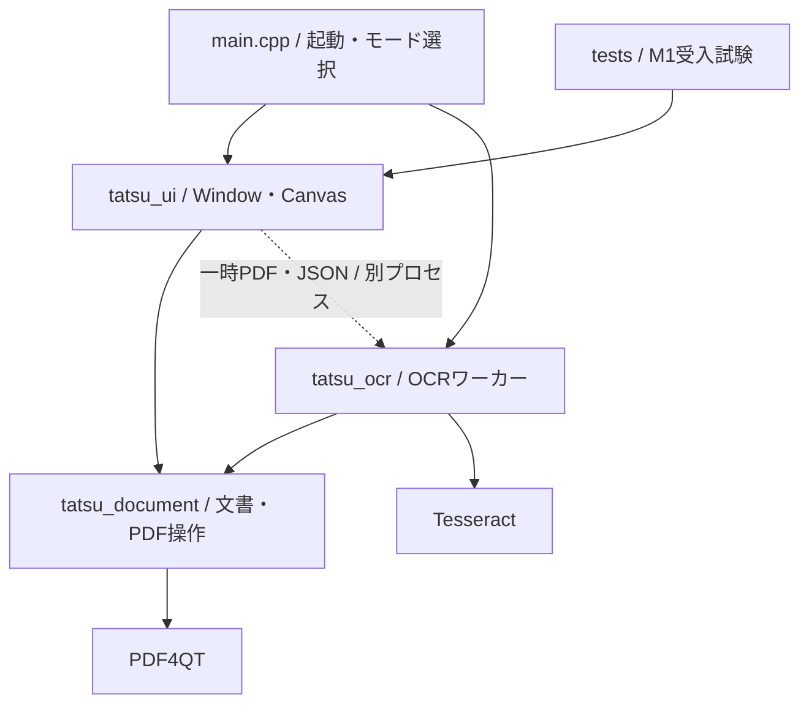

# M1の構成と変更時の約束

PDF達人はPDF4QTをライブラリとして利用するQt Widgetsアプリです。署名とOCRを同じ文書に適用し、通常のPDFとして保存します。上流のビューアを改造せず、文書表示・操作画面はこのリポジトリが所有します。

## 依存の方向

| 所有する処理 | ソース | 変更時に守ること |
|---|---|---|
| 文書状態・署名・履歴・保存の確定 | `src/document.*` | 1操作を1回のcommitにする。失敗時に原本・履歴を失わない |
| PDF読込・候補保存・ハッシュ | `src/pdf_io.cpp` | 保存候補を再読込してから置換する |
| 座標・描画・文字抽出・印刷 | `src/pdf_render.cpp` | PDF座標と画面座標の変換を一箇所に集める |
| フォント・Unicode対応 | `src/pdf_font.cpp` | 表示字形とコピー文字を両方検証する |
| PDFオブジェクト生成補助 | `src/pdf_objects.h` | 内部の小さな値生成関数。UIの状態を持たせない |
| 連続表示・読書位置・選択・ドラッグ | `src/canvas.*` | PDF4QTの表示部品をアダプターで包む。閲覧で文書・履歴を変更しない |
| 検索処理・結果モデル | `src/search_session.*` | 独立したPDFスナップショットを使い、古い世代の結果を反映しない |
| 検索入力・結果選択 | `src/search_panel.*` | IME未確定と検索開始を区別。結果追加で選択箇所を変えない |
| 選択用の文字読み込み・キャッシュ | `src/selection_text.*` | GUIでPDF解析しない。古い文書の結果を破棄し、範囲の全ページが揃う前にコピーしない |
| 宛先・しおり・ページラベルの読取 | `src/navigation.*` | 宛先を検証して値で渡す。無効参照を先頭へ代替せず、元の辞書で複合アクションを検出する |
| しおりの階層・選択 | `src/bookmarks_panel.*` | revisionごとに更新し、長いタイトルで本文幅を変えない。閲覧でPDFを変更しない |
| 物理ページ入力・検証・フォーカス | `src/page_control.*` | 入力中の文字を表示更新で上書きしない。無効値を丸めず、確定要求だけWindowへ渡す |
| 操作経路・文書ウィンドウ・OCR監督 | `src/window.*` | ワーカーの異常終了と取消を同じ未反映状態へ戻す |
| OCR解析・不可視文字層・合成 | `src/ocr.*` | 元の画像・既存文字・署名・注釈を保持する |
| 受入試験 | `tests/selftest.*` | 正解・閾値・検索語を結果に合わせて変えない |

## 文書のトランザクション

手のひら操作はCanvasの画面座標差分を既存スクロールへ渡す。明示選択・Space一時切替・進行中ドラッグを区別し、フォーカス喪失や文書更新では一時状態を破棄する。Windowはツールボタンと状態表示を同期する。閲覧移動のための文書commit・解析ワーカー・タイマーは追加しない。[操作と取消の設計](design/HAND_TOOL.md)。

`Document`はPDFスナップショット、履歴位置、保存済み位置、単調増加するrevisionを保持します。署名の配置・移動・回転・OCR結果の取り込みは、完成した文書を1回だけcommitします。Undo後に編集すると、その先のRedo履歴を破棄します。

保存は宛先と同じディレクトリの一時領域に候補を書き、再読込とページ数確認、宛先ハッシュの再確認を行います。最後にWindowsの置換APIで確定し、その後で保存済み位置を更新します。通常保存でページ全体を画像化しません。暗号化・証明書署名・非対応フォームを検出した文書は読み取り専用です。

## OCRの境界

同じexeの`--ocr-worker`モードを別プロセスとして起動します。入力は開始時のPDFスナップショットと設定JSON、出力は最終PDF・結果JSON、標準出力はページ進捗です。全対象ページが成功するまで最終PDFを出しません。UIは正常終了、ページ数、開始時revisionを確認して1回だけ取り込みます。取消・異常終了・タイムアウトでは開始前の編集を保持します。

画像のあるページを300dpiで描画し、既存の可視文字を認識対象から除外します。認識した文字列をNoto Sans JPで埋め込み、不可視のForm XObjectとして既存Contentsに追加します。既存の不可視文字を検出したページは保持します。OCRモデルはローカルで使用し、文書・署名をオンラインサービスへ送る処理はありません。

## 回帰しやすい箇所

- PDF4QTのStamp生成は既定のスタンプに合わせてRectを変えるため、署名生成後に要求したRectを明示します。
- `/Contents`内のストリームは間接オブジェクトとして保持します。PDF4QTで表示できても、直接ストリームを配列に入れると外部ビューアで壊れます。
- Qtのフォントサブセット生成では同じ字形のUnicode別名が選ばれることがあります。実際に入力された文字と字形の対応だけを補正します。一般的な文字正規化で正解を変えません。
- 座標はCropBox、回転、UserUnitを含めて変換します。OCRの線形位置合わせと、Canvasの表示変換を混同しません。
- 署名ドラッグ中は設定パネルの開閉で文書領域を変更せず、マウスの解放後に設定を開きます。
- 署名の選択はPDFオブジェクトの参照で引き継ぎます。署名の更新で注釈の配列順が変わっても、同じ添字に移った別の署名を選びません。新規配置・更新の返り値で対象を明示します。
- 画面更新・Undo・倍率変更でドラッグの前提が変わるときは、途中の操作を破棄します。その後のマウス解放で移動をcommitしません。配置開始時は文書へフォーカスを移し、Escの取消と状態表示を揃えます。
- PDF読込でパスワードを要求された場合だけ`PdfPasswordRequired`を返し、UIが入力を求めます。ファイル不存在や破損を認証エラーとして扱いません。読込失敗時には現在の文書・未保存変更を保持します。
- 注釈の描画は閲覧と印刷の用途を渡し、PDFのPrint／NoViewフラグをそれぞれ尊重します。印刷範囲は物理ページ番号です。
- OCRの日本語分かち書きに不要な空白を増やさない設定を固定しています。抽出後に都合のよい文字を削る処理で精度を合わせません。

## ページ一覧と文字選択

`PagePreviews`はページ一覧の描画・要求・画像キャッシュを所有し、Windowの画面更新から同期のPDF縮小描画を外します。低優先度の専用ワーカーでQImageを作り、同じ文書revisionとDPRの結果だけを受け付けます。固定高の行から二分探索で見える範囲を求め、全ページをスクロールごとに解析しません。画像部分の8MiBのキャッシュから除いた行は画像参照も外します。極端なDPRで表示中の行だけでも上限を超えた場合は、再要求まで未描画の外形へ戻し、同じ要求内で描画と破棄を繰り返しません。[設計](design/PAGE_PREVIEWS.md)。

`SelectionTextCache`の解析ワーカーは読み順・字形・書記素・単語の境界索引を作ります。Canvasはこの不変データからポインターの字形判定と文字／単語範囲を解決します。全文のUnicode境界をホバーのたびに計算しません。本文のホバーイベントはCanvasが所有し、上流の既定手のひらツールへ流してカーソルを上書きさせません。ダブルクリックの最初のクリックが署名やリンクだった場合は、パネル変更／ページ移動後の2回目を本文選択へ変えません。[操作仕様](design/TEXT_SELECTION.md)。

Windowは初期ページ位置の予約を通常の読書アンカーと区別します。読込直後のパネル変更は予約を次の配置処理へ引き継ぎ、明示的なページ・検索・しおり・履歴移動は予約を取り消します。パネル開閉で初期位置の予約を失って空白部分へ移動する競合を、実装前の失敗試験と修正後の4条件で検証します。

## 現在の設計上の制約

M1では`Document`の状態とウィジェットへの参照の一部を公開し、同一アプリの受入試験から操作しています。`Window`には設定パネル構築とOCRジョブ監督が残っています。大規模文書での編集履歴メモリ、OCRの縦書き読み順は未解決です。連続表示・非同期検索・表示履歴・ページをまたぐ選択は実装しましたが、文字カーソルの選択や複雑な段組みの改善等は残っています。

`TATSU_ENABLE_SELFTEST=OFF`で試験エントリーポイントとQtTest依存を外せます。M1の検証用ビルドではONを使います。M2の機能追加を構造整理に混ぜない方針です。

## 連続ビューアの境界

[ビューア要件・設計](design/VIEWER_UX.md)のうち、連続表示とPDF点を基準にした読書位置の保持を実装しました。`Canvas::Impl`がPDF4QTの`PDFWidget`と非同期コンパイラーを包み、Windowは部品の詳細へ依存しません。上流のソースは改変していません。[実行結果と未実装範囲](testing/M1_VIEWER.md)を分けて記録します。

表示用には不変のPDFスナップショットを持ちます。PDF4QTの既定レイアウトがMediaBoxを使い、物理寸法へUserUnitを反映しないため、表示用スナップショットだけMediaBoxをCropBoxへ合わせ、CropBox・回転・UserUnitから連続配置を構築します。正本のDocument、通常保存、OCR入力、Undo履歴を変更する処理ではありません。上流のコンパイラーを停止してからスナップショットを解放し、CMSとフォントキャッシュは描画側より長く保持します。

読書位置はページ番号・PDF上の点・ビューポート内の比率です。ズーム、右設定の開閉、リサイズでこの点を復元し、非同期のリサイズ通知が後から行われた明示操作を上書きしないよう世代を区別します。スクロール中は混在サイズでも自動で倍率を変えません。明示的なページ移動では対象の横位置も見える範囲へ戻します。

QPainterによる実倍率の描画と上流のコンパイル済みページキャッシュを使います。設定上限はページ256MiB、共有サムネイル32MiB、通常／インスタンスフォント各128件です。PDF本体、画像展開、履歴を含むプロセス全体の上限ではありません。長時間スクロールのフレーム時間・メモリ増加は未計測です。印刷・OCRの描画経路は既存の`pdf_render.cpp`を維持します。

## 検索と表示履歴の境界

`SearchSession`はQAbstractListModelとして結果を公開し、低優先度のQThread一つと置換待ち要求一つを管理します。要求はPDFスナップショット・検索語・現在ページ・世代番号で構成します。ページ単位で独立した文字レイアウトを作り、現在ページから先に調べ、結果は文書順へ挿入します。文字レイアウトは各ページの処理後に解放し、全文索引を常駐させません。GUIが受け取る抜粋・PDF座標は値で渡し、世代が一致する結果だけを反映します。検索語変更、別PDF、OCR・Undo等によるrevision変更で古い要求を取消します。

`SearchPanel`はIME確定後150msの入力待ち、進行・0件・解析失敗の区別、結果選択、次／前を担当します。ページ内の一致IDを保つので、前のページの結果が後から挿入されても選択は飛びません。入力だけでは本文を移動せず、Enter・F3・結果選択で移動します。Canvasは既に計算された矩形だけを描き、paintEventで検索しません。矩形はCropBoxと交差する範囲を使い、完全に切り抜かれた文字を一致として公開しません。

Windowの表示履歴はViewState（PDF点・画面内比率・倍率・幅／全体合わせ・検索選択）と検索語・revisionを保持します。明示的なページ／検索ジャンプで登録し、戻る側は最大200件、新しいジャンプで進む側を破棄します。スクロールの各刻みを記録せず、DocumentのUndo・dirty・保存には触れません。同じ検索語とrevisionの場合だけ一致選択を復元します。履歴・検索語はプロセス内に限定し、永続保存しません。

現時点の検索はflow内の大文字小文字を区別しない文字列一致です。改行や段組みを越えた正規化検索ではありません。結果件数にはまだ固定上限がなく、多数一致時のメモリ上限は未保証です。取消はページ／flow／一致の境界で確認します。終了時には処理中の1ページの文字レイアウトを待つため、極端に複雑なPDFでの終了待ち時間も未保証です。[実行結果](testing/M1_SEARCH.md)を性能保証と区別します。

## 本文選択の境界

`SelectionTextCache`は一つのワーカースレッドで、表示／選択に必要なページだけ文字レイアウトを作ります。読み順はPDF4QTのflowに従い、CropBoxで字形矩形を切り抜いた不変のSelectionPage（文字・矩形・行）をGUIへ渡します。レイアウト自体は解放します。世代で文書・revisionの変更を識別し、処理中の古い1ページを終えてもその結果は反映しません。終了時は処理中の1ページを待ちます。

通常のキャッシュ目安は16MiBで、不要なページから使用順に解放します。表示／選択中のページは途中のコピーや描画との不一致を避けるため保持し、明示的な大量選択ではこの目安を超えます。プロセス全体のメモリ上限ではありません。起動時の全ページ解析はしません。

Canvasの範囲は始点のページ・文字境界と終点で管理します。まず近い行、次に文字境界を選び、Unicodeの書記素境界に合わせます。空白がPDFの字形として存在しない場合も、前後の字形間に境界区間を与え、単語末尾で余分な空白を選ばないようにします。ハイライトとコピーは同じ索引範囲を使い、改行はLF、非空ページ間は空行1行です。水平・垂直の自動スクロール後は最新のページ変換で終点を計算します。

範囲内に読み込み待ちや解析失敗があればコピーを無効にし、以前のクリップボードは保持します。完了後に自動コピーせず、利用者のCtrl+Cまたはメニュー操作で渡します。閲覧の選択はDocumentのdirty・Undo・保存・Windowの表示履歴には入りません。[選択設計](design/TEXT_SELECTION.md)と[実行結果](testing/M1_SELECTION.md)を参照してください。

## 文書内の参照の境界

Navigationは文書の不変スナップショットから、しおりの親子関係・タイトル・宛先とページラベルを値として取り出します。固定版PDF4QTのアクション解析は`/Next`を保持しないため、アプリが元の辞書を検査し、複合アクションを未対応と表示します。URIの文字列とPageLabelsの3フィールドは、Windows DLLが公開するAPIだけを使って読みます。上流ソースは変更しません。

Canvasは表示中のリンクのRect／QuadPointsを既存のPDF座標変換で判定します。ドラッグ・署名・配置・手のひらを短いリンククリックより優先し、表示変換・文書更新・取消で保留クリックを破棄します。Windowが移動前のViewStateを履歴へ登録し、同じ位置への繰返しや無効な宛先で履歴を増やしません。編集commitや描画・OCRの新しいエンジンを追加しません。[操作設計](design/DOCUMENT_NAVIGATION.md)。

## ページ入力と集中表示の境界

PageControlは表示中の物理ページと総数、利用者の編集中の値、IME未確定状態を区別します。確定した有効な番号だけを要求として渡し、Windowが既存の表示履歴と移動へ接続します。PageLabelsは別の表示で扱い、物理番号へ黙って読み替えません。

Windowは集中表示と右設定の復元状態を持ちます。狭い画面で右設定を開くとページ／しおりを畳み、検索タブは残します。配置変更前のPDFアンカーを予約復元し、明示移動・文書revision・世代番号で古い復元を破棄します。Qtの配置処理中に強制再配置しません。保存・Undo／RedoのQActionはWindowにも登録し、隠れたツールバーへ依存させません。入力欄のShortcutOverrideを優先し、CanvasのEscは進行中の操作を先に解除します。[操作設計](design/READING_CONTROLS.md)と[最終実行結果](testing/M1_READING.md)。
