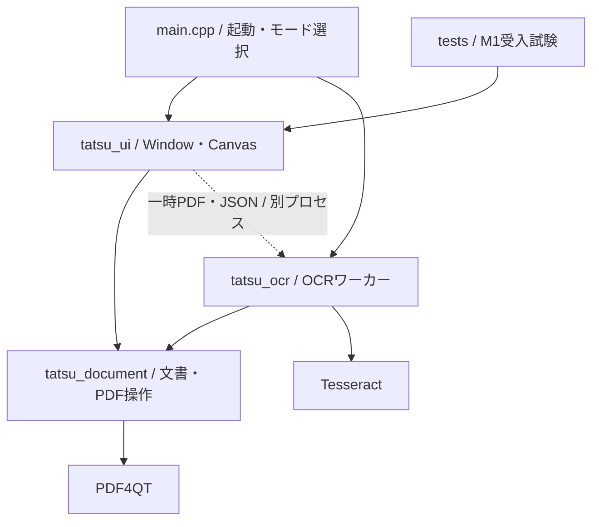

# M1の構成と変更時の約束

PDF達人はPDF4QTをライブラリとして利用するQt Widgetsアプリです。署名とOCRを同じ文書に適用し、通常のPDFとして保存します。上流のビューアを改造せず、文書表示・操作画面はこのリポジトリが所有します。

## 依存の方向

| 所有する処理 | ソース | 変更時に守ること |
|---|---|---|
| 文書状態・署名・履歴・保存の確定 | `src/document.*` | 1操作を1回のcommitにする。失敗時に原本・履歴を失わない |
| PDF読込・候補保存・ハッシュ | `src/pdf_io.cpp` | 保存候補を再読込してから置換する |
| 座標・描画・文字抽出・印刷 | `src/pdf_render.cpp` | PDF座標と画面座標の変換を一箇所に集める |
| フォント・Unicode対応 | `src/pdf_font.cpp` | 表示字形とコピー文字を両方検証する |
| PDFオブジェクト生成補助 | `src/pdf_objects.h` | 内部の小さな値生成関数。UIの状態を持たせない |
| 連続表示・読書位置・選択・ドラッグ | `src/canvas.*` | PDF4QTの表示部品をアダプターで包む。閲覧で文書・履歴を変更しない |
| 操作経路・文書ウィンドウ・OCR監督 | `src/window.*` | ワーカーの異常終了と取消を同じ未反映状態へ戻す |
| OCR解析・不可視文字層・合成 | `src/ocr.*` | 元の画像・既存文字・署名・注釈を保持する |
| 受入試験 | `tests/selftest.*` | 正解・閾値・検索語を結果に合わせて変えない |

## 文書のトランザクション

`Document`はPDFスナップショット、履歴位置、保存済み位置、単調増加するrevisionを保持します。署名の配置・移動・回転・OCR結果の取り込みは、完成した文書を1回だけcommitします。Undo後に編集すると、その先のRedo履歴を破棄します。

保存は宛先と同じディレクトリの一時領域に候補を書き、再読込とページ数確認、宛先ハッシュの再確認を行います。最後にWindowsの置換APIで確定し、その後で保存済み位置を更新します。通常保存でページ全体を画像化しません。暗号化・証明書署名・非対応フォームを検出した文書は読み取り専用です。

## OCRの境界

同じexeの`--ocr-worker`モードを別プロセスとして起動します。入力は開始時のPDFスナップショットと設定JSON、出力は最終PDF・結果JSON、標準出力はページ進捗です。全対象ページが成功するまで最終PDFを出しません。UIは正常終了、ページ数、開始時revisionを確認して1回だけ取り込みます。取消・異常終了・タイムアウトでは開始前の編集を保持します。

画像のあるページを300dpiで描画し、既存の可視文字を認識対象から除外します。認識した文字列をNoto Sans JPで埋め込み、不可視のForm XObjectとして既存Contentsに追加します。既存の不可視文字を検出したページは保持します。OCRモデルはローカルで使用し、文書・署名をオンラインサービスへ送る処理はありません。

## 回帰しやすい箇所

- PDF4QTのStamp生成は既定のスタンプに合わせてRectを変えるため、署名生成後に要求したRectを明示します。
- `/Contents`内のストリームは間接オブジェクトとして保持します。PDF4QTで表示できても、直接ストリームを配列に入れると外部ビューアで壊れます。
- Qtのフォントサブセット生成では同じ字形のUnicode別名が選ばれることがあります。実際に入力された文字と字形の対応だけを補正します。一般的な文字正規化で正解を変えません。
- 座標はCropBox、回転、UserUnitを含めて変換します。OCRの線形位置合わせと、Canvasの表示変換を混同しません。
- 署名ドラッグ中は設定パネルの開閉で文書領域を変更せず、マウスの解放後に設定を開きます。
- 署名の選択はPDFオブジェクトの参照で引き継ぎます。署名の更新で注釈の配列順が変わっても、同じ添字に移った別の署名を選びません。新規配置・更新の返り値で対象を明示します。
- 画面更新・Undo・倍率変更でドラッグの前提が変わるときは、途中の操作を破棄します。その後のマウス解放で移動をcommitしません。配置開始時は文書へフォーカスを移し、Escの取消と状態表示を揃えます。
- PDF読込でパスワードを要求された場合だけ`PdfPasswordRequired`を返し、UIが入力を求めます。ファイル不存在や破損を認証エラーとして扱いません。読込失敗時には現在の文書・未保存変更を保持します。
- 注釈の描画は閲覧と印刷の用途を渡し、PDFのPrint／NoViewフラグをそれぞれ尊重します。印刷範囲は物理ページ番号です。
- OCRの日本語分かち書きに不要な空白を増やさない設定を固定しています。抽出後に都合のよい文字を削る処理で精度を合わせません。

## 現在の設計上の制約

M1では`Document`の状態とウィジェットへの参照の一部を公開し、同一アプリの受入試験から操作しています。`Window`には設定パネル構築とOCRジョブ監督が残っています。大規模文書での履歴メモリ、検索の同期実行、OCRの縦書き読み順は未解決です。連続表示は実装しましたが、検索結果ごとの移動・表示履歴・ページをまたぐ選択等は残っています。

`TATSU_ENABLE_SELFTEST=OFF`で試験エントリーポイントとQtTest依存を外せます。M1の検証用ビルドではONを使います。M2の機能追加を構造整理に混ぜない方針です。

## 連続ビューアの境界

[ビューア要件・設計](design/VIEWER_UX.md)のうち、連続表示とPDF点を基準にした読書位置の保持を実装しました。`Canvas::Impl`がPDF4QTの`PDFWidget`と非同期コンパイラーを包み、Windowは部品の詳細へ依存しません。上流のソースは改変していません。[実行結果と未実装範囲](testing/M1_VIEWER.md)を分けて記録します。

表示用には不変のPDFスナップショットを持ちます。PDF4QTの既定レイアウトがMediaBoxを使い、物理寸法へUserUnitを反映しないため、表示用スナップショットだけMediaBoxをCropBoxへ合わせ、CropBox・回転・UserUnitから連続配置を構築します。正本のDocument、通常保存、OCR入力、Undo履歴を変更する処理ではありません。上流のコンパイラーを停止してからスナップショットを解放し、CMSとフォントキャッシュは描画側より長く保持します。

読書位置はページ番号・PDF上の点・ビューポート内の比率です。ズーム、右設定の開閉、リサイズでこの点を復元し、非同期のリサイズ通知が後から行われた明示操作を上書きしないよう世代を区別します。スクロール中は混在サイズでも自動で倍率を変えません。明示的なページ移動では対象の横位置も見える範囲へ戻します。

QPainterによる実倍率の描画と上流のコンパイル済みページキャッシュを使います。設定上限はページ256MiB、共有サムネイル32MiB、通常／インスタンスフォント各128件です。PDF本体、画像展開、履歴を含むプロセス全体の上限ではありません。長時間スクロールのフレーム時間・メモリ増加は未計測です。印刷・OCRの描画経路は既存の`pdf_render.cpp`を維持します。
