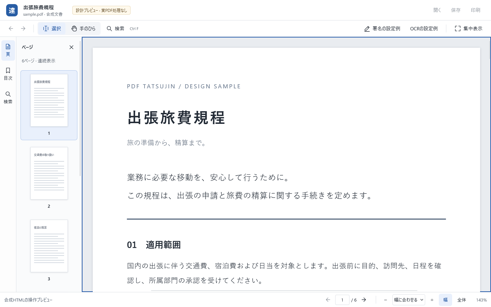

# ビューア設計プレビューの確認結果

実行日：2026-10-04。要件・操作・性能設計は[VIEWER_UX](VIEWER_UX.md)。**ここにあるPASSは合成HTML画面案の検査であり、PDFアプリのV01〜V12やM1受入の合格ではありません。**

## 開いて試せるもの

[viewer-prototype.html](viewer-prototype.html)をローカルのブラウザで開きます。同じフォルダのCSS・JavaScriptが必要です。ブラウザを100%表示にして試してください。検証ブラウザはFirefox 157.0です。

6ページの架空の出張旅費規程で、連続スクロール、ページ番号・しおりによる移動、表示履歴の戻る／進む、ズーム、幅／全体表示、検索、手のひら、集中表示、左右パネルを操作できます。検索の例は「交通費」と「expense」です。

「開く・保存・印刷」はこのプレビューでは無効です。署名・OCRは設定の配置例を開くだけで、PDFを作成・編集しません。文章はHTMLで、文字選択はブラウザの機能です。PDF用の字形対応・コピー品質・描画キャッシュを実装したとは扱いません。HTML・CSS・JSの合計は44,785バイトで、モデルや外部フォントのダウンロードはありません。この値を製品アプリの容量や速度の証拠にはしません。



## 実行した確認

Windows 11、Python 3.12.14、Selenium 4.50.0、Firefox 157.0（build 20260924084938）、geckodriver 0.37.1。専用の一時プロファイルでヘッドレス実行し、終了後に閉じました。ユーザーのブラウザプロファイル・OSクリップボードは使いません。

| 検査 | 結果 | 実際に確認した範囲 |
|---|---|---|
| P01 表示の前提 | PASS | 設計プレビューの明示、6ページの連続配置、実PDF操作の無効表示 |
| P02 ページ移動と表示履歴 | PASS | PageDown、ページ欄、戻る／進むで読書位置を復元 |
| P03 拡縮とパネル | PASS | 2段階拡大・縮小・パネル開閉の6操作で、同じ本文点の位置ずれが2 CSS px以内 |
| P04 一致ごとの検索 | PASS | 固定した「交通費」8件、3→4件目へ移動、行頭を切らない表示、Escで本文へ、消去で強調も除去 |
| P05 検索語の変更 | PASS | 結果のある状態から「expense」へ変更してすぐEnter。固定した3件を表示 |
| P06 変換中の検索 | PASS | 合成compositionイベントの未確定中に検索せず、確定後に検索。Windows IME実操作とは別 |
| P07 狭い画面 | PASS | 1024×720 CSS pxで右設定時に左を畳む、閉じて復元、集中表示とEsc復帰。読書位置保持 |
| P08 不正なページ番号 | PASS | 99を入力しても表示位置不変、理由を表示、Escで現在番号へ復帰 |
| P09 手のひら | PASS | ポインタードラッグで移動、通常選択へ復帰、検索欄でSpaceを入力してもモードが変わらない |
| P10 混在サイズ | PASS | 横長ページへスクロールしても倍率を変えず、明示的な幅合わせで変更 |
| P11 主要操作の配置 | PASS | 1024×720と1440×900、それぞれ閲覧・検索・OCR設定の3状態。主要操作の画面外はみ出し・相互重なりなし |
| P12 外部参照 | PASS | JS/CSSがローカル参照、CSPのconnect-srcはnone。パケットキャプチャによる通信試験は未実行 |

**最終結果：12 PASS / 0 FAIL。** [生データと対象ファイルのSHA-256](prototype-checks.json)。ソース検査でも既存19 fixture、固定正解、Python構文、PDF4QT固定版を確認し、Black検査に通りました。

### 見つけて直した問題

最初の12検査は通りましたが、スクリーンショットの目視で、検索語を画面の横中央へ動かすために行頭が切れる問題を発見しました。合否だけで終了せず、「ページが収まる場合は全幅を見せる」条件を追加して失敗を再現（[修正前：11 PASS / 1 FAIL](prototype-before-fix.json)）。横方向を必要最小限の移動に変え、同じ条件で再試験しました。検索語・件数・許容誤差は緩めていません。


通常1440、通常1024、検索1440、設定1024の4画像を目視確認しました。[1024の通常閲覧](reading-1024.png)も保存しています。デザインの好み・初見利用者の分かりやすさは、この確認だけで実証済みにしません。

## 再現方法

リポジトリのルートで、Python 3.12と `scripts/requirements-viewer-test.txt` のSelenium、および上記版のFirefox／geckodriverを用意します。この環境では既存の `tools/viewer-test/python`・`firefox/core/firefox.exe`・`geckodriver/geckodriver.exe` を利用しました。システムにインストール済みのブラウザや普段のプロファイルを指定する必要はありません。

今回実行した経路（`python`は上記Pythonの実行ファイルを指す）。出力先はまだ存在しないディレクトリにします。

```powershell
$env:PYTHONPATH = Join-Path (Get-Location) 'tools/viewer-test/python'
$env:PYTHONIOENCODING = 'utf-8'
python scripts/test-viewer-design.py evidence/viewer-design/new-run --firefox tools/viewer-test/firefox/core/firefox.exe --geckodriver tools/viewer-test/geckodriver/geckodriver.exe
```

ローカルの実行証拠は `evidence/viewer-design/first`、`visual-before`、`verified`。公開用の結果JSONと合成画面だけを本フォルダへ収録しています。

## 未実行と次の実装判断

- **製品側の新ビューア：未実装・V01〜V12未実行。** 上流表示部の統合、連続PDF描画、非同期検索、字形選択の品質は、このHTMLプレビューから推定しません。
- 実PDFでのスクロールfps、操作応答p95、DPR描画、メモリ上限、Acrobatとの比較：**未実行**。設計目標と手順だけを定義しました。
- 今回の実OS表示倍率100／150／200%、Windows IME、OSコピー、Narrator、第三者の初見評価：**未実行**。ブラウザのサイズ変更・合成イベントをその代用にしません。
- M1実アプリは `720c2298353f9877e0901c7621aeed71a930dd85` の試用版を維持。今回の設計作業でC++・配布物を変更せず、再ビルド・M1全回帰は追加実行していません。その版で既に行ったビルド・27 PASSの結果とM1の未実行項目は[別の記録](../testing/M1_INTERACTION.md)にあります。GitHubの同版Source checksも成功を確認しました。

採用の第一案は、独自の画面と閲覧状態管理にPDF4QTの既存表示機構を組み合わせる方式です。次の実装判断は、アンカー、D02座標、署名、OCR反映を小さく結合して確認し、保存・Undoの回帰を起こさないかで行います。要件を緩めず、M2の全機能には進みません。
