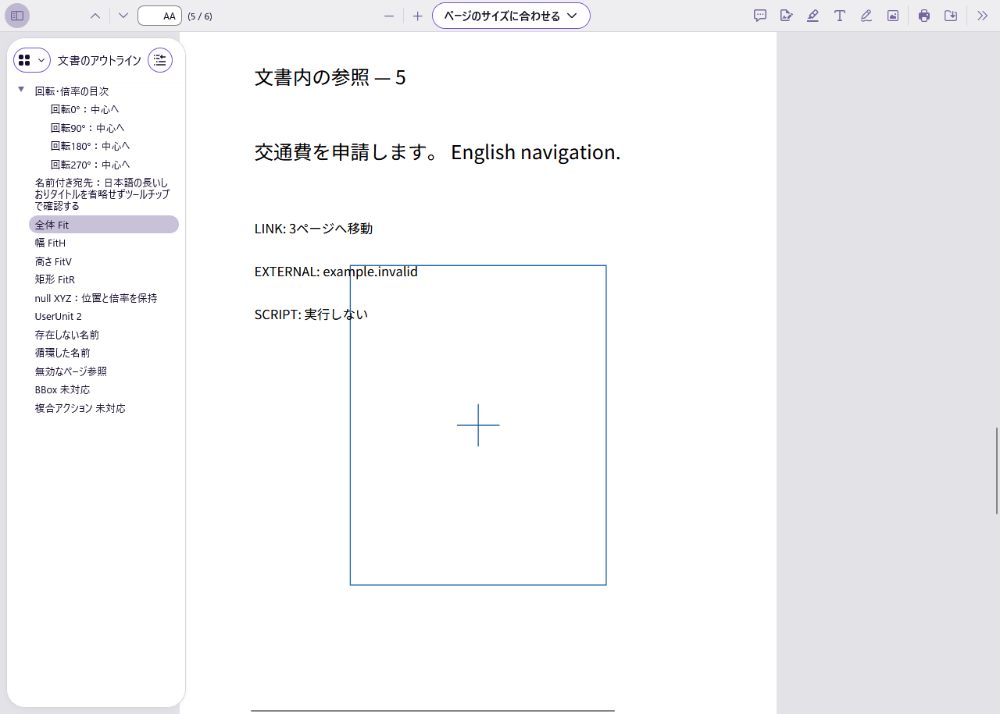

# M1 Firefox全体Fitの追加切り分け

2026-10-05。前報告で残ったFirefoxのしおり移動1件を、固定PDF・固定した期待ページのまま追跡した。**保存による差は検出していないが、連続操作の診断はFAILのまま。M1全体の合格は保留。**

## 使える成果物と起動方法

配布物は[M1の起動方法](M1_READING.md#使える成果物と起動方法)のexeとZIPを引き続き使用する。exe SHA-256は`c9876c743f4fe1eaa1d34867f6962494b4e2be3ed5ef704a86af31c0272eb0d0`。今回は診断スクリプト・結果・報告の追加で、製品のC++コードと配布exeは変更していない。

## 実際にできたこと

Firefox 157.0（build `20260924084938`）、geckodriver 0.37.1、専用ヘッドレスプロファイルで、実際のしおりDOMをクリックした。ユーザーのブラウザ・OSクリップボード・実画面は使用していない。ページ・倍率・描画・文字層・フォーカスのイベントを観測し、Firefoxの移動・フォーカスAPIは上書きしていない。

元入力のSHA-256は`26c6e489338cdf643be646bb1f19f7d83dd737d02ed58ed41368399c092899f9`、署名保存後は`82d60168bbb5748c183304590fc463386bd316b96a676764ac4e5d742b99b296`。期待する物理5ページは既存の`viewer-navigation-manifest.json`から取得した。入力・期待値・要件・閾値は変更していない。

## 試験結果

[元入力のイベント記録](fit-original.json)と[保存後のイベント記録](fit-saved.json)で、3条件ずつ、合計6診断を完了した。結果は**2 PASS／4 FAIL**。この比較は既存の11しおり＋内部リンクの試験を置き換えず、そのFAILを成功へ変更しない。

| 条件 | 実行した操作 | 期待 | 元入力 | 保存後 |
|---|---|---|---|---|
| preceding-clicks | 回転0／90／180／270度と名前付き宛先の5しおりを順にクリックし、全体Fitへ | 物理5ページに留まる | FAIL：最終2ページ | FAIL：最終2ページ |
| fresh-fit | 文書を再読込し、最初に全体Fitをクリック | 同上 | PASS：5ページ | PASS：5ページ |
| target-text-ready | preceding-clicksと同じ順序。各宛先の本文文字がDOMに現れたことも確認して次へ | 同上 | FAIL：最終2ページ | FAIL：最終2ページ |

判定では30秒以内に現在ページとビューポート位置が共に5ページとなり、500ms以上その状態に留まることを確認した。一瞬だけ期待値になった場合は成功にしない。これは追加診断の条件で、元の受入閾値を変更するものではない。各再読込で異なる`performance.timeOrigin`も記録した。

### 観測と原因の推定

連続操作では、全体Fitを押した直後に5ページへ移動した後、文字層の再描画に伴って以前の4・3・2ページへフォーカスが移った。最後に2ページが表示された。直接の全体Fitでは5ページの文字層だけへフォーカスが移り、その位置に留まった。保存後PDFでも同じ差があった。

同梱Firefoxから観測した`goToDestination`は、宛先ページの`textlayerrendered`を待ち、その文字層へフォーカスを移す処理を持つ。以前の宛先が既に描画済みの場合、登録した待機処理が後の倍率変更時に動くことが、今回の表示戻りに関与していると推定する。元・保存後で観測した関数のSHA-256は共に`233f8ec52d6b1c1e1391a54e8738cb0330c30f44fe738df5a6f99e2ae5e67e98`。観測したソース本文はローカル証拠に保存した。

これはこのFirefox版・入力・操作順に関する切り分けであり、Firefoxの全PDFへの一般化や上流側での不具合確定ではない。[前回の独立PDF構造比較](reading-navigation-export.json)でも保存前後の宛先・しおり・ラベル・リンクは一致している。保存処理の変更を必要とする差は今回も検出していない。

保存後PDFの実描画を目視確認した。次は文書を開いて直接全体Fitへ移動した画面。



[他のしおり操作後に物理2ページへ戻った画面](fit-after-bookmarks.png)も保持する。これらは専用ヘッドレスFirefoxの画面で、Windowsのネイティブ操作とは区別する。

### 再現手順

[既存の検証用Python・Firefox配置](M1_NAVIGATION.md#再現手順)を使用する。今回実行したコマンドのスクリプト・引数は次のとおり。`python`はSeleniumを配置した検証用Pythonで実行する。各出力先は未作成のものを指定する。

```powershell
$env:PYTHONPATH='tools/viewer-test/python;tools/python'
python scripts/diagnose-firefox-fit.py fixtures/viewer-navigation.pdf evidence/viewer-fit/original-comparison-2 --firefox tools/viewer-test/firefox/core/firefox.exe --geckodriver tools/viewer-test/geckodriver/geckodriver.exe
python scripts/diagnose-firefox-fit.py evidence/viewer-reading/submission-regression/navigation-preserved.pdf evidence/viewer-fit/saved-comparison-2 --firefox tools/viewer-test/firefox/core/firefox.exe --geckodriver tools/viewer-test/geckodriver/geckodriver.exe
```

診断スクリプトの終了コード0は比較が完了したことを意味する。合否はJSONの各`cases[].status`を参照し、全診断PASSと解釈しない。[実行物のハッシュ・結果の対応](fit-provenance.json)。初回は再読込後に保持されたサイドバーを誤って閉じ、2条件目の準備に失敗した。表示状態を実DOMで判定するよう修正し、元・保存後とも3条件を完了した。準備失敗のログもローカルに残す。

## 未実行・制約

Firefoxのネイティブ検索バー・OSコピー・印刷ダイアログ、Adobe Reader、最終exeでのネイティブIME・OS倍率、実容量不足、クリーンWindows・オフライン試験は未実行。前回のWindows47試験と日英OCRの独立評価は過去の実行結果を維持し、今回再実行したとは扱わない。M1の各項目は[現在のA01〜A12](M1_READING.md#a01a12の現在の範囲)を参照する。

## 採用構成と次の判断

構成A（PDF4QT＋Tesseract）を維持する。今回の追加は外部互換性の診断で、製品の依存・モデル・PDF保存形式の変更を伴わない。全体Fitの連続操作はこのFirefox版での互換性課題として残し、M1合格・閲覧UX完成の宣言は保留する。M2以降へは進んでいない。
