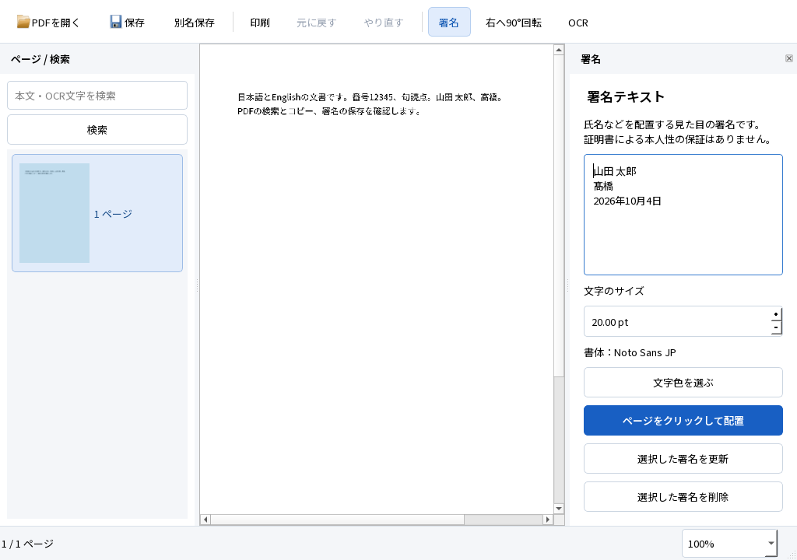
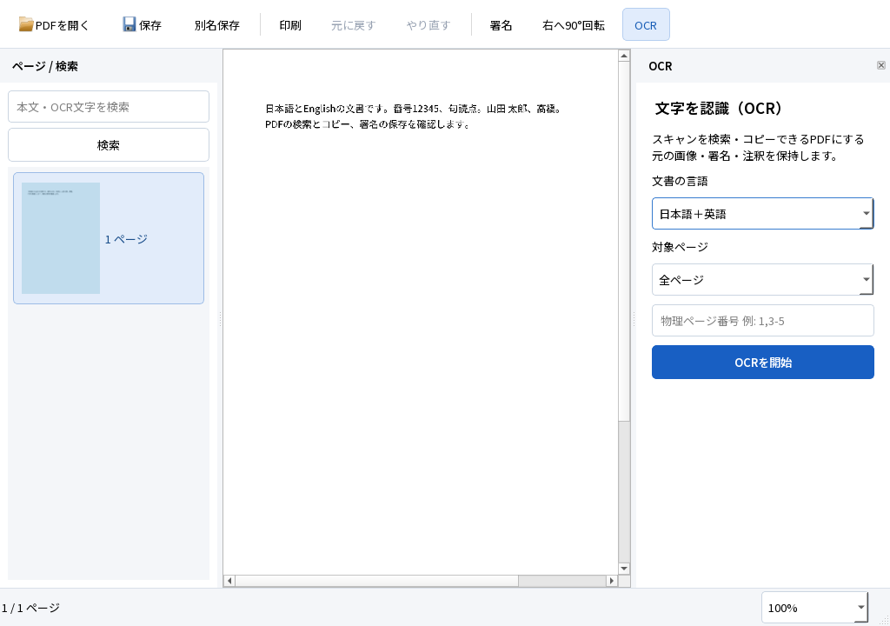

# M1追加検証と画面の調整

2026-10-04。対象はWindows 11 Home 25H2 x64、Qt 6.9.3、既存の開発ホストです。**M1全体の合格は保留**です。要件4文書・基準PDF・正解・検索語・閾値は変更していません。M2の機能は追加していません。

同日の後続試験で[Google日本語入力・Windows標準保存・再編集](NATIVE_UI.md)を実画面で確認し、IME表示の重なりを修正しました。本書中のIME・標準ダイアログの「未実行」はこの後続結果を優先してください。その他の試験と測定値は本書の実行時点の記録です。

## 成果物と操作

今回のローカル実行物は `dist/PDFTatsujin-M1-review/PDFTatsujin.exe` です。以前の配布フォルダを使っているプロセスと衝突させず、改訂版を別フォルダへ作りました。起動・署名・OCRの操作は[README](../../README.md)を参照してください。

配布ZIPは `dist/PDFTatsujin-M1-review-windows-x64.zip`（約140.7MB）です。実行フォルダ約144.9MBとQt対応ソース約53.9MBを含めています。2026-10-04のプロジェクト全体は約4.79GBで、許可された20GB以内です。部品はアプリ＋PDF4QT約9.41MB、Qt約33.11MB、他のDLL・ランタイム約45.08MB、OCRモデル約44.06MB、フォント約9.59MB、通知・資料約3.61MB。論理ファイルサイズを測り、詳細はローカル `evidence/m1-remaining/storage-breakdown.json` に記録しています。初期性能は元のM1報告の測定を保持し、今回のUI変更後に性能ベンチマークを取り直してはいません。



起動画面からPDFを開き、上部で署名／OCRを選ぶと右側に設定を表示します。選択中の操作、実行ボタン、フォーカス、入力欄を区別しました。文書を開くまではページ欄を閉じ、署名とOCRの設定に説明と項目ラベルを追加しました。UIにも同梱のNoto Sans JPを使います。Acrobatの代替として使い勝手を完成させたという評価ではありません。

修正した不具合:

- 印刷範囲・現在ページの指定が無視される問題。逆順印刷も指定順に解釈します。
- 注釈の画面表示と印刷を同じ条件で描画する問題。Print／NoViewフラグを用途別に扱います。
- 署名ドラッグ中に設定パネルが開いて座標変換が変わる問題。ドラッグの完了後に設定を開き、移動量を0.5pt以内で検査します。
- ヘッドレス環境でUIのシステムフォントが読み込めず文字が欠ける問題。同梱フォントを起動時に読み込みます。
- 日本語MSVCのshowIncludes接頭辞が文字化けし、ヘッダーの変更をNinjaが追跡できない問題。実際のコンパイラー出力をバイト列のまま検出します。Visual Studio付属版への意図しないフォールバックを避け、ビルド用Ninjaも明示します。

## 実行した試験

アプリの追加試験は `QT_QPA_PLATFORM=offscreen` を使用しました。ユーザーの操作画面を奪わずにウィジェット・イベント・OCRワーカー・PDF入出力を実行します。通常のWindows GUI、OSのIME、ネイティブダイアログを操作した証拠とは分けます。

| 試験 | 実行内容・期待 | 結果と証拠 |
|---|---|---|
| A01–A11の自動回帰＋UI描画 | 既存の署名・移動・Undo／Redo・保存・再編集・日英OCR・検索・コピー・取消・文書保持 | **20 PASS／0 FAIL**。[実行結果](followup-selftest.json)。A02のIME等を含む全受入条件の合格ではない |
| A10 保存取消 | アプリの保存操作からQt QFileDialogを開いて取消。文書版・未保存状態・原本を保持 | PASS。ネイティブWindowsダイアログは未実行 |
| A10 NTFS拒否 | 新規試験フォルダだけに書込・削除拒否ACLを設定し、新規保存／既存PDFへの保存を試行 | PASS。両方を拒否、原本・保存先・未保存状態を保持。finallyで元のACLを復元・照合 |
| A03 Windows PDFプリンター | QPrinter NativeFormatからMicrosoft Print to PDFへ出力 | PASS。PDF生成・再読込・日本語署名の描画を確認。物理印刷は未実行 |
| A03 印刷範囲 | D02の2–3ページ／現在ページ3を印刷 | PASS。出力ページ数と現在ページの寸法を照合 |
| A03 注釈フラグ | 印刷しない注釈と、画面には出さず印刷する注釈をそれぞれ描画 | PASS。元ページとの画像一致／不一致を用途別に照合 |
| A03 外部印刷 | Firefox WebDriver Print Pageで署名PDFを印刷 | PASS。独立したPopplerで描画し、氏名・髙橋・固定日付を確認。Windows印刷ダイアログ操作とは別 |
| A05 外部検索・選択 | Firefox内蔵PDF.jsで保存済みD03を読み、固定40語を検索、実テキスト層をDOM選択 | 日英各20/20語。選択文字の評価用CERは日0.5051%／英0.7741%。各2%／1%以内 |
| UI最小サイズ | 1024×720論理ピクセルで起動・署名・OCR設定を描画。Qt倍率1／1.5／2 | 読めることと署名操作部品の収まりを確認。OS表示倍率の実機試験とは別 |

[独立評価](followup-independent.json)ではPDFiumの評価用CERが日本語0.5051%／英語0.04554%、検索語が日英各20/20、全8ページの文字行の最大位置差が0.9217mmでした。回転90度は0.7964mmです。いずれも元の閾値内です。対象PDFのOCR前後の可視画素差はゼロ、既存フォーム値・注釈・リンク・しおりも保持しました。[環境追加試験](followup-environment.json)と[Firefox結果](followup-firefox.json)も収録しています。



Firefoxは157.0、Build ID `20260924084938`、geckodriver 0.37.1、Selenium 4.50.0です。ユーザーのブラウザプロファイルを使わず、試験専用プロファイルを作って終了時に削除します。検索は内蔵PDF.jsのイベント経路を呼び、実際の選択ハイライトの文字も照合しました。Firefoxのネイティブ検索バーの操作は未実行です。DOM選択の結果はクリップボードへの転送ではなく、OSクリップボードには触れていません。

Firefox取得物はMozilla署名の検証に成功しました。検証ツールは配布物へ含めません。SHA-256:

- Firefox Setup: `b3adc7530d1b1bc383994239908e06a937ae6d2ff85dea6c1b609a57fa86b220`
- geckodriver ZIP: `dfed9315abe8d2fbc1b6161a2ee8002452e79cf05ee92fdc653a4e26bc35edd8`

## 再現手順

既存Windows開発環境で実行した経路です。新規PCで依存をゼロから取得する試験とは分けます。各OutputDirectoryには未使用の名前を指定します。

```powershell
& scripts/build.ps1
& scripts/package.ps1 -OutputDirectory dist/PDFTatsujin-M1-review -TestSupport
$env:TATSU_UI_REVIEW='1'
& scripts/run-tests.ps1 -Headless -AppDirectory dist/PDFTatsujin-M1-review -OutputDirectory evidence/new-run
Remove-Item Env:TATSU_UI_REVIEW
& scripts/test-save-permissions.ps1 -AppDirectory dist/PDFTatsujin-M1-review
$env:TATSU_NATIVE_PDF_PRINTER='1'
$env:TATSU_TEST_FILTER='A03_Windows_PDF_printer'
& scripts/run-tests.ps1 -Headless -AppDirectory dist/PDFTatsujin-M1-review -OutputDirectory evidence/new-printer-run
Remove-Item Env:TATSU_NATIVE_PDF_PRINTER,Env:TATSU_TEST_FILTER
```

外部評価のPython／Poppler設定は[開発手順](../DEVELOPMENT.md)のとおりです。Firefox 157.0とgeckodriver 0.37.1を別途検証用に用意し、`scripts/requirements-viewer-test.txt`の依存を導入したPythonで以下を実行します。利用者の既存プロファイルは渡しません。

```powershell
python scripts/test-firefox.py evidence/new-run evidence/new-firefox-run --firefox tools/viewer-test/firefox/core/firefox.exe --geckodriver tools/viewer-test/geckodriver/geckodriver.exe
```

初回のFirefox試験では組み込みビューアの検索ボタンが非表示だったため、WebDriverのクリックが失敗しました。その実行を合格扱いせず、`firefox-1`に残しています。再実行では上記の検索APIと実ハイライトを検証し、ネイティブバー操作とは明示的に区別しています。

## 未実行・環境制約

- 日本語IMEの変換候補・確定・未確定時のEsc、Windowsネイティブ保存ダイアログ、OS表示倍率100／150／200%の実機操作は未実行。
- Adobe Acrobat Readerは未導入のため未実行。Firefoxのネイティブ検索バー／OSクリップボード／印刷ダイアログ操作も未実行。
- 物理プリンターの出力確認は未実行。Windows PDFプリンターと区別。
- 実際の容量不足は未実行。Cドライブを埋めずに隔離試験する仮想ディスクには管理者権限が必要で、現在のプロセスにありません。権限拒否の成功を容量不足の合格へ流用しません。
- A12のクリーンWindows＋通信無効の通し試験は未実行。現在はWindows HomeでWindows Sandboxを利用できず、同じ開発ホストのPATHを制限した試験だけでは代替になりません。
- UIの第三者評価、実スキャン、縦書き等の既知の制約は元の[M1報告](../../M1_REPORT.md)のままです。

構成Aを横書き日英OCRと署名の基盤として暫定採用する判断は維持します。残る環境試験を合格扱いせず、M2へ進みません。

次回の[実画面・環境試験手順](REMAINING_MANUAL.md)を用意しています。この手順書の存在を実行済みの証拠にはしていません。
