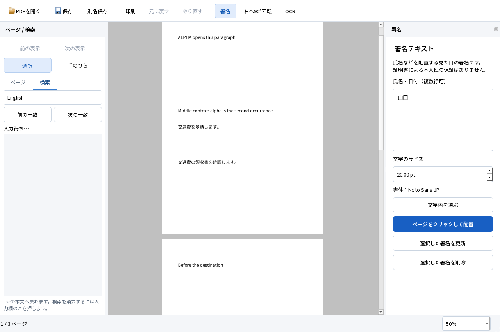

# M1 手のひら操作の実装と実行結果

2026-10-05。Windows 11 Home 25H2 x64、Qt 6.9.3、MSVC 19.50。[操作設計](../design/HAND_TOOL.md)に基づくM1の閲覧改修。SPEC・TECH・ACCEPTANCE、既存入力・正解・閾値は変更していない。**M1全体の合格は保留。M2には進んでいない。**

後続版は[しおり・リンク・表示履歴の実行結果](M1_NAVIGATION.md)。以下は手のひら版の実行記録として保持する。

## 使える成果物と起動方法

`dist/PDFTatsujin-M1-hand/PDFTatsujin.exe` を起動する。配布ZIPは `dist/PDFTatsujin-M1-hand-windows-x64.zip`。ZIPは全体展開し、DLL・assets・plugins・licensesと一緒に使う。Qt対応ソースも含む。GitHubはソース管理用の公開リポジトリであり、正式なバイナリリリースは未公開。

PDFを開き、左上の「手のひら」を押して本文をドラッグすると表示を移動できる。本文にフォーカスがあればSpaceを押している間だけ一時切替でき、Escで「選択」に戻る。署名の上でも表示だけを動かす。既存の日本語署名・Undo／Redo・日英OCR・保存・再編集は同じアプリで使える。

対象exeのSHA-256は `e7d553da7a8ecf98fec3681844f867d7ac7ae60570479f7286e510d6bd4dfa18`。

## 実際にできたこと

- 明示的な手のひらとSpace一時切替を区別し、ボタン・カーソル・状態欄を同期した。本文とページ間の余白で上下左右にドラッグできる。
- 文書端で止まっても逆方向へすぐ動き、署名・PDF・dirty・編集Undo・表示履歴を増やさない。
- Spaceの反復と途中解放、Esc、ツール変更、本文からのフォーカス移動、ウィンドウ非アクティブ化、非表示、resizeで進行中の操作を止める。
- 一時移動では確定済みの文字選択を保持し、検索欄・署名欄ではSpaceを文字入力として扱う。署名配置と別PDFの開始では選択へ戻る。
- 保護されたPDFやOCR処理中でも、許可された閲覧を継続する。



[1024×720の操作配置](hand-1024.png)も描画して確認した。これはD02の文字がCropBox外にある4ページ目を拡大した記録で、白い本文は当該入力の期待表示。実OSの表示倍率試験ではない。

## 試験結果

[Windows実行結果](hand-regression.json)：**39 PASS／0 FAIL**。既存36試験と追加3試験を同じ実行ファイルで実行した。Qt offscreen・QTestの入力であり、ネイティブOSのマウス・IME・クリップボードの合格とは区別する。

| 追加試験 | 実行した確認 |
|---|---|
| Pan_navigation | D02の4ページで上下左右のポインター追従。回転・CropBox・UserUnit込みで最大軸誤差0 DIP。0.4 DIPの25回入力が各軸10 DIPに一致。ボタンの最小画面内配置、D10のページ境界・余白、端での即時反転、コピー禁止・読取専用PDFの移動、PDFと履歴不変 |
| Pan_input | Space押下・反復・途中解放、明示ツールへの復帰、選択済み101文字の保持とコピー、Esc、検索欄・署名欄へのSpace入力、修飾キー付きSpaceの非捕捉 |
| Pan_lifecycle | 署名上の手のひら、署名ドラッグをSpaceで取り消す、フォーカス移動、非アクティブ化・非表示の合成イベント、resize、OCR busy状態の模擬、配置開始、未保存署名とUndoの保持、保存・再読込 |

実OCR中の取消・異常終了・UI応答は既存A09を回帰実行した。追加の手のひら試験におけるbusyは状態の模擬であり、実OCRと手のひらの同時操作を別途実行したとは扱わない。

### 保存PDFの独立評価

[PDFium・Poppler・pypdf](hand-independent.json)と[Firefox 157.0／PDF.js](hand-firefox.json)で、今回生成した保存PDFを検証した。日英の固定検索語は各20/20。実際の選択コピーのCERは日本語0.5051%、英語0.7741%で、既存の2%／1%基準を満たした。PDFium直接抽出は日本語0.5051%、英語0.04554%。抽出経路による違いを混同しない。

OCR文字行の最大位置ずれは0.9217mm。OCRのみ8ページと混在4ページの可視画素差は0。既存フォーム6値・注釈・リンク・しおりを保持した。Firefoxの専用ヘッドレスプロファイルでも検索とDOM選択が基準を満たし、WebDriver Print PageでPDFを出力した。ネイティブ検索バー・OSコピー・印刷ダイアログ・物理プリンターは未実行。

### 試験準備の修正記録

最初のビルドではテストの`mapTo`に渡す空初期化子がQtの整数／実数座標で曖昧だったため、`QPoint`を明示して修正した。初回の[1 PASS／2 FAIL](hand-first.json)は、PDFを開いた直後の初期レイアウト前に別ページへ移動した試験手順と、模擬busy解除後にUIを更新しなかった試験設定を修正した。描画完了を待ち、通常の状態更新経路を通した。

続く[2 PASS／1 FAIL](hand-second.json)では暗号化PDFを2回シリアライズしたバイト列を比較していた。同じ無操作の文書を2回出力しても一致しないことを追加診断で確認した。比較をPDFオブジェクト・元ファイルのSHA-256・revision・dirty・Undoの不変へ修正した。保護の条件や原本不変という期待は変えておらず、暗号化の解除もしていない。中間ログは `evidence/viewer-hand` に保持した。

最終レビューでは各入力の移動量を丸めると小数DIPを失う問題を見つけ、端数を持ち越す方式へ修正した。0.4 DIPを25回入力する試験を追加し、修正後の同じexeで全39件を再実行した。修正前の39 PASS記録も `evidence/viewer-hand/regression` に保持し、最終版は `regression-final` と区別する。

### 初期性能

[回帰試験終了後の計測](hand-performance.json)は独立プロセス各3回。実ページのコンパイル・画像取得までを計測し、QApplication・フォントの開始前初期化は含まない。RSSは10ms間隔の観測で、プロセス全体時間には250ms待機・画像保存・終了を含む。

| 入力 | 初回本文描画の中央値 | 最大観測RSS（10進MB） |
|---|---:|---:|
| D01・1ページ | 72ms | 45.81MB |
| D10・デジタル100ページ | 77ms | 46.62MB |
| D10・画像主体50ページ | 606ms | 92.57MB |

先に測った[回帰試験と並行した値](hand-performance-during-regression.json)も保存し、上表には混ぜていない。コールド起動、物理画面のFPS、入力p95、長時間のメモリ推移、Acrobatとの比較は未実行。前版より速い、またはAcrobatを上回ったとは主張しない。

### 容量

[最終文書同梱前の計測](hand-storage.json)で、依存・過去配布物・中間の失敗記録も含むプロジェクトは約6.37GB。許可された20GBまで約13.63GBの余裕がある。今回の配布フォルダは約149MB、Qt対応ソース込みZIPは約142MB。単位は10進、ファイル長の合計で、NTFSの割当サイズとは異なる。既存のシステム開発環境・共有試験ランタイムはフォルダ外として別扱い。

配布部品は、アプリとPDF4QT約10.7MB、Qtとプラグイン33.1MB、ネイティブ依存とMSVCランタイム45.1MB、日英OCRモデル44.1MB、フォント9.6MB、ライセンスと文書等約6.4MB。Qt対応ソースのアーカイブは別途53.9MB。最終ZIPは全ファイルのCRCとSHA-256を展開元と照合する。

### 再現手順

固定依存の配置は[開発手順](../DEVELOPMENT.md)。試験出力先は未使用のフォルダを指定する。

```powershell
& scripts/build.ps1
& scripts/package.ps1 -OutputDirectory dist/PDFTatsujin-M1-hand -TestSupport
Remove-Item Env:TATSU_TEST_FILTER -ErrorAction SilentlyContinue
$env:TATSU_UI_REVIEW='1'
& scripts/run-tests.ps1 -Headless -AppDirectory dist/PDFTatsujin-M1-hand -OutputDirectory evidence/viewer-hand/regression-final
python scripts/benchmark-viewer.py --app-directory dist/PDFTatsujin-M1-hand --output evidence/viewer-hand/performance-final
python scripts/evaluate.py evidence/viewer-hand/regression-final
python scripts/test-firefox.py evidence/viewer-hand/regression-final evidence/viewer-hand/firefox-final --firefox tools/viewer-test/firefox/core/firefox.exe --geckodriver tools/viewer-test/geckodriver/geckodriver.exe
python scripts/check-source.py
```

## 未実行・制約

A01〜A12の既存自動試験を39件の回帰に含めた。[前版のA01〜A12の実行範囲・制約](M1_SELECTION.md)は継続し、今回の追加結果を理由に以下を合格へ変更しない。

- A02：この版でのネイティブIME再試験は未実行。Spaceの自動試験は実IMEの変換操作の代替ではない。
- A03／A05：Adobe Reader、Firefoxのネイティブ検索・OSコピー・印刷ダイアログ、物理印刷は未実行。
- A04：実OS倍率100／150／200%は未実行。
- A10：実際の容量不足は未実行。NTFS権限拒否は過去版の記録を維持。
- A12：開発用PATH等を外した同じPCの起動は実行。クリーンWindows＋通信無効は未実行で、M1全体の合格は保留。

集中表示、文字カーソル、単語ダブルクリック、しおり・文書内リンクの移動など、閲覧設計全体には未実装・未評価部分が残る。Windows Narrator、タッチ／ペン、実マウスによる長時間操作も未実行。

## 採用構成と理由

Canvasの入力を既存PDF4QT表示アダプターのスクロールに接続し、Windowでボタンと状態を同期した。画面上の差分を使うため、回転やUserUnitを署名の保存座標へ混ぜない。新しい解析ワーカー・描画エンジン・タイマーは不要で、PDFと編集Undoを変更しない。[構成](../ARCHITECTURE.md)。

## 次の判断

今回の手のひら操作は実装・回帰検証済みとして提出する。閲覧全体の完成・M1全体の合格とはせず、上記の未実行を保持する。M2へは進めない。
