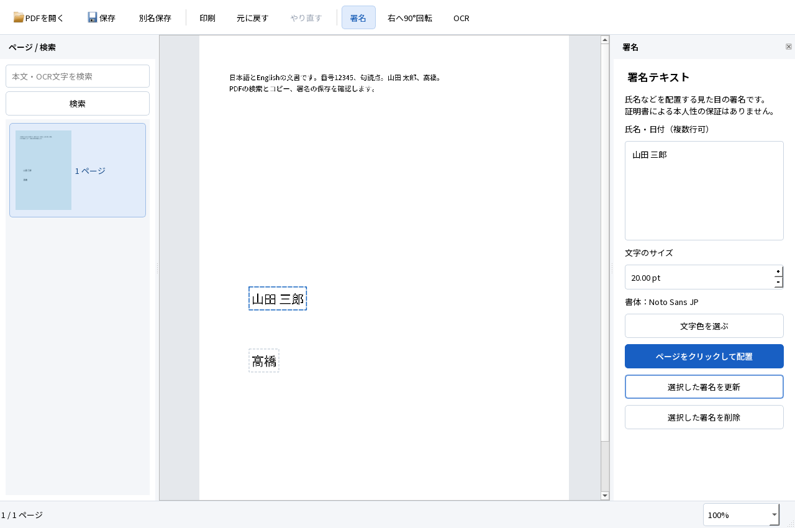

# M1 署名の再編集・操作取消・読込エラーの修正

2026-10-04。Windows 11 Home 25H2 x64、Qt 6.9.3。実装を修正し、Windowsでビルド・実行、27件の自動試験と保存PDFの独立検証を完了した。**実施範囲は成功。M1全体の受入合格は、未実行の重要試験があるため保留。M2には進んでいない。**

## 成果物と起動

ローカルの `dist/PDFTatsujin-M1-review/PDFTatsujin.exe` を起動する。ZIPは `dist/PDFTatsujin-M1-review-windows-x64.zip`。展開したフォルダ一式を使う。[操作手順](../../README.md)、[開発手順](../DEVELOPMENT.md)。GitHubにはソース・合成入力・試験証拠を登録し、正式なバイナリリリースは作っていない。

検証したexeのSHA-256: `022e1d52796dc8e0ab273b513b3f77e80877471c25c94604b0742cdebccaf37c`。

プロジェクト全体は約5.01GB／許可20GB。部品別容量・ZIPの整合性と全格納ファイルの比較結果は、ローカルの `evidence/m1-interaction/storage-breakdown.json` と `archive-verification.json` に記録する。既存の共有開発環境はこのフォルダの容量に含めない。

## 修正したこと

修正前に各問題を実行して再現し、失敗の証拠を保持した。

| 問題 | 修正内容 | 修正前の証拠 | 修正後 |
|---|---|---|---|
| 複数署名の先頭を更新すると、注釈順が変わり選択先が別の署名へ移る | 配列の添字ではなくPDFオブジェクト参照で選択を引き継ぐ。配置・更新直後の対象も明示する | [FAIL](interaction-before-identity.json) | 同じ署名を2回更新しても別署名を変更しない。保存・再読込後も2件を保持 |
| 配置ボタンを押した直後のEscで配置待ちを解除できない | 配置開始時に文書へキーボードフォーカスを移す。取消時にカーソル・案内を同時に戻す | [FAIL](interaction-before-placement.json) | ボタン操作後のEsc、OCR設定へ切替の両方で配置を取消 |
| ドラッグ中の画面更新後も古い操作が残り、解放時に移動が確定する | 画面更新・Undo・倍率変更・Escで操作途中の状態と枠を破棄する | [FAIL](interaction-before-drag.json) | 取消後のマウス解放で履歴を追加しない。Undoで署名自体が消えた場合も正常に終了 |
| 破損PDFや存在しないファイルでもパスワード入力を求める | 読込側が実際にパスワードを要求した場合だけ専用の例外をUIへ返す | [FAIL](interaction-before-open.json) | 不正入力は読込エラー。暗号化PDFのみ入力を求め、取消時は未保存文書を保持。正しいパスワードでは読取専用で開く |

ページを切り替えた際も、下部の未保存・読取専用表示を共通の処理で更新するようにした。PDFの保存形式、署名の編集情報、OCR方式、要件・正解・検索語・閾値は変更していない。



上の画面はQt offscreenの実ウィジェット描画。[保存した2署名PDF](interaction-two-signatures.pdf)をPopplerでも描画して目視確認し、山田 三郎・髙橋の字形と位置を確認した。ネイティブ画面操作の証拠とは分ける。

## 実行・試験結果

[最終自動試験](interaction-regression.json)は **27 PASS／0 FAIL**。前回の22件に、上記4件と未保存で閉じる操作の試験を追加した。

未保存で閉じる試験では、「閉じる」の取消、続けて開いた保存ダイアログの取消、指定先への保存成功後の終了、外部変更による保存失敗後の画面・編集保持、明示的な破棄を実行した。原本と外部変更された保存先のハッシュも照合した。

初回の全体試験は26 PASS／1 FAILだった。追加した試験が`QFileDialog::selectFile`を呼んだ際、ファイル名欄にフォーカスがあると入力文字を置き換えないQt 6.9.3の挙動により、試験専用出力フォルダへ別の既定名で保存されていた。Qtの対応ソースで原因を確認し、試験側で実際の入力欄を設定、選択先と保存された宛先の一致を追加検査した。条件を緩めず、全27件を新しい出力先で再実行した。失敗記録は `evidence/m1-interaction/regression/`、最終結果は `verified/` に残す。

最新の出力PDFをPDFium・Poppler・pypdfで[独立検証](interaction-independent.json)した。

| 検査 | 結果 |
|---|---|
| 評価用コピーCER | 日本語0.5051%、英語0.04554%。既定の2%／1%以下 |
| 固定語の検索 | 日本語20/20、英語20/20。既定の各19/20以上 |
| OCR文字行の位置 | 全8ページ最大0.9217mm、90度回転で0.7964mm。既定の2mm以下 |
| 元の見た目 | 日英8ページ・混在4ページの可視ピクセル差0 |
| 既存内容 | フォーム6値、コメント、リンク、しおりを保存前後で保持 |
| ソース検査 | 固定fixture19個、正解、Python構文、PDF4QT固定版、変更したC++の書式が成功 |

実行した再現コマンド。PythonとPopplerの配置は開発手順を参照し、再実行では未使用の出力フォルダを指定する。

```powershell
& scripts/build.ps1
& scripts/package.ps1 -OutputDirectory dist/PDFTatsujin-M1-review -TestSupport
$env:TATSU_UI_REVIEW='1'
Remove-Item Env:TATSU_TEST_FILTER -ErrorAction SilentlyContinue
& scripts/run-tests.ps1 -Headless -AppDirectory dist/PDFTatsujin-M1-review -OutputDirectory evidence/m1-interaction/verified
python scripts/evaluate.py evidence/m1-interaction/verified
python scripts/check-source.py
```

## A01〜A12の現在の範囲

自動試験はWindows上のQt offscreen・合成入力イベントであり、OSの実入力や実クリップボードを今回操作したとは扱わない。過去の[Google日本語入力・標準保存の実操作](NATIVE_UI.md)と[Firefox等の追加検証](M1_FOLLOWUP.md)は、各実行版の記録として保持する。

| ID | 実施済み | 残る制約・未実行 |
|---|---|---|
| A01 | PDF表示、ズーム、ページ移動、検索、選択・コピー | 連続スクロール等の既存UI差分はREADMEに記載 |
| A02 | 日本語署名、配置・移動・更新・取消、Undo／Redo。過去の版ではGoogle日本語入力の実操作も成功 | 今回の修正版でOSのIME操作を再実施していない。Microsoft IMEは未実行 |
| A03 | 保存・再編集、複数署名の保持、別エンジン描画。過去にFirefox PDF印刷・Windows PDFプリンター出力 | Reader、外部ビューアのネイティブ印刷ダイアログ、物理印刷は未実行 |
| A04 | 4回転・CropBox・UserUnit・ズームの座標誤差0.5pt以内 | 実OSの表示倍率100／150／200%比較は未実行 |
| A05 | 日英8ページOCR、同じアプリで検索・コピー・保存。上表の独立評価、過去のFirefoxヘッドレス評価 | ReaderとFirefoxのネイティブ検索・OSクリップボードの検証は未実行 |
| A06 | 対象ページだけのOCR、既存文字と画像の混在、署名と見た目の保持 | 多様な実文書一般の保証ではない |
| A07 | 既存OCRの保持、空白・写真ページの文字未検出、二重層の防止 | 他製品の広範なOCR形式は未評価 |
| A08 | 署名→回転→OCR→Undo／Redo→保存 | 縦書き・段組みの既知の限界は残る |
| A09 | 1ページ進捗後の取消、強制終了、UI応答・一時領域の後始末、未保存変更の保持 | OS全体の強制終了・電源断は未実行 |
| A10 | 保存取消、競合、大小文字別名、読取専用、閉じる各経路。過去にNTFS権限拒否・標準保存取消 | 実際の容量不足は未実行 |
| A11 | 暗号化・証明書署名・XFA・不正入力の拒否／読取専用。パスワード入力の取消と正入力 | 証明書の信頼性評価は対象外 |
| A12 | 開発用PATH・アセット設定を外した配布フォルダの同一PC実行 | クリーンWindows＋通信無効は未実行。代替合格にしない |

Firefoxのネイティブ試験は合成PDFを開くところまで試みたが、Computer Useが当該ブラウザのURL安全確認に未対応のため操作を停止した。検索・コピーは実行済みにしない。試験専用プロファイルのFirefoxプロセスは終了し、通常の開発を継続した。[残る試験の手順](REMAINING_MANUAL.md)。

## 採用構成と次の判断

Qtの独自UI＋PDF4QTライブラリ＋ローカルTesseract日英OCRを維持する。文書の履歴・保存はDocument、選択・操作途中の状態はCanvas、ダイアログと実行経路はWindowが扱う。今回もその責務の範囲で修正し、上流コードを改変せず検証できた。

署名とOCRを同じPDFへ適用するM1試作の実装・実行可能な検証を進めた。別PCや画面操作ツールの制約を通常の実装修正の前提にせず、未実行項目と区別して記録する。M1の受入合格を宣言せず、M2以降の機能追加も開始しない。
