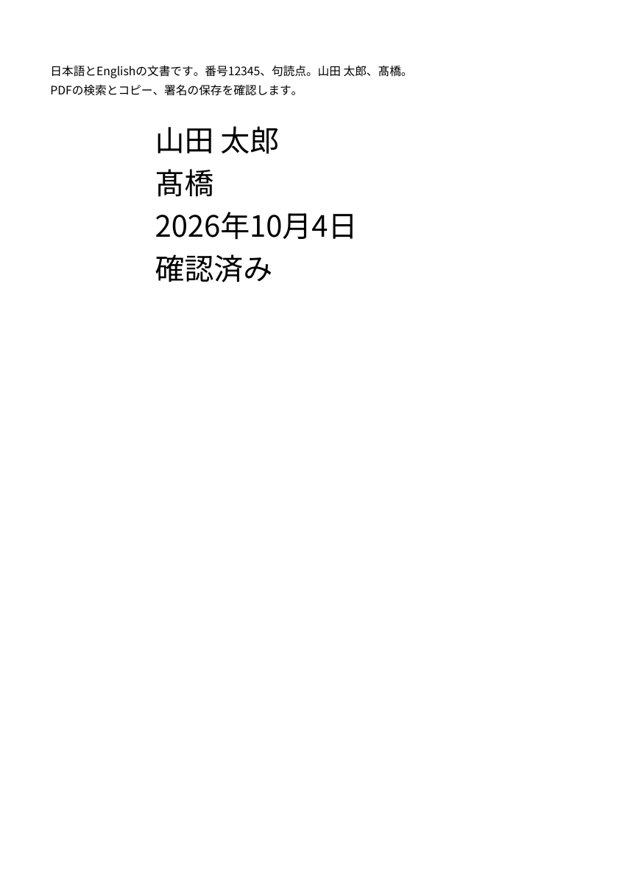
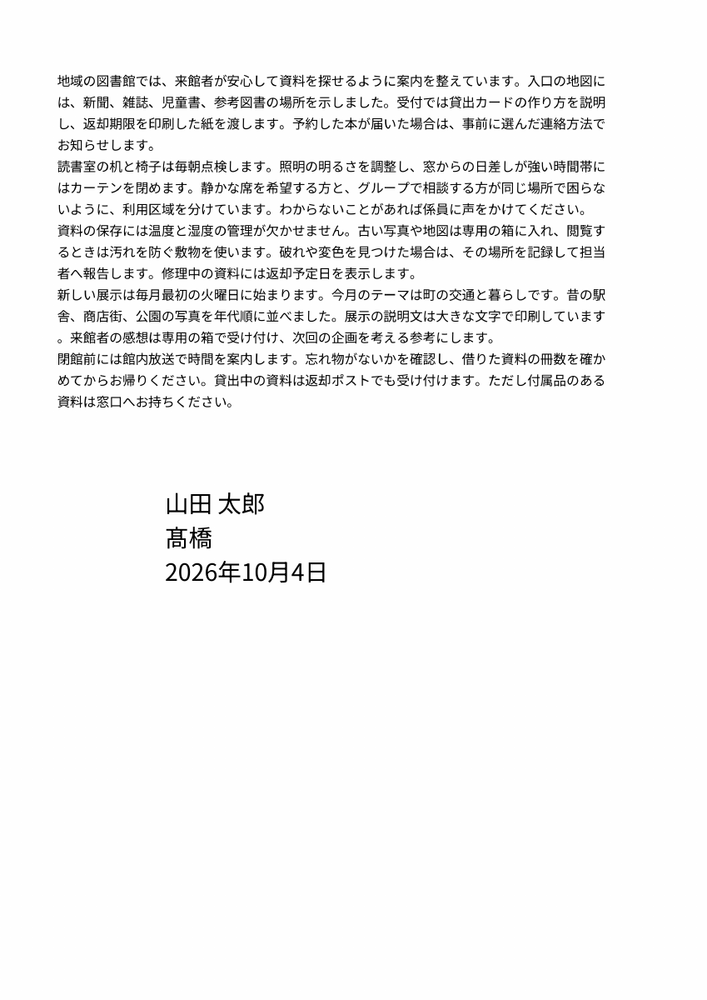

# M1 最終配布物のWindows実画面検証

2026-10-05。Windows 11 Home 25H2 x64、Google日本語入力3.34.6260.0（GoogleIMEJaTIP64.dllのFileVersion）。[閲覧改修版の47件](M1_READING.md)と同じ配布exeを実画面で操作した。要件・入力・正解・検索語・閾値は変更していない。**M1全体の合格は保留。今回の停止点はM1の成立性判断資料まで。**

## 使える成果物と起動方法

`dist/PDFTatsujin-M1-reading/PDFTatsujin.exe`を起動する。配布ZIPは`dist/PDFTatsujin-M1-reading-windows-x64.zip`。全体を展開し、DLL・assets・plugins・licenses・Qt対応ソースを保持する。通常の起動・操作は[README](../../README.md)、ビルドは[開発手順](../DEVELOPMENT.md)。ソースは[公開MITリポジトリ](https://github.com/okakanatto/PDF_Tatsujin)で管理する。

実行したexeのSHA-256は`c9876c743f4fe1eaa1d34867f6962494b4e2be3ed5ef704a86af31c0272eb0d0`。配布ZIPは142,693,488 bytes、SHA-256は`16b7bd83817e7690ac4a181349424265cc2c0712ff646f3d1aaa18c5355e2343`。前回の全329ファイル照合はローカルの`evidence/viewer-reading/archive-verification.json`に保持し、今回もZIPハッシュが一致した。`evidence/`・`dist/`はローカル成果物で、Gitには含めない。

今回の合成PDFは`evidence/native-final-20261005/`に保存した。ソースと公開用結果・画像はリポジトリに含める。

| PDF | 実際の保存経路と内容 |
|---|---|
| native-signature.pdf | IMEで変換した氏名・異体字・固定日付、配置・移動・Undo／Redo、標準別名保存。氏名の区切りが全角だった初回のFAIL入力として保持 |
| native-signature-corrected.pdf | 初回PDFを再読込し、区切りをキー操作で半角へ直して更新・標準別名保存 |
| native-signature-reopened-reedited.pdf | ディスクから初回PDFを開いた新しいウィンドウで、文字・20→28pt・位置を変更して標準別名保存 |
| native-same-window-ocr.pdf | 日英8ページのD03に署名を置き、OCR・検索・OSコピー・OCR Undo／Redo後に標準別名保存 |

各ファイルのSHA-256とサイズは[修正後の独立検証](native-final-independent.json)を参照する。

## 実際にできたこと

署名入力で`yamada`→変換→「山田」、`tarou`→変換→「太郎」、`takahashi`→変換→「髙橋」を確定した。未確定の「あ」をEscで取り消しても確定済み氏名は残った。`kinou`の変換候補に実際に表示された「2026年10月4日」を選び、実行日の翌日に試験日付が勝手に変わることを避けた。日本語の変換証拠はOSの実IMEキー入力であり、プログラムから文字を投入する試験とは区別する。

同じ文書で署名を配置し、一回のドラッグ→Ctrl+Z→Ctrl+Shift+Zで位置が戻ることを確認した。別名保存をEscで取り消すと、未保存表示と署名を保持した。標準ダイアログはAlt+Nでファイル名欄へ移り、入力値を確認してAlt+S／Alt+Oで保存・開くを実行できた。

開く操作は新しい文書ウィンドウを作るため、保存前のウィンドウとの取り違えを避け、返された新しいウィンドウIDを選択・前面化して確認した。ディスクから開いた署名は20pt・編集履歴なしの状態だった。四行・28ptへ更新し、再度移動して別のPDFへ保存した。追記「確認済み」はUIの文字値設定であり、追加のIME変換証拠には数えない。

D03は標準の開くダイアログから開いた。同じ文書に署名を配置し、右側の「日本語＋英語／全ページ」でOCRを開始。結果は1〜8ページすべて「処理済み」、署名も保持された。「市民公園」は3ページ、「coastal」は7ページへ移動した。実本文をドラッグ選択し、Ctrl+C→同じアプリの確認用文字欄へCtrl+Vで、日英の先頭行42文字／77文字を確認した。確認用欄の貼付文字は文書へ反映せず、PDFには元の署名を保存した。

本文にフォーカスして一回Undoすると検索結果が消え、8ページに文字層がない旨を表示した。一回Redoすると検索が復元した。保存したPDFを別の新しい文書ウィンドウへ再読込し、編集履歴がない状態から再び「coastal」の一致へ移動できた。[操作と観測値](native-final-observations.json)。





## 試験結果

製品のビルド・Windows自動回帰は同じ最終exeの**47 PASS／0 FAIL**を維持する。今回の実画面で保存したPDFを対象とする独立検証は、初回**20 PASS／1 FAIL**、文字入力修正後**21 PASS／0 FAIL**。異なる試験単位の数を合計して受入合格数にはしない。

| 対象 | 操作・期待 | 実結果・証拠 |
|---|---|---|
| A01・A02・A03 | 実IME、日本語署名、ドラッグ、Undo／Redo、標準保存取消・保存、ディスク再読込後の再編集 | 上記実操作。[観測記録](native-final-observations.json)。保存注釈の文字・20／28pt・矩形・印刷フラグ・外観を独立に確認 |
| A05 | 署名付き日英8ページOCR、固定語による検索、本文選択・OSコピー、OCR Undo／Redo、保存・再読込検索 | 日英一語ずつのネイティブ検索と先頭一行ずつのOSコピーを実行。コピー文字は固定正解の対応行と完全一致。全文のOSコピーCERや全40語のネイティブ検索はこの実画面試験では未実行 |
| A05・外部抽出 | 保存済みOCR本文のPDFium直接抽出、設定固定後評価ページ、固定検索語各20語 | CER 日本語0.5051%、英語0.04554%。元の2%／1%以内。検索20/20ずつ。[独立結果](native-final-independent.json) |
| 可視内容・原本 | 保存後の本文をPDFiumで描画。追加署名注釈を描画対象から外し、OCRの本文変更を分離 | 8ページすべて変化画素0。D01・D03原本は固定manifestのSHA-256と一致 |
| 外部表示・検索・選択 | 今回の実画面で保存したPDFをFirefox 157.0／PDF.jsで開く。専用ヘッドレスプロファイルで全40検索語・DOM選択を実行 | 各20/20。DOM選択CER 日本語0.5051%、英語0.7741%。[Firefox結果](native-final-firefox.json)。OSクリップボードとは区別 |
| 外部印刷出力 | 同じ署名PDFをFirefoxのWebDriver Print PageでPDF出力し、Popplerで描画 | 氏名・異体字・日付と改行を目視確認。[印刷PDFの描画](native-final-firefox-print.png)。ネイティブ印刷ダイアログ・実機印刷は未実行 |

### 初回FAILと修正

初回の署名文字は`山田\u3000太郎`で、期待した`山田\u0020太郎`と一致しなかった。[初回の独立結果](native-final-first.json)はFAILのまま保持する。UIAの観測値は空白を統一して表示しており、画面だけでは全角／半角を区別できなかった。PDFの注釈文字と編集情報を読み取る厳密比較によって検出した。

同じPDFを開いて文字欄の先頭から二文字進み、Deleteで全角スペースを削除。IME切替後にSpaceを入力し、更新・別名保存した。最終PDFでは編集情報と注釈本文の両方が`山田 太郎\n髙橋\n2026年10月4日`と完全一致する。正解の全半角を消してPASSにする処理は加えていない。これは今回の入力手順の修正であり、製品が保存時に文字を変換したという証拠はない。

独立検証スクリプトの初回準備では、固定PDFiumのオブジェクトがcontext managerに未対応でTypeError、正解区分を`eval`と誤読してZeroDivisionErrorとなった。明示closeと固定正解に存在する`evaluation`へ合わせて修正した。準備エラーを製品の成功扱いにせず、その後の実PDF検査で上記の空白FAILを検出・再試験した。

## 未実行・制約

Adobe Readerの表示・検索・コピー・印刷、Firefoxのネイティブ検索バー・OSコピー・印刷ダイアログ、実プリンター、実容量不足、開発環境のないクリーンWindows＋通信無効、Microsoft IME、OS倍率100／150／200%は**未実行**。Firefoxの[連続しおり操作後の全体Fit診断FAIL](M1_EXTERNAL_FIT.md)も保持する。Acrobatとの応答速度・体験比較、第三者の使いやすさ評価は未評価。

今回のネイティブ試験は署名→OCR→Undo／Redoを扱い、回転を挟むA08全経路のネイティブ操作とOCR途中取消は追加実行していない。[47件の自動回帰](M1_READING.md)の複合操作・取消・強制終了・座標・注釈・フォーム保持等とは実行範囲を分ける。A01〜A12全体の一覧は同報告を参照する。

Computer Useは自分で起動したPDF達人のウィンドウだけを操作した。他アプリの通知とIME学習候補を含む生の実画面画像は保存・公開していない。公開画像は合成の保存PDFをPopplerで描画したもの。既存クリップボードの内容は読まず、今回コピーした合成行だけをアプリ内の貼付先で観測した。試験用ウィンドウはすべて閉じた。

## 容量・再現手順

今回の成果物を含む[部品別容量](native-final-storage.json)は7,019,524,855 bytes（約7.02GB）、20GB上限まで約12.98GB。測定は2026-10-05 18:15で、公開用結果・画像の複製とGit記録前の値。ファイル長合計で、NTFS割当量とフォルダ外の既存開発・試験環境は別。配布フォルダ150,405,937 bytesにQt対応ソース53,891,276 bytesを同梱する。初期性能は同じexeの[3試行の計測](reading-performance.json)を参照する。

実IME・クリック・標準ダイアログの操作手順は上記と[残る環境試験](REMAINING_MANUAL.md)。実画面結果を用意した後の独立検証は、今回次のコマンドを実行した。Python・Popplerの配置は[既存の検証環境](M1_NAVIGATION.md#再現手順)と同じ。

```powershell
python scripts/verify-native-output.py evidence/native-final-20261005 --app dist/PDFTatsujin-M1-reading/PDFTatsujin.exe --result independent-first.json
python scripts/verify-native-output.py evidence/native-final-20261005 --app dist/PDFTatsujin-M1-reading/PDFTatsujin.exe --signature native-signature-corrected.pdf
python scripts/test-firefox.py evidence/native-final-20261005/firefox-input evidence/native-final-20261005/firefox --firefox tools/viewer-test/firefox/core/firefox.exe --geckodriver tools/viewer-test/geckodriver/geckodriver.exe
python scripts/check-source.py
```

一行目は初回の全角スペース不一致により終了コード1となる。修正後は0。Firefox入力は今回の署名PDFを`signature.pdf`、同文書OCR PDFを`D03-ocr.pdf`として専用フォルダへ複製し、[対応ハッシュ](native-final-provenance.json)で同一性を確認する。既存スクリプトの出力フォルダは新しい名前を使う。

## 採用構成と理由・次の判断

PDF4QT＋Tesseractの構成Aを維持する。同じ文書状態で署名・OCR・通常PDF保存と再編集が成立し、Windows配布物でも実操作できた。追加のPDFエンジンを製品に同梱する理由は今回の検証から得ていない。

署名・日英OCR・再編集と外部利用の成立性を示す成果物を提出する。重要な環境試験の未実行とFirefox Fit課題があるため、M1合格・一般配布・UX完成・Acrobat以上という判断は保留する。M2以降の開発には進まない。
