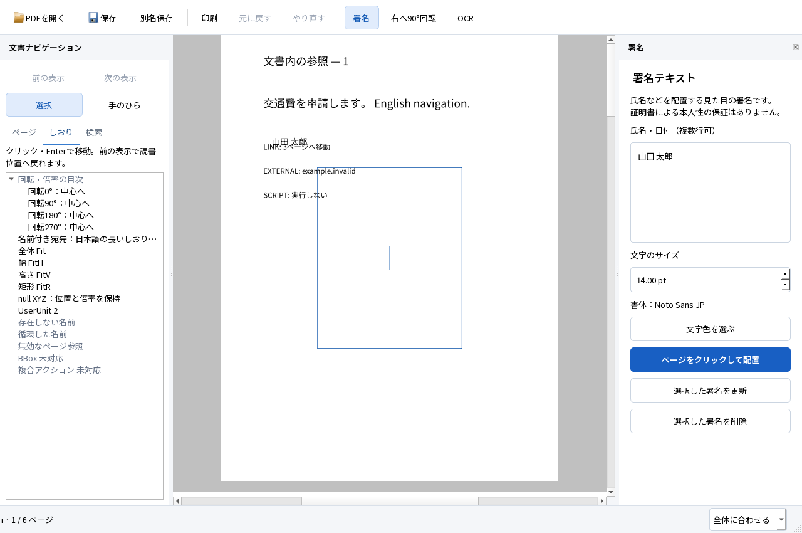

# M1 しおり・リンク・表示履歴の実装と実行結果

2026-10-05。Windows 11 Home 25H2 x64、Qt 6.9.3、MSVC 19.50。[操作設計](../design/DOCUMENT_NAVIGATION.md)に基づくM1の閲覧改修。SPEC・TECH・ACCEPTANCEと既存の入力・正解・閾値は変更していない。**M1全体の合格は保留。M2には進んでいない。**

## 使える成果物と起動方法

`dist/PDFTatsujin-M1-navigation/PDFTatsujin.exe`を起動する。配布ZIPは`dist/PDFTatsujin-M1-navigation-windows-x64.zip`。全体を展開し、DLL・assets・plugins・licensesと一緒に使う。Qt対応ソースも含む。GitHubにはソースと合成入力・結果を登録し、正式なバイナリリリースは未公開。

PDFを開き、左の「しおり」をクリックまたはEnterで選ぶ。「前の表示／次の表示」で読書位置と倍率へ戻れる。本文の内部リンクは「選択」ツールで短くクリックする。ドラッグは文字選択、署名枠は署名編集、「手のひら」は表示移動になる。試験入力は`fixtures/viewer-navigation.pdf`。日本語署名・移動・Undo／Redo・日英OCR・保存・再編集は同じアプリで使える。

最終exeのSHA-256：`fcb75d449eff673f06bc0af41e5f5d04956cffe97702c24d2c22e4a9014a376c`。

## 実際にできたこと

- 階層しおり、全文タイトルのツールチップ、移動先のラベルと物理番号。長いタイトルは列内で省略し、本文の幅を変えない。
- 名前付き宛先、XYZ／Fit／FitH／FitV／FitR、XYZのnullによる現在位置・倍率の保持。回転・CropBox・UserUnitを既存の変換で扱う。
- 無効な名前・循環・存在しないページ参照を拒否し、先頭ページへ誤移動しない。BBoxと複合アクションは未対応と表示する。
- Rect／QuadPoints内のリンクを判定し、Hidden／NoViewのリンクは実行しない。Esc・フォーカス・非アクティブ化・倍率や文書の変更で保留クリックを破棄する。
- 外部URIは文字列と未対応の説明を表示する。外部ファイル・JavaScript・起動時アクションを自動実行しない。
- ページラベルと物理番号を併記し、閲覧でPDF・dirty・編集Undoを変えない。文書更新後はしおりを読み直し、別PDFでは入れ替える。



[1024×720](navigation-1024.png)の画面と、[外部リンクの説明](navigation-external.png)も描画して確認した。署名がリンクに重なるのは、操作の優先順位を試すための意図的な合成入力。画面はQt offscreenであり、実OS倍率試験ではない。

## 試験結果

[Windows最終実行結果](navigation-regression.json)：**42 PASS／0 FAIL**。既存39試験と追加3試験を同じ配布exeで実行した。PATHをSystem32へ限定し、開発用のQt・assets環境変数を外した。QTestの入力とQt offscreenを用い、ネイティブOS入力の合格とは区別する。

| 追加試験 | 実行した確認 |
|---|---|
| Navigation_bookmarks | 13根・4子の階層、単クリック・Enter、4方向のXYZ、UserUnit 2、名前付き宛先、Fit各形式、FitR矩形の全体表示、null XYZ、無効5形式、ラベル、戻る／進む、繰返し移動の重複防止、最小画面 |
| Navigation_links | PDFの実リンク、名前付き宛先、ドラッグ選択、Esc・フォーカス・非アクティブ化、手のひら優先、外部URI・スクリプトの通知、Hidden・QuadPoints、コピー禁止・読取専用PDFの移動、倍率変更の取消 |
| Navigation_lifecycle | リンク上の署名移動とUndo、回転・revision更新、折り畳みの保持、busy中の閲覧、保存・再読込・署名再編集、ラベル・リンクの保持、別PDFへの切替、D07の既存しおり |

4方向のXYZ位置の最大軸誤差は0.5 DIP、Backの復元誤差は最大1 DIP。試験前に固定した2 DIP以内。追加入力と期待値は[manifest](../../fixtures/viewer-navigation-manifest.json)へ固定し、`check-source.py`でハッシュを照合する。文書端のスクロール制限と既存の25〜400%の倍率制限は別の境界として扱う。

busyのリンク試験は状態の模擬。実OCR・進捗・取消・異常終了はA05〜A09を回帰実行したが、実OCRとリンククリックの同時操作を別途実行したとは扱わない。

### A01〜A12の今回の範囲

| 条件 | 今回実行したこと | 未実行・残る制約 |
|---|---|---|
| A01 | 実PDF表示・移動・検索・範囲コピー・入口・画面配置、閲覧改修の回帰 | 実OS倍率・アクセシビリティ・第三者の操作評価 |
| A02 | 日本語署名の配置・移動・操作単位・取消・Undo／Redo | この版のネイティブIME。以前のGoogle日本語入力の[実画面記録](NATIVE_UI.md)は保持 |
| A03 | PDF保存・再編集、PDFium／Poppler描画、Qt PDF印刷、Firefox PDF印刷 | Reader、実プリンター、ネイティブ印刷ダイアログ。Windows PDFドライバーは以前の記録であり今回未再実行 |
| A04 | 4方向・CropBox・UserUnitの保存座標と閲覧位置 | 実OS倍率100／150／200% |
| A05 | 日英8ページOCR・検索・選択コピー・保存・独立評価・Firefox | Reader、Firefoxネイティブ検索バー・OSクリップボード |
| A06 | 対象ページ指定・混在ページOCR、既存文字・署名・注釈の保持、可視画素比較 | 実務文書の追加評価 |
| A07 | 既存OCR・白紙・写真の扱い、二重追加の回帰 | 多様な実スキャン・複雑な段組み |
| A08 | 署名→回転→OCR→Undo／Redo→保存、位置・内容保持 | ネイティブ入力での複合操作 |
| A09 | 途中取消・ワーカークラッシュ・UI取消・一時領域整理・未保存変更保持 | 極端な長時間・大容量文書 |
| A10 | 保存競合・読取専用・大小文字・取消・失敗・未保存で閉じる各経路 | 実容量不足、今回のNTFS拒否再試験。以前の権限拒否記録は保持 |
| A11 | 誤パスワード・暗号化・証明書署名・XFA・破損・エラー経路 | 証明書の有効性評価は対象外 |
| A12 | 配布フォルダから同じPCで起動、開発用PATH等を外した実行 | クリーンWindows＋通信無効は環境制約／未実行 |

### 保存PDFの独立評価

[pypdf／PDFiumの追加検証](navigation-export.json)では、しおり・名前付き宛先・ページラベル・5リンクの意味が原本と同一。6ページを描画し、日本語署名注釈の文字`山田 太郎`と外観を確認した。[保存結果の別エンジン描画](navigation-export-page-1.png)。通常保存で本文を画像化していない。外部ビューアによる今回の内部リンクのネイティブクリックは未実行。

[既存M1保存結果の独立評価](navigation-independent.json)と[Firefox 157.0／PDF.js](navigation-firefox.json)は日英の固定検索語が各20/20。実際の範囲選択コピーのCERは日本語0.5051%、英語0.7741%で、既存の2%／1%以内。PDFiumの本文直接抽出は日本語0.5051%、英語0.04554%。経路を混同しない。OCR文字行の最大位置ずれは0.9217mm、OCRのみ8ページ・混在4ページの可視画素差は0。フォーム6値・リンク・注釈・しおりを保持した。

Firefoxは専用ヘッドレスプロファイルを使い、ユーザーのブラウザやOSクリップボードは操作していない。DOM選択と検索イベントを確認し、WebDriver Print PageでPDFを出力してPopplerで描画・[目視確認](navigation-firefox-print.png)した。ネイティブ検索バー・コピー・印刷ダイアログ・物理プリンターは未実行。

### 修正と試験準備の記録

最初のビルドでは明示的なPDFDestinationコンストラクターの初期化を修正した。続いてPDF4QT Windows DLLがURI文字列・PageLabels解析関数を公開していないことがリンク時に判明したため、公開APIを使う小さなアダプターへ変更した。引数の修正を含む失敗ログは`evidence/viewer-navigation/build-*.log`へ保持した。

初回の[1 PASS／2 FAIL](navigation-first.json)から、読取専用PDFの表示ページを試験で明示し、長いしおりの列幅とクリックの可視性を整えた。[2 PASS／1 FAIL](navigation-second.json)でも通知の失敗が残り、[宛先を絞った診断](navigation-third.json)で、複合アクションの最初だけが実行されていると特定した。固定版PDF4QTのアクション解析が`/Next`を保持しないため、元の辞書を読む共通アダプターで拒否した。既存の正解や閾値は変更していない。

独立検証の準備ではPDFiumページがcontext managerを提供しない点を修正した。また、新規の検証コードが署名注釈を本文textpageから抽出できると誤認していた。SPEC 5.2は注釈文字の本文と同じ検索を外部互換条件にしていないため、正確な注釈文字・外観ストリーム・別エンジンでの実描画を区別して検査した。本文・OCRコピーの正解や閾値は変更していない。中間の失敗は`export-first`／`export-second`に残し、最終結果は`export-final`。

画面の確認で古い移動通知が別ページの状態表示を覆う問題を修正し、表示変更で通知を解除した。コピー禁止の文書でも倍率変更で保留クリックを破棄する試験を追加した。修正前の42 PASSは`regression`、最終exeの42 PASSは`regression-final`として保持する。

### 初期性能と容量

[回帰終了後の各3回計測](navigation-performance.json)。実PDFページの初回描画までを計測し、QApplication・フォントの開始前初期化は含まない。RSSは10ms間隔の観測値。プロセス全体時間は250ms待機・画像保存・終了を含む。

| 文書 | 初回描画の中央値 | 最大観測RSS（10進MB） |
|---|---:|---:|
| D01・1ページ | 71ms | 46.53MB |
| D10・デジタル100ページ | 82ms | 47.04MB |
| D10・画像主体50ページ | 608ms | 93.09MB |

コールド起動、実画面FPS・入力p95、長時間メモリ推移、Acrobat比較、巨大なしおりの応答は未実行。速さやUXの優越を宣言する結果ではない。

[最終文書同梱前の容量計測](navigation-storage.json)は、過去版・依存・失敗記録を含めて6.635GB。上限20GBまで13.365GBの余裕がある。今回の配布フォルダは約149.6MB、Qt対応ソース込みZIPは約142.2MB。単位は10進、ファイル長の合計で、NTFSの割当容量とは区別する。フォルダ外の既存MSVC・Windows・共有試験ランタイムは別扱い。

| 配布部品 | 容量（10進MB） |
|---|---:|
| アプリとPDF4QT | 10.84 |
| Qtとプラグイン | 33.11 |
| ネイティブ依存とMSVCランタイム | 45.08 |
| 日英OCRモデル | 44.06 |
| フォント | 9.59 |
| ライセンス・文書等 | 6.90 |
| 別同梱のQt対応ソース | 53.89 |

最終ZIPはCRCと全ファイルのSHA-256を展開元へ照合した。最終ハッシュと照合記録は`evidence/viewer-navigation/archive-verification.json`、配布後の容量は`evidence/viewer-navigation/storage-final.json`へ保存する。バイナリはソース管理へ含めない。

### 再現手順

固定環境は[開発手順](../DEVELOPMENT.md)。下記は今回実行したコマンド。出力先は未使用のフォルダを指定し、既存の合成PDF・manifestを再生成しない。

```powershell
& scripts/build.ps1
& scripts/package.ps1 -OutputDirectory dist/PDFTatsujin-M1-navigation -TestSupport
Remove-Item Env:TATSU_TEST_FILTER -ErrorAction SilentlyContinue
$env:TATSU_UI_REVIEW='1'
& scripts/run-tests.ps1 -Headless -AppDirectory dist/PDFTatsujin-M1-navigation -OutputDirectory evidence/viewer-navigation/regression-final
python scripts/benchmark-viewer.py --app-directory dist/PDFTatsujin-M1-navigation --output evidence/viewer-navigation/performance
python scripts/test-navigation-export.py evidence/viewer-navigation/regression-final evidence/viewer-navigation/export-final
python scripts/evaluate.py evidence/viewer-navigation/regression-final
python scripts/test-firefox.py evidence/viewer-navigation/regression-final evidence/viewer-navigation/firefox --firefox tools/viewer-test/firefox/core/firefox.exe --geckodriver tools/viewer-test/geckodriver/geckodriver.exe
python scripts/check-source.py
```

## 未実行・制約

上表の未実行に加え、BBox宛先・外部リンクを開く操作・集中表示・文字カーソル・単語ダブルクリック等の未実装部分が残る。しおりは1万件・64階層まで、異常に長いローマ数字・英字ラベルは物理番号へ戻す。[設計の境界](../design/DOCUMENT_NAVIGATION.md)。リンクのNoRotate／NoZoomの特殊フラグ、タッチ／ペン、Narrator・ハイコントラスト、実マウスの長時間操作も未実行。全てのPDFや閲覧設計全体の合格にはしない。

## 採用構成と理由

TECHの構成Aと、PDF4QTをライブラリとして包む既存の連続表示を維持した。Navigationは宛先・ラベル・しおりの値、BookmarksPanelは階層UI、Canvasはリンク判定と表示変換、Windowは移動・表示履歴を所有する。保存・OCR・編集Undoを変更せず、新しい描画エンジンや解析ワーカーを追加しない。上流コードの改変も不要。構成Bの新たな比較は行っていない。

## 次の判断

今回のしおり・内部リンク・表示履歴は実装・回帰検証済みとして提出する。Reader・実OS倍率・クリーンWindows等の未実行を残し、M1全体の合格・閲覧UX完成・Acrobatを上回ったという判断は保留する。M2の全機能開発へは進めない。
