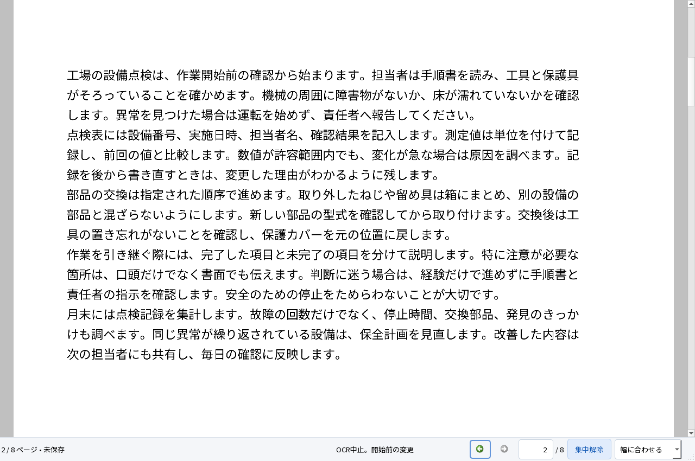

# M1 ページ入力・集中表示と最終検証

2026-10-05。Windows 11 Home 25H2 x64、Qt 6.9.3、MSVC 19.50。[操作設計](../design/READING_CONTROLS.md)に沿ったM1の閲覧改修。要件4文書、固定入力、正解、検索語、受入閾値は変更していない。**M1全体の合格は保留。M2以降には進んでいない。**

## 使える成果物と起動方法

`dist/PDFTatsujin-M1-reading/PDFTatsujin.exe`を起動する。ZIPは`dist/PDFTatsujin-M1-reading-windows-x64.zip`。全体を展開し、DLL・assets・plugins・licenses・Qt対応ソースを保持する。ソースは[公開リポジトリ](https://github.com/okakanatto/PDF_Tatsujin)、自作コードはMIT。正式なバイナリリリースは未公開。

Ctrl+Lで物理ページ番号を入力し、Enterで移動する。本文のF8または下部ボタンで集中表示に切り替え、Escで解除する。Ctrl+Fは検索欄を開き、集中表示を解除する。本文ではCtrl+Home／End、Ctrl+Plus／Minus、Ctrl+0（全体）、Ctrl+1（幅）が使える。集中表示でも保存・Undo／Redoの文書ショートカットを利用できる。

最終exe SHA-256：`c9876c743f4fe1eaa1d34867f6962494b4e2be3ed5ef704a86af31c0272eb0d0`。配布ZIPの全ファイル照合は`evidence/viewer-reading/archive-verification.json`に保存する。

## 実際にできたこと

- ページラベルと物理番号を区別して表示・入力する。空欄・文字・範囲外は説明し、表示を移動したり数値を丸めたりしない。Escで入力を戻し、入力中のスクロールでは未確定入力を保持する。
- 集中表示で左右パネルと文書ツールバーを畳む。下部のページ・倍率・表示履歴・解除・OCR取消を残し、解除時は前の設定を戻す。OSの全画面や表示倍率の設定を変更しない。
- 1024×720では右設定を開くと左のページ／しおりを畳む。検索タブは署名設定との併用中も残し、元の検索操作を失わない。
- パネル切替でPDF上の中央点を保ち、閲覧だけでは文書・dirty・編集Undoを変えない。初期表示の予約は明示的なページ移動で取り消す。
- 実OCR中にも集中表示・ページ入力・取消が動く。取消で未保存署名を保持し、保存後の署名を再編集できる。集中表示からのCtrl+Z、Ctrl+Shift+Z、Ctrl+Sも実PDFで検証する。



[狭い画面の署名設定](reading-1024-signature.png)、[ページ入力の説明](reading-invalid-page.png)、[ページラベルの併記](reading-page-label.png)も実アプリから取得した。画面はQt offscreenであり、実OS倍率や第三者の体験評価とは区別する。

## 試験結果

最終配布exeの[Windows実行結果](reading-regression.json)：**47 PASS／0 FAIL**。既存42試験、追加の閲覧3試験、実NTFS拒否とWindows PDFドライバ2試験を実行した。集中表示からのキーUndo／Redo・実PDF保存もPASS。PATHはSystem32へ限定し、開発用Qt・assets変数を外した。[最終exe・ACL復元の記録](reading-windows-errors.json)。

| 追加試験 | 入力・実行手順 | 期待・実結果の確認 | 証拠 |
|---|---|---|---|
| Reading_page_input | D10 100ページ、ページ番号・Ctrl+Home／End・拡縮・Esc・IME未確定を入力。PageLabels付きPDFにも切替 | 物理ページ・範囲拒否・履歴・アンカー・文書不変。IMEはQInputMethodEvent | reading-regression.json |
| Reading_focus_layout | 4方向回転とUserUnit 2、1280×850／1024×720で設定と集中表示を開閉 | PDFアンカー軸誤差2論理px以下、取消の優先、Ctrl+F、文書不変 | reading-regression.json・各画面 |
| Reading_OCR_cancel | D03に署名、実jpn+engワーカーが1ページ終了後に集中表示でページ移動・取消。保存・移動・キーUndo／Redo・キー保存・再読込 | 部分OCRを反映せず、署名・dirty・一時領域・保存後の再編集を確認 | reading-regression.json |
| A10_NTFS_access_denied | 自分で作成した専用NTFSフォルダの書込を一時的に拒否。新規保存・既存宛先置換を試す | 原本・宛先ハッシュ・未保存文書を保持。ACLをfinallyで復元 | reading-windows-errors.json |
| A03_Windows_PDF_printer | 日本語署名付きD01をMicrosoft Print to PDF実ドライバへ出力 | PDFを再読込し、Popplerで描画して日本語を目視確認 | reading-windows-print.png |

### A01〜A12の現在の範囲

下表は実行範囲の整理で、未実行を含む項目全体の合格宣言ではない。実行環境は上記Windows、入力は同梱の合成PDF。操作・期待・実結果の詳細は最終JSONと各独立評価を参照する。

| ID | 状態・入力・実行した操作 | 確認した期待・結果 | 未実行・残課題 |
|---|---|---|---|
| A01 | 実行。D01／D10／閲覧用PDFで表示・連続移動・倍率・検索・コピー | 同じ画面の署名／OCR入口、読書位置、検索・閲覧履歴、集中表示を確認 | 実OS倍率・Narrator・第三者の体験評価 |
| A02 | 実行。D01に日本語署名を配置・移動・サイズ変更・Undo／Redo | 操作単位・保存文字・取消・署名同一性。以前の[Google日本語入力実画面](NATIVE_UI.md)を維持 | この最終exeでのネイティブIME・Microsoft IMEは未実行 |
| A03 | 実行。別名保存・再読込・署名再編集・Qt／Windowsドライバ／Firefox PDF印刷 | 原本不変、日本語署名外観、再編集、別エンジンの描画 | Reader・ネイティブ印刷ダイアログ・実プリンターは未実行 |
| A04 | 実行。D02の回転・CropBox・UserUnit、署名保存と拡縮 | 保存座標0.5pt以内、閲覧アンカーと4方向の回帰 | OS倍率100／150／200%は未実行 |
| A05 | 実行。D03日英8ページOCR→検索・選択コピー→保存→外部評価 | 固定したCER・20検索語・読み順・文字行位置を評価 | Reader、Firefoxネイティブ検索バー・OSクリップボードは未実行 |
| A06 | 実行。D04対象指定・D05混在OCR | 既存文字・画像・署名・注釈、対象外可視内容・二重コピーを確認 | 実務文書への一般化は未評価 |
| A07 | 実行。D06既存OCR・白紙・写真へ再実行 | 二重追加を避け、既存保持・未検出を区別 | 多様な実スキャン・複雑な段組みは未評価 |
| A08 | 実行。署名→回転→OCR→Undo／Redo→保存 | OCRだけのUndo、署名・回転・検索位置の保持 | ネイティブ入力による複合操作は未実行 |
| A09 | 実行。部分OCR後取消・ワーカー強制終了・UI取消 | 未保存署名・文書・revisionを保持、一時領域を整理。集中表示も確認 | 極端な大容量・長時間運用は未実行 |
| A10 | 一部実行。D09保存取消・宛先競合・読取専用・実NTFS拒否 | 原本・既存宛先・dirtyの保持と失敗通知 | 実容量不足は未実行。ACL拒否で代替しない |
| A11 | 実行。D08誤パスワード・暗号化・証明書署名・XFA・破損 | 編集／OCR／平文保存を防ぎ、読取専用と理由を表示 | 証明書の信頼性評価は対象外 |
| A12 | 環境制約／未実行 | 同じPCの配布フォルダでPATH制限の起動・処理は実行 | 開発環境のないクリーンWindows＋通信無効は未実行 |

### 保存PDFと外部評価

[独立評価](reading-independent.json)と[Firefox検索・DOM選択](reading-firefox.json)は日英の固定検索語が各20/20。実際の範囲選択コピーのCERは日本語0.5051%、英語0.7741%で、既存の2%／1%以内。PDFiumの本文直接抽出では日本語0.5051%、英語0.04554%。OCR文字行の最大位置ずれは0.9217mm、OCRのみ8ページと混在4ページの可視画素差は0。フォーム6値・注釈・リンク・しおりを保持した。正解・閾値は変更していない。

Firefox 157.0／PDF.jsは専用ヘッドレスプロファイルで実行し、DOM選択・検索イベント・WebDriver Print Page出力を確認した。印刷PDFをPopplerで描画して[日本語署名・異体字・日付を目視確認](reading-firefox-print.png)。DOM選択をOSクリップボード操作と呼ばず、ネイティブ検索バー・印刷ダイアログ・実プリンターは未実行と区別する。

[しおり・名前付き宛先・PageLabels・5リンクの構造比較](reading-navigation-export.json)とPDFiumの6ページ描画で保存保持を検証する。署名の本文検索はSPEC 5.2の外部互換条件に含めず、注釈文字・外観・実描画を別々に確認する。

Firefox 157.0の追加操作診断では、未編集入力と保存後入力の双方で11種類中10種類のしおりと内部リンクが期待ページへ移動した。全体Fitは期待の5ページに対して2ページとなり、**この診断はFAIL**。元のPDFでも再現し、保存前後の宛先構造は一致するため、保存による差は検出していない。ビューア／この試験文書との互換性課題として残し、全外部操作の合格とは扱わない。[未編集入力の結果](reading-firefox-navigation-original.json)・[保存入力の結果](reading-firefox-navigation-saved.json)。期待ページを変更しない。

その後の[イベント追跡・3条件比較](M1_EXTERNAL_FIT.md)では、直接の全体Fitは5ページ、他のしおり操作後は2ページとなる差を、元・保存後の双方で確認した。以前の宛先の文字層へフォーカスが戻る処理の関与を推定する。連続操作のFAILとM1合格保留は維持する。

### 失敗と修正の記録

初回はページ入力1 FAILと、その後の配置試験でプロセスクラッシュ。文書を開いた直後の予約移動を明示ジャンプで取り消し、Qtの配置処理中の強制再配置を避けた。[初回記録](reading-first.json)。修正後の追加3試験はPASSとなった。クラッシュのスタック取得は未実行で、修正後に再現しないことを確認した結果と区別する。QWidget::sizeと既存メンバー名の衝突によるビルド失敗もログを保持する。

最初の全回帰では検索欄が1024×720の署名設定と併用中に隠れる1 FAILを検出した。[失敗記録](reading-regression-first.json)。検索タブを残すよう製品を修正し、元の検査を変更せず再試験した。集中表示でツールバーを隠した場合の文書ショートカットをWindowにも登録し、実保存まで検証する。入力欄の装飾は検証状態が変わった場合だけ再計算する。

Firefox診断スクリプトは新しいサイドバー識別子、treeItem構造、リンク属性を実DOMで確認して対応した。PDFオブジェクト生成だけでなく実文字描画・ページ初期化・対象リンク表示を待ち、倍率変更後に表示ページを設定する。試験準備の失敗は`evidence/viewer-reading/firefox-*`に保持し、実リンクのクリックと期待ページの判定を省略して成功扱いにしない。

## 未実行・制約

上表の未実行に加え、実画面FPS・入力p95・長時間メモリ・Acrobat比較、文字カーソル、単語ダブルクリック、全ページサムネイルの先読み、BBox宛先・外部リンクを開く操作等が残る。今回のComputer Useでは起動とWindowsファイルダイアログを確認したが、ファイル名欄のフォーカス確認で異なる要素が返り、入力・保存・OCRの新たなOS操作の証拠にはしていない。試験用ウィンドウは閉じ、可能な実装とWindows自動検証を続けた。

## 容量・初期性能

[各3回の実PDF表示計測](reading-performance.json)の中央値と観測最大RSSは次のとおり。起動時間はQApplication・初期フォント設定後からのoffscreen実描画で、OSキャッシュを消していない。RSSは10ms間隔の観測値。実ディスプレイのFPS・全起動時間・Acrobat比較とは区別する。

| 入力 | 初回読める状態の中央値 | 観測最大RSS（10進MB） |
|---|---:|---:|
| D01 | 155ms | 46.21 |
| D10 デジタル100ページ | 167ms | 46.95 |
| D10 画像50ページ | 1094ms | 93.17 |

前報告の71／82／608msより増えたため、[直前版を同じPC・同じ経路で再計測](reading-performance-previous.json)した。その中央値は156／146／1027ms。今回の最終版との差は入力によって異なり、背景負荷・OS状態は統制していない。表示の速さの優越や、変動原因の確定は主張しない。個別3試行とexe・入力ハッシュを残す。

[梱包前の部品別容量](reading-storage.json)と、ZIP完成後の`evidence/viewer-reading/storage-final.json`を区別する。プロジェクトの上限は10進20GB。過去版・失敗記録・依存を含むファイル長の合計で、NTFSの割当量やフォルダ外の既存MSVC・共有試験ランタイムは別扱い。

### 再現手順

固定依存・対象環境は[開発手順](../DEVELOPMENT.md)。下記は今回実行した経路。出力先は新しいフォルダを指定し、固定したPDF・正解を再生成しない。NTFS試験は作成した専用フォルダのACLだけを変更し、finallyで復元する。容量不足の代替とはしない。

```powershell
& scripts/build.ps1
& scripts/package.ps1 -OutputDirectory dist/PDFTatsujin-M1-reading -TestSupport
Remove-Item Env:TATSU_TEST_FILTER -ErrorAction SilentlyContinue
$env:TATSU_UI_REVIEW='1'
& scripts/test-windows-errors.ps1 -IncludeNativePrinter -AppDirectory dist/PDFTatsujin-M1-reading -OutputDirectory evidence/viewer-reading/submission-regression
python scripts/benchmark-viewer.py --app-directory dist/PDFTatsujin-M1-reading --output evidence/viewer-reading/performance-final
python scripts/evaluate.py evidence/viewer-reading/submission-regression
python scripts/test-navigation-export.py evidence/viewer-reading/submission-regression evidence/viewer-reading/submission-export
python scripts/test-firefox.py evidence/viewer-reading/submission-regression evidence/viewer-reading/firefox-submission --firefox tools/viewer-test/firefox/core/firefox.exe --geckodriver tools/viewer-test/geckodriver/geckodriver.exe
python scripts/test-firefox-navigation.py evidence/viewer-reading/submission-regression/navigation-preserved.pdf evidence/viewer-reading/firefox-navigation-submission --firefox tools/viewer-test/firefox/core/firefox.exe --geckodriver tools/viewer-test/geckodriver/geckodriver.exe
python scripts/archive-distribution.py --app-directory dist/PDFTatsujin-M1-reading --output dist/PDFTatsujin-M1-reading-windows-x64.zip --verification evidence/viewer-reading/archive-verification.json
python scripts/check-source.py
```

補助Python・Poppler等の配置と環境変数は[各検証の既存手順](M1_NAVIGATION.md#再現手順)を参照。Firefoxナビゲーション診断は既知のFit 1件で終了コード1となる。GUI・クリーンWindowsなどの未実行項目は[残る環境試験の手順](REMAINING_MANUAL.md)を参照し、手順の存在を実行済み判定にしない。

## 採用構成と理由

構成A（PDF4QT＋Tesseract）のライブラリ利用を維持する。PageControlは入力検証とフォーカス、Windowは移動・表示履歴・パネル状態、CanvasはPDFアンカーと本文のキー操作を担当する。文書状態・通常PDF保存・OCR統合を作り直さず、同じアプリで回帰した。追加のPDFエンジン・モデル・常駐ワーカーは製品へ入れていない。構成Bの新たな比較は行っていない。

## 次の判断

M1の署名・日英OCR・通常PDF保存・再編集の成立性を示す試作、閲覧改修、配布物、入力・正解・試験記録を提出する。A10の実容量不足、A12、Reader等の未実行とFirefox Fitの診断課題が残るため、M1合格・一般配布・閲覧UX完成・Acrobatを上回ったという判断は保留する。今回の停止点はM1の成立性判断資料までで、M2以降の開発へは進まない。
