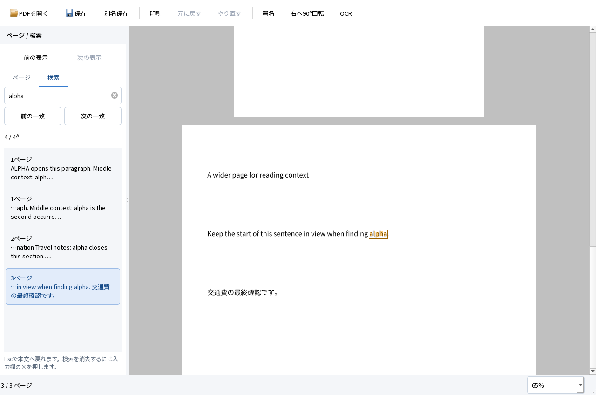
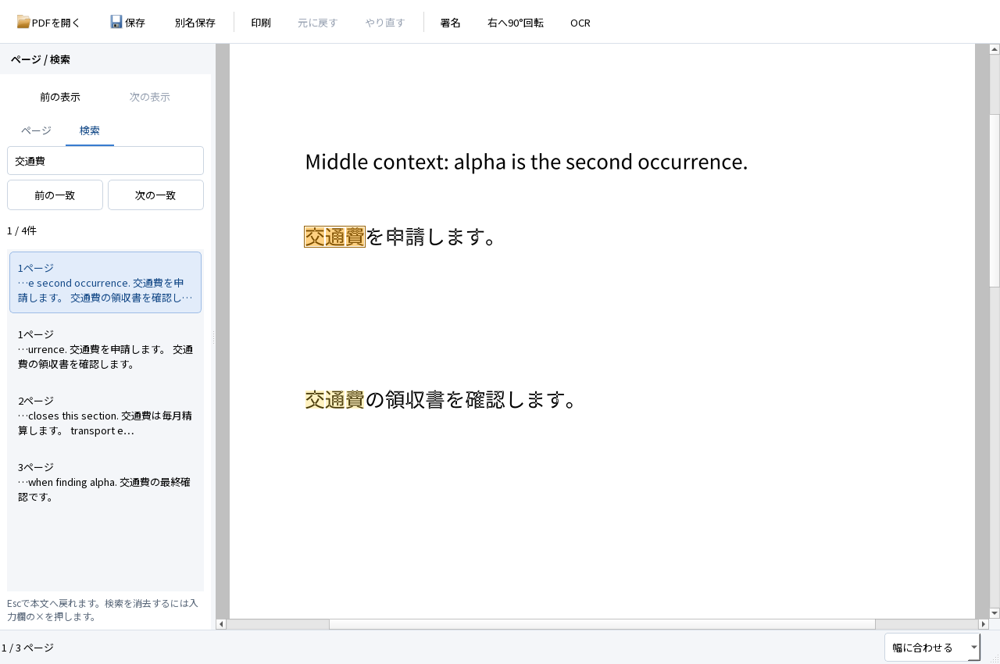
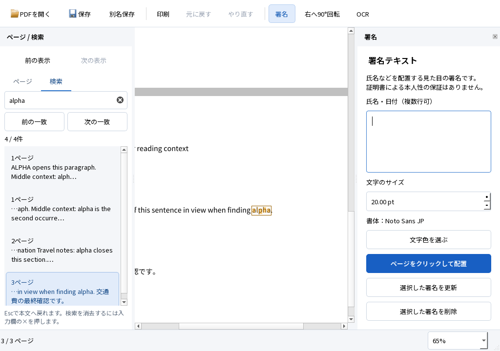

# M1 検索・表示履歴の実装と実行結果

2026-10-04。Windows 11 Home 25H2 x64、Qt 6.9.3、MSVC 19.50。閲覧設計に基づき、連続ビューアへ非同期検索と表示履歴を統合した。**M1全体の合格は保留。Acrobatとの比較は未実行で、M2には進んでいない。** 既存の入力・OCR正解・検索語・閾値は変更していない。

## 使える成果物と起動方法

ローカルの `dist/PDFTatsujin-M1-search/PDFTatsujin.exe` を起動する。配布用は `dist/PDFTatsujin-M1-search-windows-x64.zip`。ZIP全体を展開し、DLL・assets・plugins・licensesを含むフォルダ一式で使用する。Qt対応ソースも同梱する。GitHubはソース管理用であり、正式なバイナリリリースは未公開。

配布フォルダは約148.2MB、Qt対応ソース約53.9MB、両方を含むZIPは約141.4MB。[部品別容量](search-storage.json)の測定時点でプロジェクトは約5.68GB、許可上限20GB以内。数値は10進のファイル長合計で、NTFS割当量とは異なる。既存のシステムMSVC・共有テストランタイムはこのフォルダの外にある。最終ZIPは全収録ファイルのCRCとSHA-256を照合し、ローカルの `evidence/viewer-search/archive-verification.json` に記録する。

`fixtures/viewer-search.pdf` は3ページの合成文書。「alpha」と「交通費」は各4件あり、同一ページ内の移動と縦横サイズ混在を試せる。「expense」は2ページ目に1件。生成元と事前固定した件数・ページ・ハッシュは [manifest](../../fixtures/viewer-search-manifest.json)。元の19種類のM1入力とは別に追加した。自作の試験文字列はMIT、埋込みフォントはNoto Sans JPのOFL。

## 実際にできたこと

- Ctrl+Fで検索欄へ移り、確定した入力をバックグラウンドで検索する。現在ページから結果を出し、一覧は文書順に並べる。後から結果が増えても現在の選択を保つ。
- 結果はページ番号と前後の抜粋を表示する。Enter／F3で次、Shift併用で前の一致へ移動する。ページ内の複数一致も別々に扱い、選択中を濃く表示する。末尾からの循環を通知する。
- 検索への移動は倍率を保ち、可能なら行頭も見える横位置にする。「前の表示／次の表示」でPDF上の位置・倍率・表示モード・一致選択を復元する。Alt+Left／Rightも割り当て、入力欄の編集中は無効にする。文書のUndoとは独立する。
- Escは語と結果を残して本文へ戻り、検索欄の×で消去する。0件、検索途中、解析できないページ、文字情報がないページを区別する。
- 検索語の変更、別文書、OCR・Undo後の文書変更では古い検索結果を捨てる。OCR後は同じ語で再検索し、勝手に本文を移動しない。







## 試験結果

最終版で **33 PASS／0 FAIL**。[実行結果](search-regression.json)は既存M1・連続ビューアの30件と検索追加3件を含む。日本語署名の配置・移動・Undo／Redo・保存後の再編集、日英OCR、検索・選択コピー、保存、取消・異常系を同じアプリで回帰した。これはA01〜A12の全条件合格を意味しない。

検索追加の3試験は、実行ファイル内のQt QTestで実際のPDF・Window・Canvasを操作した。実OS入力と混同しない。

| 試験 | 検査した内容 |
|---|---|
| Search_occurrences_history | 英語4件・日本語4件、ページ順、同一ページの第2一致、単独一致への再移動、前／次の表示、新しい移動後の進む側破棄、明示倍率保持、循環表示、0件・消去、1024×720の操作部、PDFと編集Undoの不変 |
| Search_generation_lifecycle | 100ページの現在ページ優先、結果挿入後の選択維持、GUIタイマー継続、検索語連続変更、別PDF、署名・Undo後の自動再検索、回転とCropBox、画像だけの8ページ、検索中の終了 |
| Search_IME_commit | 合成QInputMethodEventによる未確定入力抑止と確定後検索、Escで本文へ戻り結果維持。ネイティブIMEは未実行 |

表示履歴の位置誤差は最大1 DIP（論理ピクセル）。100ページの検索は123ms、処理中のGUIタイマー7回、検索中の終了待ちは10msだった。これは当該合成入力での各1回の観測であり、p95・最悪時間・任意PDFの応答保証ではない。D10の各ページは同じ内容を参照する。

既存の同一画面OCR試験には、開始前の「図書館」が0件、完了後に入力をやり直さず1件になる確認を加えた。既存の文字検索・635文字の選択コピー・保存・OCR Undo／Redoも維持する。

[別エンジンによる検証](search-independent.json)では、設定固定後の評価用OCRのCERが日本語0.5051%・英語0.04554%、事前固定語は各20/20。文字行の位置ずれは最大0.9217mm、回転90度の複合操作では最大0.7965mm。OCRのみ8ページと混在4ページの可視画素差は0。フォーム6値、既存注釈・リンク・しおりを保持した。PDFium 153.0.7999.0とPoppler 26.07.0を使用した。

[Firefoxの結果](search-firefox.json)は専用のヘッドレスFirefox 157／PDF.jsで実行した。保存後の検索は日英各20/20、DOMで選択した評価用テキストのCERは日本語0.5051%・英語0.7741%。外部エンジンの抽出と同じ数値にはならないため分けて記録する。署名の画面表示とWebDriver Print PageによるPDF出力を実行し、[印刷PDFをPopplerで描画した画像](search-firefox-print.png)で日本語の字形を確認した。ネイティブ検索バー、OSクリップボード、実際の印刷ダイアログ・プリンターは未実行。ユーザーのブラウザプロファイルは使用しない。

### 初期性能

[各3回の生データ](search-performance.json)は別プロセスのQt offscreenで測定。実ページコンパイル完了とウィンドウ画像取得までを計時し、開始前のQApplication・フォント初期化は含まない。プロセス全体時間には250msの観測待ち、画像保存、終了を含む。RSSは10ms間隔で観測した。

| 入力 | 初回本文描画までの中央値 | ピークRSS（3回中の最大、10進MB） |
|---|---:|---:|
| D01・1ページ | 79ms | 43.78MB |
| D10・デジタル100ページ | 77ms | 44.67MB |
| D10・画像主体50ページ | 618ms | 93.53MB |

exeのSHA-256は `f7b07a22992b2f14bece177e3ce83aca3a4a88b440a7e443914aa94784403002`。測定対象をこの版に固定した。OSキャッシュを消去したコールド起動、実画面FPS、入力p95、長時間スクロールのメモリ推移、Acrobatとの比較は未実行。前回との差から速度向上を主張しない。

見つけて修正した不具合:

| 問題 | 修正と証拠 |
|---|---|
| CropBox外の見えない文字を検索結果に数える | 一致の文字矩形をCropBoxで切り抜き、可視矩形のない一致は出さない。D02の4ページ目は本文が完全に外側にあり、入力を変えず3件を期待した。[修正前](search-crop-before.json)はFAIL、修正後は3件・各一致が画面内に入ることを確認 |
| 一致が1件のとき、別ページへ移った後のEnterで戻れない | 選択IDが同じでも明示的な移動要求を処理する。[修正前](search-single-before.json)を残し、同じ操作で修正を確認 |

実行ログは `evidence/viewer-search` に保持する。初回の全体試験 `release` はアプリ側33 PASS・0 FAILだったが、外側の手動PowerShellコマンドが無関係な `$LASTEXITCODE` を読み、失敗を誤報した。`run-tests.ps1`自体は実プロセスのExitCodeで判定しており変更していない。最終結果はこの外側のチェックを除いた `release-final` を採用する。

再現コマンド。依存配置は[開発手順](../DEVELOPMENT.md)を参照し、試験時は未使用の出力先を指定する。

```powershell
& scripts/build.ps1
& scripts/package.ps1 -OutputDirectory dist/PDFTatsujin-M1-search -TestSupport
$env:TATSU_UI_REVIEW='1'
Remove-Item Env:TATSU_TEST_FILTER -ErrorAction SilentlyContinue
& scripts/run-tests.ps1 -Headless -AppDirectory dist/PDFTatsujin-M1-search -OutputDirectory evidence/viewer-search/release-final
python scripts/evaluate.py evidence/viewer-search/release-final
python scripts/benchmark-viewer.py --app-directory dist/PDFTatsujin-M1-search --output evidence/viewer-search/performance
python scripts/test-firefox.py evidence/viewer-search/release-final evidence/viewer-search/firefox --firefox tools/viewer-test/firefox/core/firefox.exe --geckodriver tools/viewer-test/geckodriver/geckodriver.exe
python scripts/check-source.py
```

## 未実行・制約

| ID | 今回の検証対象 | 未実行・制約 |
|---|---|---|
| A01 | 実PDF閲覧、連続表示・ズーム、検索・一致移動・表示履歴・選択コピー | ページをまたぐ選択、しおり・内部リンクへの移動は未実装 |
| A02 | 日本語署名の配置・移動・再編集・Undo／Redo | この版のネイティブIME再試験は未実行。合成入力は実IMEの代替ではない |
| A03 | 保存・再読込・外部描画・PDF印刷出力 | Adobe Reader、ネイティブ印刷ダイアログ、物理印刷は未実行 |
| A04 | 回転・CropBox・UserUnit・倍率と実配置、回転後の検索移動 | 実OS拡大率100／150／200%の比較は未実行 |
| A05 | 日英OCR、同じ画面の検索・コピー、保存後の独立評価 | Reader、Firefoxのネイティブ検索バーとOSコピーは未実行 |
| A06 | ページ指定・混在ページOCR、既存文字・署名・注釈・フォーム保持 | 多様な実スキャン一般の品質保証ではない |
| A07 | 既存OCR・空白・写真・重複防止 | 他社OCRの全形式は未評価 |
| A08 | 署名→回転→OCR→Undo／Redo→保存、自動再検索 | 縦書き・段組みの限界は継続 |
| A09 | 進捗後の取消・異常終了・UI応答・未保存変更保持 | 電源断・OS異常終了は未実行 |
| A10 | 保存取消・外部競合・別名表記・読取専用・閉じる経路 | 実ディスク容量不足は未実行。NTFS拒否は過去版で実施 |
| A11 | 暗号化・証明書署名・XFA・破損PDFの保護 | 証明書の信頼チェーン・失効確認は対象外 |
| A12 | 開発用PATH等を外した同じPCの配布フォルダ起動 | クリーンWindows＋通信無効は未実行。M1全体の合格を保留 |

検索は大文字小文字を区別しないflow内の文字列一致。改行をまたぐ語句、縦書き・複雑な段組み、不可視文字の全方式には対応を保証しない。検索結果数の固定上限はなく、極端に多い一致のメモリ使用量は未測定。取消時も処理中1ページのレイアウト完了を待つため、病的に重いPDFの終了時間は未保証。

全サムネイルの先読み、手のひら・集中表示、キーボードによる署名枠操作、Narrator実操作、Acrobat比較、第三者の使い勝手評価は未実装または未実行。[V01〜V12](../design/VIEWER_UX.md)全体を合格扱いにしない。過去の[Google日本語入力](NATIVE_UI.md)等は過去版の証拠として区別する。

## 採用構成と理由

独自Qt UI＋PDF4QT表示アダプターを維持する。検索の処理・モデルをSearchSession、入力・選択をSearchPanelへ分離し、Canvasは計算済み座標の描画、Windowは表示履歴の統合に限定した。検索は1ワーカーと1置換待ち要求で、全文索引を保持せずページごとに文字レイアウトを解放する。古い世代は破棄し、OCR等のrevision変更を反映する。表示履歴はプロセス内の最大200件で、文書編集Undoと保存には触れない。[詳細](../ARCHITECTURE.md)。

## 次の判断

M1内の閲覧改善として、検索から読書へ戻る実装と証拠を提出する。M1の重要な環境試験と閲覧設計の未実装・未評価部分を残す。要件を緩めて完成とはせず、M2へは進めない。
