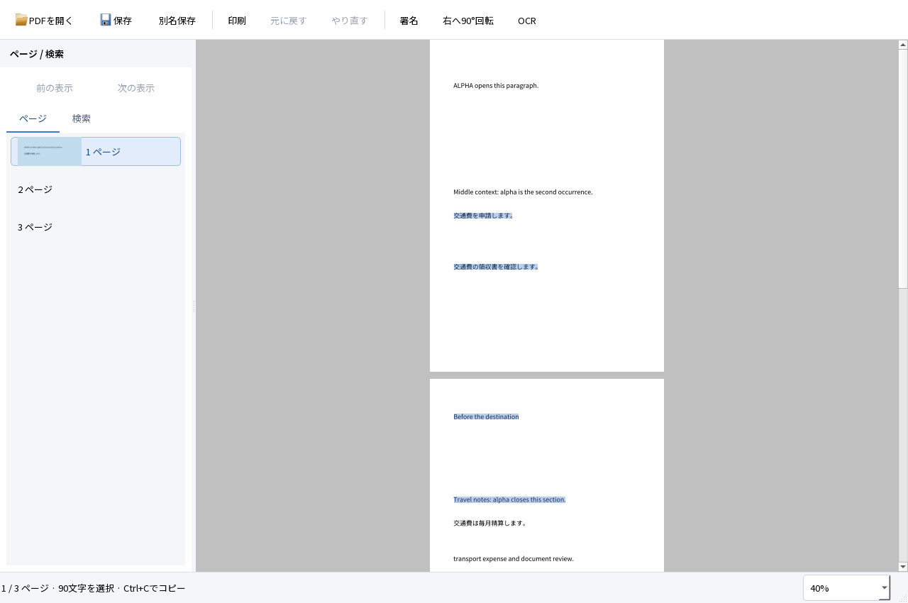
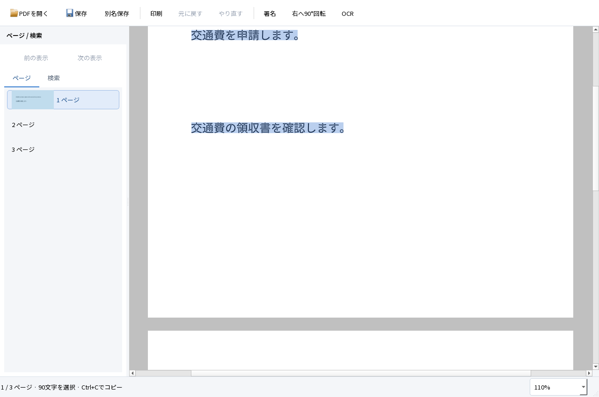
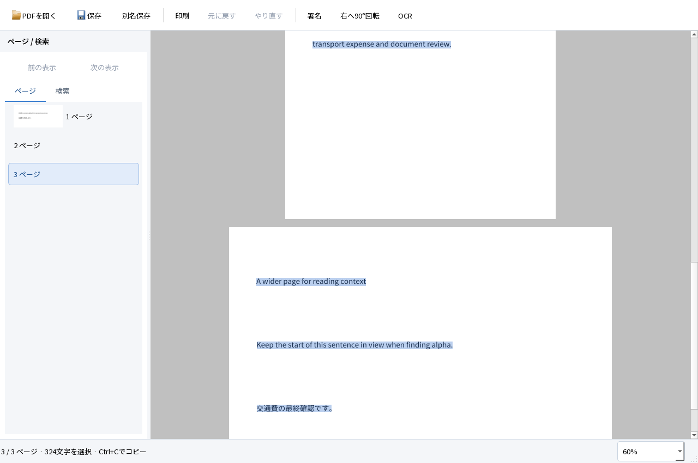

# M1 本文選択・コピーの実装と実行結果

2026-10-04。Windows 11 Home 25H2 x64、Qt 6.9.3、MSVC 19.50。[本文選択の設計](../design/TEXT_SELECTION.md)に基づき、同じアプリのビューアを改修した。SPEC・TECH・ACCEPTANCEの正解・閾値は変更していない。**M1全体の合格は保留。Acrobatとの比較は未実行。M2には進んでいない。**

## 使える成果物と起動方法

`dist/PDFTatsujin-M1-selection/PDFTatsujin.exe` を起動する。配布ZIPは `dist/PDFTatsujin-M1-selection-windows-x64.zip`。ZIPを全体展開し、DLL・assets・plugins・licensesと一緒に使用する。Qt対応ソースもZIPに同梱する。GitHubにはソースと合成試験入力・記録を公開し、正式なバイナリリリースはまだ公開していない。

最初に試すPDFは `fixtures/viewer-search.pdf`。ページ間でドラッグし、Ctrl+Cまたは右クリック「コピー」で結果を確認できる。画像PDFは `fixtures/D03.pdf` へ日英OCRを実行してから選択する。入力・出力ともローカル処理である。

## 実際にできたこと

- ページをまたぐ文字選択。順方向と逆方向で同じ範囲をコピーできる。行ごとの強調とコピーする文字に同じ索引を使う。
- 画面端へのドラッグで自動スクロールし、移動後の座標で範囲を延ばす。解放とEscで止まり、Esc後のマウス解放で選択を復活させない。
- Ctrl+Cと右クリックの「コピー」を統一。無選択・権限なし・文字読み込み途中には、クリップボードを上書きしない。読み込み後も自動コピーしない。
- 表示・選択に必要なページだけをワーカーで解析する。別PDFや文書更新の前の結果を捨て、画像だけ／CropBox外の文字に偽ハイライトを作らない。
- 日本語署名・検索・OCR・保存は同じアプリに維持。本文を選ぶだけでPDF、未保存状態、編集Undo、表示履歴を増やさない。







## 試験結果

[Windows実行ファイルの回帰結果](selection-regression.json)は **36 PASS／0 FAIL**。従来の33試験に選択の3試験を追加し、既存A05には8ページのOCR文字を実際に選択・コピーする検査を加えた。Qt offscreen／QTestの合成イベントであり、実OS入力・OSクリップボードの合格とは扱わない。

| 試験 | 実行結果 |
|---|---|
| Selection_ranges | 固定した日本語1行、ページ境界を含む90文字が完全一致。逆向きも一致。拡大後の範囲維持、右クリックとCtrl+Cの同一性、Esc、無選択時のクリップボード保持、PDF・dirty・Undo不変を確認 |
| Selection_autoscroll | 3ページ全体のコピーが[実行前の正解](../../fixtures/viewer-selection-manifest.json)と完全一致。画面端で3ページ目へ移動し、解放・Escで停止。100ページの各固定文章を重複・欠落なく選択 |
| Selection_lifecycle | D02の回転・CropBox・UserUnitを含む3ページで「PDF」が一致。切り抜かれた4ページ目はコピーしない。別PDF、署名確定・Undoによる選択解除、利用者パスワードで開いたコピー禁止PDFを確認 |
| A05_OCR_eight_pages内の追加検査 | OCR済み8ページをマウス操作で選択し、Qtクリップボードへ6,696文字をコピー。ページの順序・全文一致を確認し、[実際のコピー内容](selection-ocr-copy.json)を独立評価へ渡した |

100ページを開いた直後に読み込んだ文字情報は1ページ。100ページ全体の選択は1,319msで揃い、その間に5ms設定のGUIタイマーを98回処理した。保持した選択用文字キャッシュは242,200バイト。1回の合成入力での観測であり、入力p95・最悪応答・プロセス全体のメモリ上限ではない。D10は同じ本文を参照する合成入力で、多様な100ページ文書の代表値ではない。

### OCR・保存PDFの独立評価

[独立検証](selection-independent.json)は既存のNFC・空白規則と閾値をそのまま使う。**新しい選択操作でコピーした評価用文字のCERは、日本語0.5051%・英語0.7741%でともにPASS**。PDFiumの直接抽出では日本語0.5051%・英語0.04554%。文字抽出エンジンによって結果が異なるため、同じ数値として扱わない。検索は日英それぞれ固定20語中20語を検出した。

文字行の位置ずれは最大0.9217mm。OCRのみの8ページと混在文書4ページの可視画素差は0。署名、フォーム6値、既存注釈・リンク・しおりを保持した。PDFium 153.0.7999.0、Poppler 26.07.0、pypdfで確認した。

[Firefox 157／PDF.jsの検証](selection-firefox.json)でも保存後の検索は日英各20/20、DOM選択のCERは日本語0.5051%・英語0.7741%。専用ヘッドレスプロファイルで実行し、ユーザーの画面・ブラウザプロファイルは使わない。署名を表示し、WebDriver Print PageのPDF出力を行い、[Poppler描画](selection-firefox-print.png)で日本語の字形を確認した。Firefoxのネイティブ検索バー、OSコピー、印刷ダイアログ、物理印刷は未実行。

### 試験中の修正と入力の区別

[最初の試験](selection-first.json)では、既存D08-encryptedをコピー禁止PDFと誤認してFAILになった。この入力はパスワードと読み取り専用の検査用で、生成時の既定権限はコピーを許可していた。既存入力や期待条件は変更せず、コピー禁止を明示した[別の合成入力](../../fixtures/viewer-selection-restricted-manifest.json)を生成し、権限とハッシュを実行前に固定した。パスワードはこの公開試験だけの固定値であり、ユーザーの認証情報ではない。

その後、行を優先する文字境界へ変更した際の[単語末尾の試験失敗](selection-boundary-before.json)を修正した。PDFの空白が字形矩形を持たないときにも前後の字形の間へ文字境界を与え、「ALPHA」だけを選ぶ試験を通した。コピー正解や基準値は変更していない。中間記録は `evidence/viewer-selection` に保持する。

### 初期性能

[計測値](selection-performance.json)は別プロセスで各3回、Qt offscreenの実ページコンパイルと画像取得までを測った。開始前のQApplication・フォント初期化は含まない。プロセス全体時間には250msの観測待ち・画像保存・終了を含み、RSSを10ms間隔で観測する。

| 入力 | 初回本文描画までの中央値 | 最大観測RSS（10進MB） |
|---|---:|---:|
| D01・1ページ | 86ms | 44.47MB |
| D10・デジタル100ページ | 100ms | 45.20MB |
| D10・画像主体50ページ | 675ms | 91.02MB |

対象exeのSHA-256は `cdad3a12f37d2f484a8462cb73109e2bec14c63a066cfa78d952503bb99d39d9`。OSキャッシュを消したコールド起動、実画面FPS、入力p95、長時間利用のメモリ、Acrobat比較は未実行。前回より高速になったとは主張しない。

### 容量

[配布作成時の容量計測](selection-storage.json)では、プロジェクト全体は約5.99GBで、許可された20GBまで約14.01GBの余裕がある。配布フォルダは148.65MB、対応するQtソース込みZIPは141.66MB。文書の最終追記前の値で、単位は10進、ファイル長の合計である。NTFSの実割当量とは異なり、既存のシステム開発環境と共有試験ランタイムは含まない。

| 配布内の部品 | 容量 |
|---|---:|
| アプリ・PDF4QT | 10.71MB |
| Qt・プラグイン | 33.11MB |
| ネイティブ依存・MSVCランタイム | 45.08MB |
| 日英OCRモデル | 44.06MB |
| フォント | 9.59MB |
| ライセンス・文書など | 6.10MB |

Qt対応ソースのアーカイブは別途53.89MB。最終ZIPは展開対象全ファイルのCRCとSHA-256を照合して検証した。

### 再現コマンド

依存配置は[開発手順](../DEVELOPMENT.md)。試験の出力先は毎回未使用のフォルダを指定する。

```powershell
& scripts/build.ps1
& scripts/package.ps1 -OutputDirectory dist/PDFTatsujin-M1-selection -TestSupport
$env:TATSU_UI_REVIEW='1'
Remove-Item Env:TATSU_TEST_FILTER -ErrorAction SilentlyContinue
& scripts/run-tests.ps1 -Headless -AppDirectory dist/PDFTatsujin-M1-selection -OutputDirectory evidence/viewer-selection/regression-first
python scripts/evaluate.py evidence/viewer-selection/regression-first
python scripts/benchmark-viewer.py --app-directory dist/PDFTatsujin-M1-selection --output evidence/viewer-selection/performance
python scripts/test-firefox.py evidence/viewer-selection/regression-first evidence/viewer-selection/firefox --firefox tools/viewer-test/firefox/core/firefox.exe --geckodriver tools/viewer-test/geckodriver/geckodriver.exe
python scripts/check-source.py
```

## 未実行・制約とA01〜A12

| ID | 今回の実行範囲 | 未実行・制約 |
|---|---|---|
| A01 | 閲覧・連続表示・ズーム・検索・表示履歴・ページをまたぐ選択コピー | 文字カーソル、しおり／内部リンクの移動、Narratorは未実装または未実行 |
| A02 | 日本語署名の配置・移動・更新・取消・Undo／Redo | この版でのネイティブIME再試験は未実行 |
| A03 | 保存・再編集・外部描画・Qt PDF印刷・Firefox PDF出力 | Reader、ネイティブ印刷ダイアログ、物理印刷は未実行 |
| A04 | 回転・CropBox・UserUnit・倍率の配置、実文字選択 | 実OS倍率100／150／200%の比較は未実行 |
| A05 | 日英OCR・検索・実範囲選択コピー・保存・固定正解評価 | ReaderとネイティブOSクリップボードは未実行 |
| A06 | 対象指定と混在OCR、元の文字・画像・署名・注釈・フォーム保持 | 一般の実スキャン全般の品質保証ではない |
| A07 | 既存OCR・空白・写真の区別、二重層防止 | 他製品のすべてのOCR形式は未評価 |
| A08 | 署名→回転→OCR→Undo／Redo→保存、検索更新 | 縦書き・段組みの限界は継続 |
| A09 | 取消・ワーカー異常終了・UI応答・未保存変更保持 | 電源断・OS全体の異常終了は未実行 |
| A10 | 保存取消・外部競合・大小文字別名・読取専用・閉じる経路 | 実容量不足は未実行。NTFS拒否は過去版の証拠を保持 |
| A11 | 暗号化・証明書署名・XFA・破損入力、コピー権限 | 信頼チェーン・失効確認は対象外 |
| A12 | 開発用PATH等を外した同じPCの配布フォルダ起動 | クリーンWindows＋通信無効は未実行。M1合格を代替しない |

選択の読み順はPDF4QTに依存し、縦書き・複雑な段組み・任意角度の本文での文字境界は保証しない。Unicode境界への補正を実装したが、すべての結合文字・複雑な字形を網羅する実PDF試験は未実行。ダブルクリックの単語選択、キーボードの文字カーソル、全サムネイル先読み、手のひら・集中表示は残る。新しい自動スクロールは上下方向を実行確認し、左右方向と実OSのウィンドウ非アクティブ化は未実行として残す。

## 採用構成と理由

上流の文字レイアウトと読み順を使い、同一ページドラッグに限定された上流ツールの範囲管理を独立したキャッシュとCanvasで補った。上流ソースは変更しない。文字はワーカーでページ単位に取り出し、GUIは不変の文字・矩形から範囲を描く。コピーとハイライトを同じ索引に合わせることで、選んだ見た目と内容の分離を防ぐ。[構成詳細](../ARCHITECTURE.md)。

キャッシュ目安は16MiB。表示・選択中のページは保持するため、能動的な大量選択ではこの値を超える。プロセス全体の上限や任意PDFでの終了時間を保証しない。終了は処理中1ページの解析を待つ。本文の選択を文書編集のトランザクションへ混ぜない。

## 次の判断

この改修はM1内の閲覧改善として提出する。基本の選択・コピー経路を実装・検証したが、M1の環境試験と閲覧設計の未実装・未評価部分は残る。合格条件を緩めて完成とはせず、M2へは進めない。
