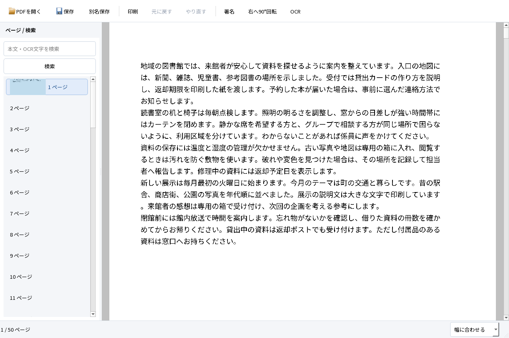
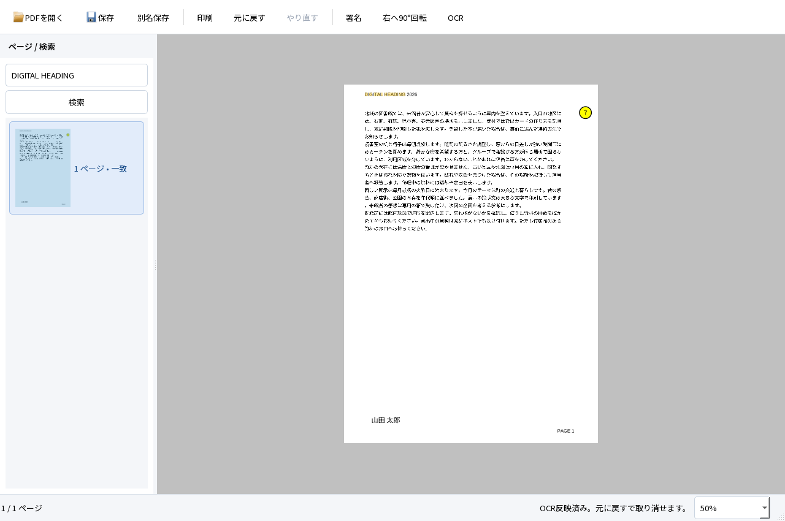

# M1 連続ビューアの実装・実行結果

2026-10-04。Windows 11 Home 25H2 x64、Qt 6.9.3。設計した閲覧体験のうち、実PDFの連続表示と読書位置保持をアプリへ組み込んだ。署名・OCR・保存も同じアプリで回帰した。**設計全体とM1全体の合格は保留。Acrobatを上回ったという比較結果はなく、M2には進んでいない。**

## 使える成果物と起動

この作業環境では `dist/PDFTatsujin-M1-viewer/PDFTatsujin.exe` を開く。ZIPは `dist/PDFTatsujin-M1-viewer-windows-x64.zip`。展開したフォルダ一式が必要で、Qt対応ソースもZIPへ同梱する。GitHubはソースと合成試験入力・結果の管理先であり、正式なバイナリリリースは未作成。[操作手順](../../README.md)、[ビルド手順](../DEVELOPMENT.md)。

検証したexeとZIPのハッシュはローカルの `evidence/viewer-native/archive-verification.json`。部品別容量は `evidence/viewer-native/storage-breakdown.json`。既存の共有開発環境はこのフォルダの容量に含めない。

## 実際にできたこと

- 100ページの実PDFを連続表示し、PageDownでページ境界を越えて読む。現在ページと左の選択を同期する。
- ズーム・右設定の開閉・ウィンドウのリサイズ後も、読んでいたPDF上の点を保持する。混在サイズをスクロールするだけでは倍率を変えない。
- CropBox、4方向の回転、UserUnitを含めて表示・署名の座標を扱う。「全体に合わせる」で4ページとも表示範囲の四隅が収まる。
- 日本語署名を配置・移動・更新し、Undo／Redo、保存・再読込・再編集する。
- 同じ画面で日英OCR、検索・選択・コピー、保存を行う。OCR前の署名・注釈を保持し、取消・失敗を部分反映しない。





画像はWindows版の実Qtウィジェットをoffscreenで描画したもの。HTML画面案やOS画面の操作証拠とは区別する。

## 試験結果

新しい実行先 `evidence/viewer-native/release` で、[30件の自動試験](viewer-regression.json)が **30 PASS／0 FAIL**。既存27件と連続表示・座標・保存署名の3件を含む。PDF表示が非同期になったため、OCR後の画面保存は描画完了を待つ検査を追加した。正解・検索語・閾値は変更していない。

| 検査 | 実測・確認範囲 |
|---|---|
| 読書位置 | 100ページ文書の中間で130→180→130→200%。最大軸ずれ0.49論理px。設定の開閉・1100×780へのリサイズでも2論理px以内 |
| 表示と文書の分離 | 閲覧後もPDFのシリアライズ結果・dirty・Undo位置が不変 |
| 混在サイズ・4回転 | 共通倍率にUserUnitを反映。全体表示の四隅、PDF点の往復変換を検査 |
| 実際の署名クリック | D02の4ページに200%表示で配置。最大誤差0.18pt、既存0.5pt基準以内。Undo／Redo・保存後の再編集情報を検査 |
| OCR評価 | 日英8ページ。評価用CERは日本語0.5051%／英語0.04554%、検索は各20/20、行位置差最大0.9217mm。[独立検証](viewer-independent.json) |
| 保存の互換性 | PDFium・Popplerで描画、フォーム6値・注釈・リンク・しおりを保持。OCR前後8ページと混在4ページの可視ピクセル差0 |

今回保存したPDFを専用プロファイルのFirefox 157.0（ヘッドレス、同梱PDF.js）でも再検証した。[結果](viewer-firefox.json)は日英各20/20の検索、DOMで選択した評価用テキストのCERが日本語0.5051%／英語0.7741%。署名の表示とWebDriver Print PageのPDF出力を実行し、印刷PDFをPopplerで描画して字形を確認した。ネイティブ検索バー、OSクリップボード、実際の印刷ダイアログは**未実行**。

```powershell
python scripts/test-firefox.py evidence/viewer-native/release evidence/viewer-native/firefox --firefox tools/viewer-test/firefox/core/firefox.exe --geckodriver tools/viewer-test/geckodriver/geckodriver.exe
```

Firefox・geckodriver・Seleniumは開発試験専用で、配布するアプリには同梱しない。ユーザーのブラウザプロファイルは使わない。

組込み中に発見して直した問題:

| 問題 | 修正と証拠 |
|---|---|
| 初回レイアウト確定前のページ位置で、本文先頭が見えない | 最初の配置確定後にページ0へ移動。`a01-first`の1 FAIL→`a01-second`の3 PASS |
| スクロールバー発生時の遅延リサイズが後のズーム位置を上書き | 表示操作の世代と最新アンカーを扱う。ずれ424.35pxの[失敗](viewer-before.json)を保存し、最大0.49pxへ修正 |
| 混在サイズのページ移動で、対象が横の画面外に残る | 対象PDF点の可視化と横位置の補正を行ってからページ先頭へ移動 |
| 独自倍率から「幅に合わせる」を選び直しても反応しない | コンボの添字変更だけでなく利用者による再選択を処理。[修正前の失敗](viewer-menu-before.json)と修正後のキー操作試験を保持 |

画面点検でD02の4ページ目が白紙に見えたため調査した。この入力は本文がCropBoxの外にあり、Popplerの`-cropbox`描画でも白紙だった。全体表示の四隅と署名追加後の表示を追加で確認し、入力や期待値は変えなかった。中間の失敗・調査記録も `evidence/viewer-native` に残す。

再現に使ったコマンド。Python・Popplerの配置は開発手順を参照し、再実行時は未使用の出力先を指定する。

```powershell
& scripts/build.ps1
& scripts/package.ps1 -OutputDirectory dist/PDFTatsujin-M1-viewer -TestSupport
$env:TATSU_UI_REVIEW='1'
Remove-Item Env:TATSU_TEST_FILTER -ErrorAction SilentlyContinue
& scripts/run-tests.ps1 -Headless -AppDirectory dist/PDFTatsujin-M1-viewer -OutputDirectory evidence/viewer-native/release
python scripts/evaluate.py evidence/viewer-native/release
python scripts/benchmark-viewer.py --app-directory dist/PDFTatsujin-M1-viewer --output evidence/viewer-native/performance-release
python scripts/check-source.py
```

### 初期性能の測り方

[生の計測結果](viewer-performance.json)は各文書3回の別プロセス実行。`measurement_version=2`は実際の表示部品のページコンパイル完了とウィンドウ画像取得までを測る。計時開始前のQApplication・フォント初期化は含まない。プロセス全体時間には250msの観測待ち・画像保存・終了を含む。10ms間隔でRSS／private bytesを観測する。

| 入力 | 初回本文描画までの中央値 | 観測ピークRSS（3回中の最大） |
|---|---:|---:|
| D01・1ページ | 60ms | 43.25MB |
| D10・デジタル100ページ | 69ms | 43.73MB |
| D10・画像主体50ページ | 581ms | 90.40MB |

対象exeのSHA-256は `874f285ed729e97e8d33e83b8e96a01dd6d06f23565edfca06fccc4a3baee503`。MBは10進表記。

この版では起動時の余分な同期ページ描画を除去した。以前の`--measure`とは測定経路も変わるため、その数値を直接比較した速度向上率は示さない。D10は同じページを参照する合成入力で、異なる内容の100ページの負荷を代表しない。OSキャッシュを消去したコールド起動、実ディスプレイのフレーム時間、入力p95、長時間スクロールのメモリ推移、Acrobat比較は**未実行**。

## 未実行・制約とA01〜A12

今回の自動操作はWindows上のQt offscreen・QTest。OSのIMEや実クリップボード操作と同一視しない。過去の[Google日本語入力・標準保存](NATIVE_UI.md)、[Firefox等の追加検証](M1_FOLLOWUP.md)は各版の履歴として保持する。

| ID | 今回実施した範囲 | 未実行・制約 |
|---|---|---|
| A01 | 実PDF、連続表示、ズーム、ページ移動、検索・選択・コピー | 一致ごとの結果一覧・表示履歴は未実装 |
| A02 | 日本語署名の配置・移動・更新・取消・Undo／Redo | この版でのOS IME再試験は未実行 |
| A03 | 保存・再編集、外部描画、Qt PDF印刷デバイス | Reader・ネイティブ印刷ダイアログ・物理印刷は未実行 |
| A04 | 回転・CropBox・UserUnit・倍率、4ページの実配置 | 実OS倍率100／150／200%の比較は未実行 |
| A05 | 日英OCR、同じ画面で検索・コピー・保存、独立評価 | Reader、Firefoxのネイティブ検索・OSコピーは未実行 |
| A06 | 対象ページOCR、既存文字・画像・署名の保持 | 多様な実文書一般の品質保証ではない |
| A07 | 既存OCR、空白、写真、二重層防止 | 他製品の広範なOCR形式は未評価 |
| A08 | 署名→回転→OCR→Undo／Redo→保存 | 縦書き・段組みの既知の限界は継続 |
| A09 | 進捗後の取消・異常終了・UI応答・未保存変更保持 | 電源断・OS全体の異常終了は未実行 |
| A10 | 保存取消・競合・大小文字別名・読取専用・閉じる経路 | 実ディスク容量不足は未実行。NTFS拒否は過去版で実施 |
| A11 | 暗号化・証明書署名・XFA・破損入力の保護 | 信頼チェーン・失効確認は対象外 |
| A12 | 開発用PATH等を外した同一PCの配布フォルダ実行 | クリーンWindows＋通信無効は未実行。合格を代替しない |

新しい[設計のV01〜V12](../design/VIEWER_UX.md)では、V01・V02・V12等の一部を確認した段階。ページをまたぐ選択、検索の非同期化・一致ごとの移動、戻る／進む、全サムネイルの先読み、手のひら／集中表示、アクセシビリティ実操作は残る。通常検索は同期・ページ単位であり、設計プレビュー全体を製品へ実装済みとはしない。

## 採用構成と理由、次の判断

独自Qt UI＋PDF4QTの表示部品をアダプターで包む設計を採用した。非同期コンパイルと実倍率の描画を利用し、文書・履歴・保存・ローカルTesseract OCRを既存の責務で維持できた。CropBox／UserUnitの不足は使い捨ての表示スナップショットと連続レイアウトで補い、正本や上流ソースは変更しない。[構成の詳細](../ARCHITECTURE.md)。

この成果物はM1の閲覧基盤の改善として提出する。M1の重要な未実行試験、閲覧設計の残り、実測による操作性評価を残し、完成宣言やM2への移行は行わない。
