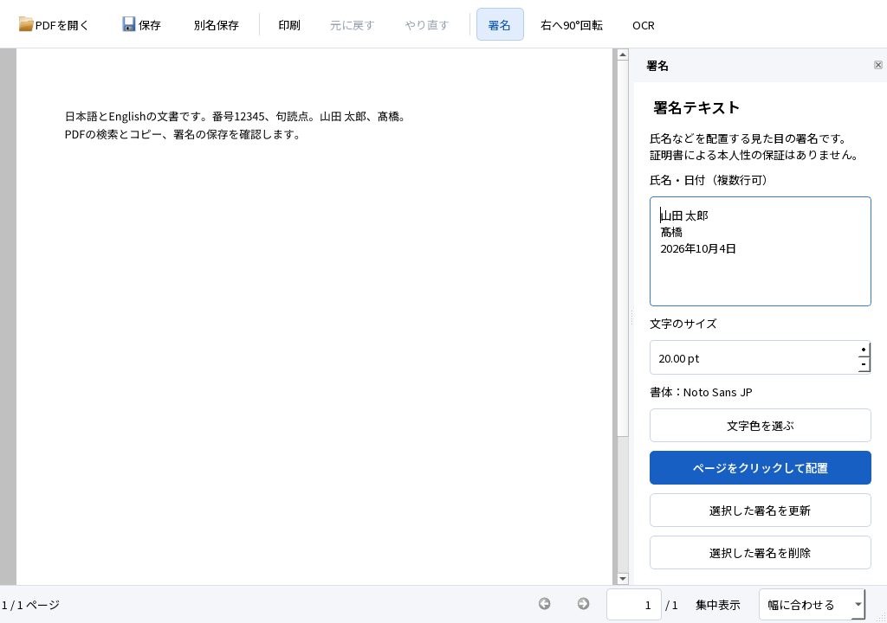

# M1：単語選択・ページ一覧・初期表示の実装と検証

2026-10-05、Windows 11 Home 25H2 x64、Qt 6.9.3、MSVC 19.50。閲覧の[操作設計](../design/TEXT_SELECTION.md)、[ページ一覧設計](../design/PAGE_PREVIEWS.md)、[読書位置の設計](../design/READING_CONTROLS.md)を先に具体化してから製品へ実装した。SPEC・TECH・ACCEPTANCE・AGENTS、固定入力・正解・閾値は変更していない。**M1全体の合格は保留。M2以降には進んでいない。**

## 使える成果物と起動方法

最新版は `dist/PDFTatsujin-M1-reading-refined/PDFTatsujin.exe`。配布ZIPは `dist/PDFTatsujin-M1-reading-refined-windows-x64.zip`。全体を展開し、同名フォルダのexeを開く。DLL・assets・plugins・licensesとQt対応ソースを保持する。通常利用にPythonの別途インストールは不要。[公開ソース](https://github.com/okakanatto/PDF_Tatsujin)は自作部分MIT。バイナリのGitHub Release公開は未実施。

最終exe SHA-256：`fe265707a41b2d732d5bdf12686f1900646c963bcb92bef948c72c70d7110f3d`。最終全回帰の実行時は作業用の `PDFTatsujin-M1-selection` に配置し、同じバイトのexeを新しい `reading-refined` フォルダへ移した。移動後も実画面起動・コピー・性能・DPR試験を実行した。既存版とZIPは保持する。[版・入力・公開記録の照合](refined-provenance.json)に実行範囲を分けて記録した。

本文はドラッグで範囲選択、ダブルクリックで単語選択、2回目を押したままドラッグで単語ごとに拡張、Shift+クリックで既存選択を拡張する。Ctrl+Cでコピーする。左の縮小画像からページへ移動し、Alt+Leftで元の表示へ戻れる。Ctrl+Lでページ入力、Ctrl+Fで検索、F8で集中表示。署名・OCR・保存も同じアプリで使う。

## 実際にできたこと

- 本文の字形と行内空白にI字カーソルを表示する。リンク・署名移動・手のひら・署名配置のカーソルを優先し、余白・画像だけ・コピー禁止では文字選択できるように見せない。
- 英語の単語・句読点・空白、結合文字・絵文字を境界に沿って選択する。日本語はQtのUnicode単語境界を使い、「交通費」の今回のダブルクリック結果は「交」。形態素解析による語句選択は未対応で、語句全体はドラッグで選ぶ。逆方向・別行・ページ境界・Shift拡張・Esc・遅延解析の取消も実装した。
- ページ一覧に実PDFの縮小画像を表示し、回転・CropBox・UserUnit・署名・注釈を反映する。表示中の行と現在ページを低優先度のワーカーで描く。100ページを開いた直後の描画は3ページ。描画前後で行の高さは変わらず、選択・番号・ラベルを保つ。
- 縮小画像キャッシュを8MiBに制限し、退避した画像は行データからも外す。旧文書やUndo前の遅延結果を破棄する。パネル非表示中は新しい描画を始めない。プロセス全体のメモリ上限とは区別する。
- PDFを開いた直後に署名／OCR設定を表示しても最初の本文を見せる。明示的なページ移動を初期表示の予約で上書きしない。読むだけではPDF・dirty・編集Undoを変えない。



[ページをまたぐ単語選択](refined-words-cross-page.png)、[回転ページの一覧](refined-previews.png)、[100ページの末尾の縮小画像](refined-previews-100.png)は合成PDFを実アプリで描いたQt offscreen画面。実OS倍率やAcrobatとの比較評価とは区別する。

## 試験結果

最終配布exeの[Windows全回帰](refined-regression.json)は **52 PASS／0 FAIL**。以前の47試験に単語選択3、ページ一覧1、初期パネル表示1を追加した。同一アプリの署名→移動→Undo／Redo→PDF保存→再編集と、日英OCR→検索・選択コピー→PDF保存も再実行した。PATHをSystem32に限定し、開発用Qtとassets環境変数を外した。実NTFS書込拒否とMicrosoft Print to PDFを含む。[ACL復元・exeの記録](refined-windows-errors.json)。

| 追加試験 | 固定した期待と実行範囲 | 結果 |
|---|---|---|
| Selection_words | opens／paragraph／句点／空白／交、前後方向・ページ境界・単語ドラッグ・Shift拡張、PDFとUndo不変 | PASS |
| Selection_word_boundaries | can't・数値・結合文字・絵文字・漢字、UTF-16境界を分割しない、余白を選ばない | PASS |
| Selection_word_lifecycle | D02の4回転・CropBox・UserUnit、リンク／署名／手のひら優先、コピー権限、別文書・revision・解析待ちのEsc、入力欄との競合 | PASS |
| Viewer_page_previews | 100ページ・末尾スクロール・履歴・8MiB・UIタイマー、D02の画像寸法と現PDFの描画一致、署名Undo、遅延結果破棄、非表示 | PASS |
| Reading_initial_panels | show前後×署名／OCRの4条件、1024×720で先頭の日英本文、明示50ページ移動、文書不変 | PASS |

別途[Qt倍率2のページ一覧試験](refined-previews-dpr2.json)もPASS。最大保持画像は8,340,480バイトで8MiB以内。これは `QT_SCALE_FACTOR=2` のoffscreen試験で、OSの100／150／200%設定による試験は未実行。

[最終exeのWindows実画面](refined-native.json)ではPDFを開き、英語「opens」のダブルクリック→Ctrl+C→自作アプリの入力欄へCtrl+Vを確認。日本語「交」も同じ経路で完全一致した。署名として配置せず、試験後に自分のアプリだけ閉じた。[直前版の縮小画像クリック・表示履歴](refined-native-previous.json)はそのexeの記録として保持する。実IME・署名ドラッグ・標準保存・再編集・実OCR・日英OSコピーの全経路は[以前のexeの実画面記録](M1_NATIVE_FINAL.md)にあり、今回のexeで全経路を再びネイティブ入力したとは扱わない。

### A01〜A12の現在の実行範囲

以下は実行範囲で、未実行を含む項目全体の合格宣言ではない。入力・操作・期待と実結果の詳細は最終JSONと独立評価に保持する。

| ID | 最終exeで実行した範囲・結果 | 未実行・残課題 |
|---|---|---|
| A01 | D01／D10／閲覧PDFの表示、検索、コピー、連続移動、履歴、集中表示、単語選択と一覧。PASS | 実OS倍率・Narrator・利用者評価・Acrobat比較 |
| A02 | 日英・異体字の署名配置、移動、更新、Undo／Redo。PASS | 最終exeでの全ネイティブ入力は未再実行。実Google IMEは以前のexe、Microsoft IME未実行 |
| A03 | 別名保存→再読込→署名再編集、Qt／Windows PDFドライバ／Firefox PDF印刷、独立描画。PASS | Reader、ネイティブ印刷ダイアログ、実プリンター未実行 |
| A04 | D02の回転・CropBox・UserUnit、座標0.5pt以内、アンカー2論理px以内、署名保存。PASS | 実OS100／150／200%は未実行 |
| A05 | D03日英8ページOCR、検索・選択コピー・保存と外部評価。固定閾値内でPASS | Reader、Firefoxネイティブ検索・OSコピー未実行 |
| A06 | D04指定対象・D05混在、既存文字・画像・署名・注釈・対象外保持。PASS | 多様な実務文書への一般化は未評価 |
| A07 | D06既存OCR・白紙・写真、二重追加を避けて保持・未検出を区別。PASS | 複雑な段組み・縦書き・低品質実スキャン未評価 |
| A08 | 署名→回転→OCR→Undo／Redo→保存。OCRだけを戻して署名・回転を保持。PASS | 全複合経路の実OS入力は未実行 |
| A09 | 部分OCR後取消・ワーカー強制終了・画面取消。未保存署名・revision保持、一時領域整理。PASS | 極端な容量・長時間運用は未実行 |
| A10 | 取消・宛先競合・読取専用・実NTFS拒否。原本・宛先・dirty保持、ACL復元。PASS | **実容量不足は未実行**。権限拒否を代替としない |
| A11 | D08誤パスワード・暗号化・証明書署名・XFA・破損。読取専用・拒否経路。PASS | 証明書の信頼性評価は対象外 |
| A12 | 同じPCの配布フォルダ、PATH制限で起動・処理を実行 | **環境制約／未実行**：開発環境のないWindows＋通信無効 |

### 保存PDFと外部評価

[PDFium・Poppler・pypdfの独立評価](refined-independent.json)では、固定検索語は日本語20/20・英語20/20。実範囲選択のコピーCERは日本語0.5051%・英語0.7741%で既定2%／1%以内。PDFium本文直接抽出は0.5051%／0.04554%。OCR文字行の最大位置差は0.9217mmで既定2mm以内、90°回転でも0.7964mm。OCRのみ8ページ・混在4ページの可視画素差は0。フォーム6値・既存注釈・リンク・しおりを保持した。

[Firefox 157.0／PDF.js](refined-firefox.json)でも日英各20/20検索、DOM選択コピーCER0.5051%／0.7741%がPASS。WebDriver Print Pageの出力をPopplerで描画し、[日本語署名・髙・日付の外観](refined-firefox-print.png)を目視確認した。DOM選択をOSクリップボード、Print Pageを印刷ダイアログ／実機印刷とは呼ばない。[Windows実PDFドライバの描画](refined-windows-print.png)も別記録。

[保存したナビゲーションの構造と描画](refined-navigation-export.json)は5リンク・PageLabels・名前付き宛先・しおりを比較し、6ページのPDFium描画がPASS。以前のFirefox連続操作における全体Fitは、期待5ページに対し元入力と保存入力の双方で2ページとなる**FAIL**を維持する。[切り分け](M1_EXTERNAL_FIT.md)。今回の保存構造一致をその操作の合格へ置き換えない。署名の本文検索はSPEC 5.2の必須条件ではなく、注釈文字と外観を別確認する。

### 検出した失敗と修正

[単語試験の初回](refined-words-first.json)と[第2回](refined-words-second.json)ではI字カーソルが上流のマウス移動処理によりOpenHandへ戻る不具合を検出。自作のホバー処理で競合を解消した。[第3回](refined-words-third.json)では署名選択でパネルが開いた直後の2回目クリックが、配置変更後の本文単語を選ぶ不具合を検出。最初の署名／リンク操作を追跡し、その2回目を本文選択にしないよう修正した。初回のページ境界試験の可視範囲不足、offscreenのグローバルマウス移動に依存した試験準備も修正し、製品の不具合と区別する。固定したコピー文字列は変更していない。

その後の画面検査で、開いた直後に右パネルを出すと初期移動が取り消され、本文のない中間位置を見せる問題を発見。[修正前の追加試験](refined-initial-before-fix.json)はFAIL。初期ページの保留を通常のアンカー復元から区別し、4条件と明示移動を検証してPASSにした。最終52件にも含む。古い失敗記録を成功結果で上書きしない。

## 未実行・制約

上表の未実行に加え、実OS入力によるShift拡張と単語ドラッグ、文字カーソルのキーボード選択、署名枠のキーボード移動、実画面FPS・入力p95・長時間メモリ・OSキャッシュを消した起動は未実行または未対応。今回の日本語単語選択はUnicode境界で、形態素解析はしない。単語・ページ一覧の改善を閲覧UX完成やAcrobat超えとは扱わない。残る環境試験は[手順](REMAINING_MANUAL.md)を保持し、その制約を独立した実装・自動試験を止める理由にはしなかった。

### 初期性能と容量

[最終exeを別プロセスで各3回計測](refined-performance.json)。QApplication・初期フォント設定後から実PDFが読めるまでのoffscreen計測で、OSファイルキャッシュは消していない。RSSは10ms間隔の観測最大、250msの観測期間。全起動時間・実画面FPS・Acrobat比較ではない。

| 入力 | 読めるまでの中央値 | 観測最大RSS（10進MB） |
|---|---:|---:|
| D01 | 142ms | 46.27 |
| D10 デジタル100ページ | 133ms | 47.56 |
| D10 画像50ページ | 505ms | 145.56 |

過去版の画像50ページは93.17MBで、今回の観測値は増えている。縮小画像の並行描画を追加したが、背景負荷などを統制した因果比較は未実行。8MiBは保持する縮小画像の上限で、本文レンダラー・処理中画像・プロセス全体の上限ではない。軽量性の優越は主張しない。

梱包前のプロジェクトは7.060GB、配布フォルダ151.116MB、Qt対応ソース53.891MB。最終ZIP後の部品別容量と上限20,000,000,000バイトの確認は、ローカル `evidence/viewer-selection-20261005/storage-final.json` と[公開の容量記録](https://github.com/okakanatto/PDF_Tatsujin/blob/main/docs/testing/refined-storage.json)に残す。ZIPの全CRC／SHA-256照合は[公開の梱包記録](https://github.com/okakanatto/PDF_Tatsujin/blob/main/docs/testing/refined-archive.json)。これらはZIP完成後に生成する外部記録で、ZIP自身への自己包含はしない。ファイル長の合計で、NTFS割当量やフォルダ外の既存MSVC・共有試験ランタイムとは区別する。

## 採用構成と理由

構成AのPDF4QTライブラリ＋Tesseractを維持する。自作WindowとCanvasに既存のPDF表示・保存・OCR状態を統合し、単語境界はSelectionTextCacheの解析ワーカー、一覧は独立したPagePreviewsが担当する。ホバー時に全文を解析せず、一覧もGUIで同期描画しない。固定した上流ソースは改変せず、全クラス再設計や追加エンジン・モデルは行っていない。構成Bの追加比較は不要で未実施。各部品の責務は[構成](../ARCHITECTURE.md)。

### 実行した経路と再現

固定依存は[開発手順](../DEVELOPMENT.md)。Pythonの試験パッケージ、PopplerとFirefoxは[既存検証手順](M1_NAVIGATION.md#再現手順)の配置を使った。以下は最終バイナリで実行した経路。全回帰の元配置から名前だけを移動した点は上記のとおり。出力先は未使用フォルダへ変更し、既存証拠・固定入力を上書きしない。

```powershell
& scripts/build.ps1
& scripts/package.ps1 -OutputDirectory dist/PDFTatsujin-M1-reading-refined -TestSupport
Remove-Item Env:TATSU_TEST_FILTER -ErrorAction SilentlyContinue
$env:TATSU_UI_REVIEW='1'
& scripts/test-windows-errors.ps1 -IncludeNativePrinter -AppDirectory dist/PDFTatsujin-M1-reading-refined -OutputDirectory evidence/new-refined-regression
python scripts/evaluate.py evidence/new-refined-regression
python scripts/test-navigation-export.py evidence/new-refined-regression evidence/new-refined-export
python scripts/test-firefox.py evidence/new-refined-regression evidence/new-refined-firefox --firefox tools/viewer-test/firefox/core/firefox.exe --geckodriver tools/viewer-test/geckodriver/geckodriver.exe
python scripts/benchmark-viewer.py --app-directory dist/PDFTatsujin-M1-reading-refined --output evidence/new-refined-performance
$env:QT_SCALE_FACTOR='2'
$env:TATSU_TEST_FILTER='Viewer_page_previews'
& scripts/run-tests.ps1 -Headless -AppDirectory dist/PDFTatsujin-M1-reading-refined -OutputDirectory evidence/new-refined-dpr2
Remove-Item Env:QT_SCALE_FACTOR,Env:TATSU_TEST_FILTER -ErrorAction SilentlyContinue
python scripts/archive-distribution.py --app-directory dist/PDFTatsujin-M1-reading-refined --output dist/new-refined-windows-x64.zip --verification evidence/new-refined-archive.json
python scripts/storage-breakdown.py --app-directory dist/PDFTatsujin-M1-reading-refined --archive dist/new-refined-windows-x64.zip --output evidence/new-refined-storage.json
python scripts/check-source.py
```

clang-format、Black、PowerShell構文、固定19文書・閲覧正解・PDF4QTピンの検査も実行してPASS。ソースCIはWindows GUIや未実行の受入項目の代替にしない。

## 次の判断

署名・日英OCR・通常PDF保存・再編集を維持したM1試作に、単語選択、非同期ページ一覧、初期本文表示の修正を統合し、実装・配布物・入力と正解・失敗を含む検証記録を提出する。実容量不足、クリーンWindows、Readerなどの未実行とFirefox Fitの既知診断が残るため、M1全体の合格・一般配布・Acrobatを上回るという判断は保留する。今回の成果はM1の成立性判断までで、M2以降には進まない。
