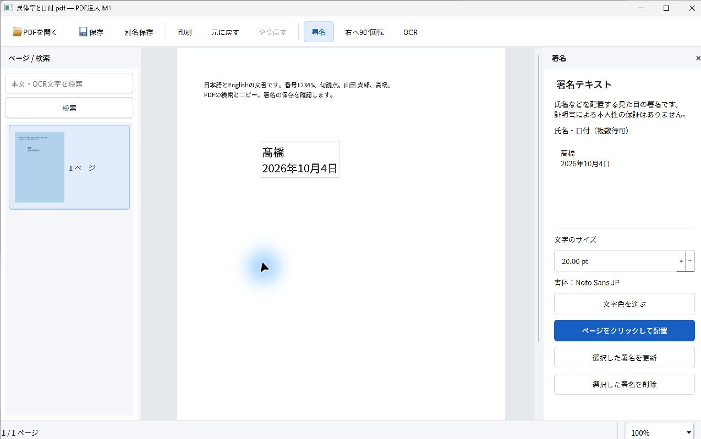

# M1 Windows実画面の入力・保存検証

2026-10-04。Windows 11 Home 25H2 x64、Qt 6.9.3、Google日本語入力 3.34.6260.0。合成文書D01だけを使用し、Windowsへのキー入力・マウス操作を行った。確定文字列の貼り付けをIME変換の証拠にはしていない。**M1全体の合格は引き続き保留**。

## 成果物と実行版

修正版は `dist/PDFTatsujin-M1-review/PDFTatsujin.exe`。配布フォルダ一式、または `dist/PDFTatsujin-M1-review-windows-x64.zip` を展開して起動する。使用手順は[README](../../README.md)。

再梱包後のプロジェクトは約4.80GB（許可20GB）、ZIP約138.6MB、展開後は実行フォルダ約145.2MB＋Qt対応ソース約53.9MB。実行フォルダの内訳は本体・PDF4QT約9.41MB、Qt約33.11MB、他DLL・ランタイム約45.08MB、OCRモデル約44.06MB、フォント約9.59MB、通知・資料約3.93MB。論理ファイルサイズで測定し、ログは `evidence/native-ui-20261004/storage-breakdown.json`。ZIP整合性、梱包exeと試験済みexeのバイト一致も確認した。

- 初回の氏名・移動・保存・再編集試験のexe SHA-256: `58191c646c038218e0c321d63f9370d289426618263066474560aebc44261572`
- IME表示修正後のexe SHA-256: `fd06af8ce59c47b1b478dbbe07bf389670a0601ab3c2a9f042cb4fdd82841763`
- 入力: `fixtures/D01.pdf`、SHA-256 `6724283a4bad502a77738826d4550f23b6ba5f09dfe6c8a0a30f989a4c8089ff`。全操作後も一致。

修正は、署名欄のプレースホルダーを外側のラベルへ移したもの。空欄でIME変換を始めると案内文と未確定文字が重なっていた。再ビルド後、空欄から「たかはし」を入力・変換し、重なりの解消を確認した。入力内容、保存方式、OCR要件は変更していない。



## 実際の操作と結果

| ID・操作 | 期待 | 実結果・証拠 | 残課題 |
|---|---|---|---|
| A01 標準の「PDFを開く」 | 日本語パスのD01を読み、本文と署名入口を表示 | PASS。Windows共通ファイルダイアログから読込 | この追加試験ではズーム・本文コピーを再実施していない。既存自動試験と分ける |
| A02 IMEで氏名入力 | 読み→候補変換→確定が正しい | PASS。`yamada`→山田、`tarou`→太郎をSpaceで変換、Enterで確定。実入力は「山田太郎」（空白なし） | 空白を含む「山田 太郎」は既存自動試験で検証。Microsoft IMEは未実行 |
| A02 未確定時Esc | 確定済み氏名を失わない | PASS。「山田太郎」の末尾に未確定「あ」を入力し、Escで「あ」だけ取消 | 他IMEでの再試験は未実行 |
| A02 配置・移動・Undo／Redo | PDF上で署名を移動し、1回で戻す／復元する | PASS。ページへ配置→ドラッグ→上部の元に戻す→やり直す。目視で各位置を確認 | 座標の定量検査は自動試験A04等の結果を参照 |
| A10 標準の保存ダイアログ取消 | 署名と未保存状態を維持 | PASS。「別名保存」→キャンセル。署名と未保存表示を維持 | 実容量不足は未実行 |
| A03 標準の別名保存 | 日本語パスへ保存し、未保存表示を解除 | PASS。[氏名の保存PDF](native-name.pdf)、[保存画面](native-ime-saved.png)。原本ハッシュ不変 | 指定外部ビューアの実画面印刷は未実行 |
| A02・A03 保存後のサイズ再編集 | PDF単独から編集情報を復元 | PASS。同じPDFを新しい文書ウィンドウで開き、署名を選択、20pt→28ptへ更新し別名保存。[再編集PDF](native-name-reedited.pdf)、[再編集画面](native-ime-reedited.png) | 今回の実画面では再読込後の文字変更・再移動は未実行。自動試験の文字変更とは区別 |
| A02 修正版の異体字入力 | 異体字を別字に置換しない | PASS。`takahashi`→Spaceで候補を選び「髙橋」を確定。PDFの編集情報でもU+9AD9を確認 | 一般の全異体字・IVS対応を保証しない |
| A02 修正版の複数行・日付 | 日付を確定文字として保存 | PASS。改行後、`kyou`を変換し日付候補「2026年10月4日」を選択・確定。[異体字・日付PDF](native-variant-date.pdf) | 日付は保存された固定文字列 |
| A03 別エンジン描画 | 保存PDFの氏名・サイズ・異体字・日付が読める | PASS。上記3点をPopplerで描画し全ページを目視。文字化け・クリッピングなし | Poppler描画をReader実画面の合格にはしない |

保存PDFをpypdfでも読み、Stamp注釈・外観・編集用メタデータ、20pt／28pt、氏名・異体字・日付を検査した。[検査結果](native-saved-pdf-check.json)。独自サイドカーは使用していない。

途中で操作ツールが別の文書ウィンドウを対象にして署名未選択の通知が出たため、その試行は成立とせず、新しく開いたウィンドウを明示選択してサイズ変更・保存を再試行した。上表は再試行後の確認結果。IME候補中に表示される個人の学習候補は公開証拠へ保存していない。

## 修正後のビルド・回帰

実行したコマンド:

```powershell
& scripts/build.ps1
& scripts/package.ps1 -OutputDirectory dist/PDFTatsujin-M1-review -TestSupport
$env:TATSU_UI_REVIEW='1'
& scripts/run-tests.ps1 -Headless -AppDirectory dist/PDFTatsujin-M1-review -OutputDirectory evidence/native-ui-20261004/regression
```

Windowsビルド成功。[回帰結果](native-regression.json)は **20 PASS／0 FAIL**。日英8ページOCR、同一画面の署名＋OCR＋検索・コピー＋保存、取消・クラッシュ・文書保持、座標、保存競合、印刷範囲・注釈フラグ、1024×720のレイアウトを含む。これはQt offscreenでの実行であり、上表のWindowsネイティブ入力とは別の証拠。

ローカルのビルド・配布ログ、操作で保存したPDF、画面、Poppler画像は `evidence/native-ui-20261004/` にある。元の要件4文書、fixture、正解、検索語、閾値は変更していない。

## 未実行・停止点

Adobe Reader、Firefoxのネイティブ検索バー・OSクリップボード・印刷ダイアログ、物理印刷、実容量不足、クリーンなWindowsで通信を無効にしたA12、OS表示倍率100／150／200%の比較は**未実行**。必要な環境と手順は[残る試験](REMAINING_MANUAL.md)。以前の[Firefox・独立OCR評価](M1_FOLLOWUP.md)を、これらの実行済み判定へ流用しない。

構成A（PDF4QT＋Tesseract）の暫定採用を維持する。署名の通常PDF保存・再編集と横書き日英OCRの成立性は実証した範囲で判断し、残る重要試験のためM1合格は保留する。M2には進まない。
